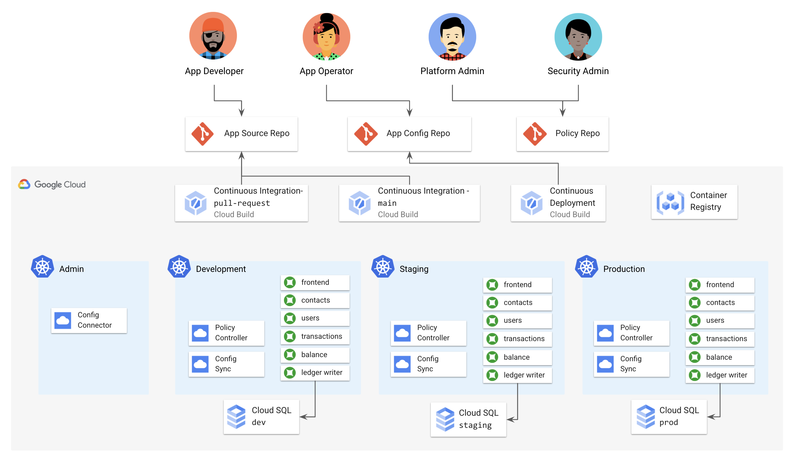
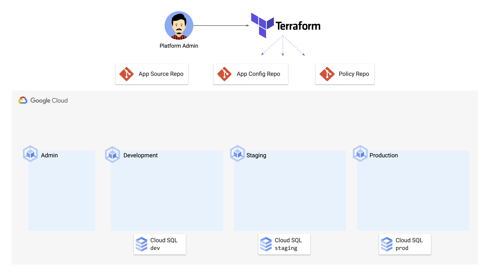

# 1 - Setup 

## Introduction

Welcome to the *Build a Platform with KRM* demos! This is a five-part series designed to show you, from start to finish, how to build a developer-facing Kubernetes platform for your organization— one that can scale to both the size of your engineering org, as well as to the number of services you're running. No prior knowledge of Kubernetes or config management is required to complete these demos, but if you're a K8s power-user, hopefully this series will have some new info and tools you can try.

By the end of part 5, you will have the setup below. This is a Kubernetes-based platform for a (simulated) banking application called **[Cymbal Bank](https://github.com/GoogleCloudPlatform/bank-of-anthos)**. Cymbal Bank's platform runs in Google Cloud, and hosts production workloads as well as a development environment. Cymbal Bank's source code and configuration flows from developers into Git, then automation kicks in - deploying code to staging, running tests, checking code against company policies, and building production artifacts. You'll learn how each of these pieces work in the next demos. 



Before we dive into the setup, it's worth covering the purpose of doing all this - what are the key takeaways from these demos? There are two. The first is that **Kubernetes**, with its declarative resource model ("KRM"), provide a powerful foundation for your developers to build and deploy modern applications. The second is that **not all developers have to interact with a Kubernetes environment in the same way** - different developer personas, from data engineers to security operators, have different needs. In fact, no single developer has to become a Kubernetes expert in order to be successful. The demos will show you how to build automation, abstractions, and safe guardrails so that all developers can become productive in a Kubernetes environment.   

Each demo will come back to these two themes - but for part 1, we're just going to focus on getting a base-layer Kubernetes environment up and running. You'll build on this environment throughout the demos. 

## What's deployed?  

Your baseline environment is set up using Terraform, which in turn will spin up Google Cloud and GitHub resources on your behalf. The `base-env/` subdirectory in `1-setup/` contains the Terraform resource files needed for setup. 



The diagram above shows the resources Terraform will create during setup: 

- **4 [Google Kubernetes Engine](https://cloud.google.com/kubernetes-engine) (GKE) clusters** for admin, development, staging, and production. The admin cluster has [**Config Connector**](https://cloud.google.com/config-connector/docs/overview) enabled, which will be used in part 5. 
- **3 [Cloud SQL](https://cloud.google.com/sql)** (Postgres) databases for development, staging, and production. 
- **3 Github repos** for application source code, application config, and org-wide policies. **⚠️ Note - this demo does require creating new public repos in your Github account. You can delete these repos when you are done with the demos.** 
- **3 [Secret Manager](https://cloud.google.com/secret-manager) secrets** containing your Github username, email, and developer token. 

## Prerequisites 

1. **A local development environment**, either Linux or MacOS, into which you can install command-line tools. **Note** - make sure you're using a POSIX-compliant shell, such as `bash` or `zsh`. Non-POSIX compliant shells like `fish` aren't supported.  
2. An **Google Cloud project**, with billing enabled. Have the Project ID handy. *A note to Googlers* - it's recommended that you use a project in an external organization. 
3. A **Github account**. 
4. A [**Github Personal Access token**](https://docs.github.com/en/github/authenticating-to-github/creating-a-personal-access-token) with repo creation permissions. (See example below.)


## Steps 

### 1. Install the following tools. 

(You might have some of these installed already. You can check by running `which <tool>`, for instance: `which kubectl`.) 

- [gcloud](https://cloud.google.com/sdk/docs/install)
- [kubectl](https://cloud.google.com/sdk/gcloud/reference/components/install)
- [kubectx](https://github.com/ahmetb/kubectx#installation)
- [terraform](https://learn.hashicorp.com/tutorials/terraform/install-cli) 
- **tree** - `brew install tree` (MacOS)
- [Docker desktop](https://www.docker.com/products/docker-desktop) (Mac) or [Docker Engine](https://docs.docker.com/engine/install/ubuntu/) (Linux)
- [skaffold](https://skaffold.dev/docs/install/). 
- [Java - JDK 14](https://www.oracle.com/java/technologies/javase-downloads.html)
- [Maven (Java)](https://maven.apache.org/install.html)
- [VSCode](https://code.visualstudio.com/Download)
- [Cloud Code Extension for VSCode](https://cloud.google.com/code/docs/vscode/install) 


### 2. **Open a terminal, and clone this repo.**

```
git clone https://github.com/askmeegs/intro-to-krm
cd intro-to-krm/1-setup/ 
```

###  3. **Set variables**. 

```
export PROJECT_ID="<your-project-id>" 
export GITHUB_USERNAME="<your-github-username>"
```

###  4. **Enable Google Cloud APIs** in your project. ⚠️ Note- This command takes a few minutes to run.

```
gcloud config set project ${PROJECT_ID}
gcloud services enable \
  container.googleapis.com \
  cloudbuild.googleapis.com \
  sqladmin.googleapis.com \
  secretmanager.googleapis.com \
  cloudasset.googleapis.com \
  storage.googleapis.com
```

### 5. **Get the project number corresponding to your project ID.** 

```
export PROJECT=$(gcloud config get-value project)
gcloud projects list --filter="$PROJECT" --format="value(PROJECT_NUMBER)"
```

### 6. View the .tf files in the `base-env` directory. 

```
tree base-env
```

Expected output: 

```
base-env
├── cloud-sql.tf
├── cloudbuild.tf
├── github.tf
├── gke.tf
├── outputs.tf
├── secret-manager.tf
├── terraform-megan.tfvars
├── terraform.tfvars
├── versions.tf
└── workload-identity.tf

0 directories, 10 files
```

You can open any of these files to see how the Google Cloud resources for IAM, GKE, Cloud SQL, and Secret Manager are specified using the Terraform HCL language. The `github.tf` file has Terraform resources to spin up Github repos in your account.

### 7. **Replace the values in `base-env/terraform.tfvars`** with the values corresponding to your project. 

```
github_token = ""
github_username = ""
github_email = ""
project_id = ""
project_number = ""
```

### 8. **Set up application default credentials** for your project - this allows Terraform to create GCP resources on your behalf. A browser window should open, or you should be prompted to copy a token into the URL output by the command. 

```
gcloud auth application-default login
```

Expected output (your path will be different): 

```
Credentials saved to file: [/Users/mokeefe/.config/gcloud/application_default_credentials.json]
```

### 9. **Run `terraform init`.** This downloads the providers (Github, Google Cloud) needed for setup. 

```
terraform init base-env
```

Expected output: 

```
Terraform has been successfully initialized!

You may now begin working with Terraform. Try running "terraform plan" to see
any changes that are required for your infrastructure. All Terraform commands
should now work.
```

### 10. **Run `terraform plan`.** This looks at the `.tf` files in the `base-env` directory and tells you what it will deploy to your Google Cloud project. 


```
terraform plan -var-file="base-env/terraform.tfvars" base-env
```

Expected output: 

```
Plan: 35 to add, 0 to change, 0 to destroy.

Changes to Outputs:
  + kubernetes_admin_cluster_name   = "cymbal-admin"
  + kubernetes_dev_cluster_name     = "cymbal-dev"
  + kubernetes_prod_cluster_name    = "cymbal-prod"
  + kubernetes_staging_cluster_name = "cymbal-staging"

```

### 11.  **Run `terraform apply`** to create the resources.

You will see a bunch of output as Terraform creates the resources. This command will take about 10 minutes to run.

```
terraform apply -auto-approve -var-file="base-env/terraform.tfvars" base-env
```

Expected output: 

```
Apply complete! Resources: 35 added, 0 changed, 0 destroyed.

Outputs:

kubernetes_admin_cluster_name = "cymbal-admin"
kubernetes_dev_cluster_name = "cymbal-dev"
kubernetes_prod_cluster_name = "cymbal-prod"
kubernetes_staging_cluster_name = "cymbal-staging"
```

### 12. **Run the cluster setup script from the `1-setup/` directory.** 

This registers the clusters to the Anthos dashboard, sets up Kubernetes contexts, and sets up the Kubernetes namespaces you'll deploy the application into, in the next demo. **Note - this script can take up to 10 minutes to complete.** 

```
./cluster-setup.sh
```

Expected output: 

```
✅ GKE Cluster Setup Complete.
```

###  13.  **Verify that you can now access your different clusters as follows:** 

```
kubectx cymbal-prod 
kubectl get nodes
```

Expected output: 

```
Switched to context "cymbal-prod".
NAME                                                  STATUS   ROLES    AGE   VERSION
gke-cymbal-prod-cymbal-prod-node-pool-de8b1260-7np8   Ready    <none>   15m   v1.18.16-gke.302
gke-cymbal-prod-cymbal-prod-node-pool-de8b1260-mdts   Ready    <none>   15m   v1.18.16-gke.302
gke-cymbal-prod-cymbal-prod-node-pool-de8b1260-n9hw   Ready    <none>   15m   v1.18.16-gke.302
gke-cymbal-prod-cymbal-prod-node-pool-de8b1260-wv69   Ready    <none>   15m   v1.18.16-gke.302
```

###  🎊 **Congrats**! You just set up the GKE environment you'll use for the rest of the demos.

###  **[Continue to Part 2- How KRM Works.](/2-how-krm-works/)**
