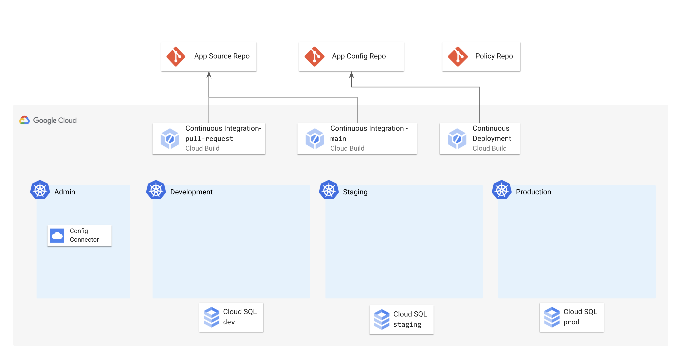

# 1 - Setup 

This directory contains Terraform and Cloud Build resources to set up a basic GKE cluster with the CymbalBank app's KRM resources deployed to it. 

Note: This setup process will also create a Github repository in your account, and you will push the CymbalBank manifests to that repo.

## Architecture 



This Terraform setup bootstraps many of the GCP resources used in subsequent demos in this series. The Terraform scripts in this directory set up the following: 

- 4 GKE clusters for admin, dev, staging, and prod. The admin cluster has [Config Connector](https://cloud.google.com/config-connector/docs/overview) enabled, which will be used in a later demo.
- 3 Cloud SQL (Postgres) databases for dev, staging, and prod. 
- 3 Github repos for app source, app config, and policy. 
- 3 Cloud Build triggers:
  - **`ci-pr`** - Continuous Integration for Pull Requests (app source repo). Builds and deploys images to the Staging GKE cluster. 
  - **`ci-main`** - Continous Integration for commits to the `main` branch (app source repo). Builds images + pushes to GCR. Injects the GCR image tags into the Kubernetes manifests in the app config repo. 
  - **`cd-prod`** - Watches commits to the app-config-repo `main` branch (done by the `ci-main` pipeline above). Deploys Kubernetes manifests to the `prod` cluster. 

Once the Terraform script completes, the subsequent steps in this README will show you how to initialize your new app source/config repos, and push existing CymbalBank app manifests. This will trigger the Continuous Deployment pipeline, to get you started with a working version of the app running on the production cluster. 

## Prerequisites 

1. A Google Cloud project 
2. A Github account (you will be creating 3 new repositories overall). 
3. The following tools installed in your local environment: 
- git
- [gcloud](https://cloud.google.com/sdk/docs/install)
- [kubectl](https://cloud.google.com/sdk/gcloud/reference/components/install) - you can install this via gcloud: `gcloud components install kubectl`
- [kubectx](https://github.com/ahmetb/kubectx#installation)
- [terraform](https://learn.hashicorp.com/tutorials/terraform/install-cli) 
- tree - `brew install tree` 

4. A Github Personal Access token that Terraform can use to create a Github repo on your behalf. See instructions [here](https://docs.github.com/en/github/authenticating-to-github/creating-a-personal-access-token). 

## Steps 

1. **Create a Google Cloud project** or get the ID of an existing project.

2. **Clone this repo.**

```
git clone https://github.com/askmeegs/intro-to-krm
cd intro-to-krm/1-setup/ 
```

3. **Set vars**. 

```
export PROJECT_ID="<your-project-id>" 
export GITHUB_USERNAME="<your-github-username>"
```

4. **Enable Google Cloud APIs.**  

```
gcloud config set project ${PROJECT_ID}
gcloud services enable container.googleapis.com cloudbuild.googleapis.com sqladmin.googleapis.com
```

5. **Replace the values in `terraform.tfvars`** with the values corresponding to your project. 

```
project_id = ""
project_number = ""
github_username = ""
github_token = ""
```

7. **Set up application default credentials** for your project - this allows Terraform to create GCP resources on your behalf. 

```
gcloud auth application-default login
```

8. **Run `terraform init`.** This downloads the providers (Github, Google Cloud) needed for setup. On success, you should see: 

```
terraform init 
```

Expected output: 

```
Terraform has been successfully initialized!
```

9. **Run `terraform plan`.** This looks at the `.tf` files in the directory and tells you what it will deploy to your Google Cloud project. 


```
terraform plan
```

Expected output: 

```
Plan: 28 to add, 0 to change, 0 to destroy.

Changes to Outputs:
  + kubernetes_admin_cluster_name   = "cymbal-admin"
  + kubernetes_dev_cluster_name     = "cymbal-dev"
  + kubernetes_prod_cluster_name    = "cymbal-prod"
  + kubernetes_staging_cluster_name = "cymbal-staging"
```

1.  **Run `terraform apply`** to create the resources. It will take a few minutes for Terraform to set up the cluster and the Cloud Build pipeline. When the command completes, you should see something similar to this: 

```
terraform apply -auto-approve
```

Expected output: 

```
Apply complete! Resources: 31 added, 0 changed, 0 destroyed.

Outputs:

kubernetes_admin_cluster_name = "cymbal-admin"
kubernetes_dev_cluster_name = "cymbal-dev"
kubernetes_prod_cluster_name = "cymbal-prod"
kubernetes_staging_cluster_name = "cymbal-staging"
```


11. **Run the cluster setup script.** This sets up kubernetes contexts, boostraps app namespaces, a

```
./cluster-setup.sh
```

12. Verify that you can now access your different clusters as follows: 

```
kubectx cymbal-prod 
kubectl get nodes
```

🎊 Congrats! You just set up your base-layer Kubernetes environment, which you'll use in the rest of the demos.