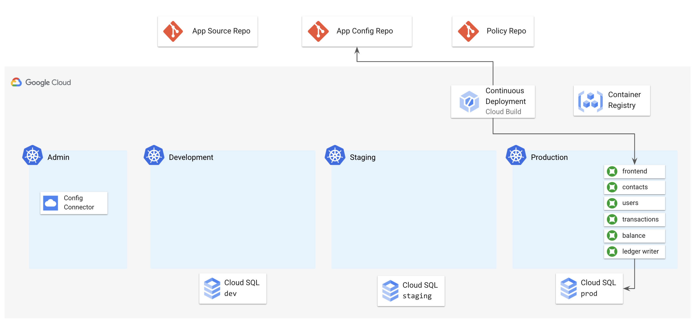
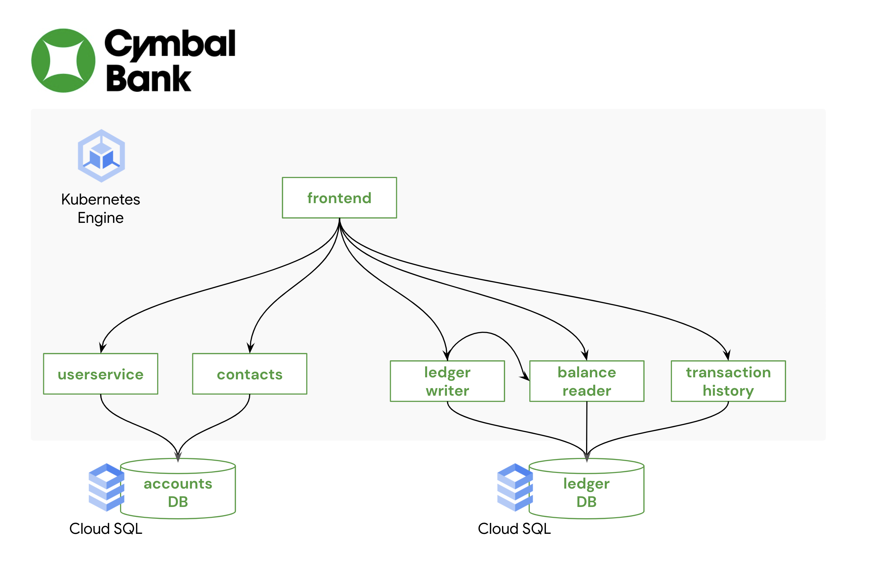
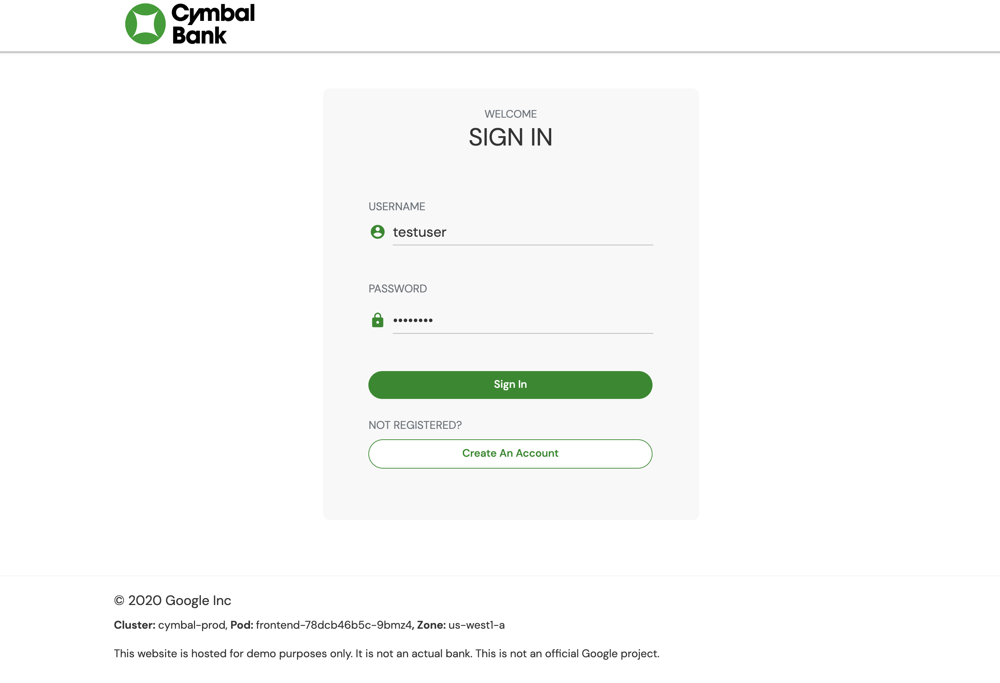

# 2 - How KRM Works 

Now that you have a Kubernetes environment to work with, let's deploy the CymbalBank application, formatted as KRM, to one of the clusters. 

## Contents

  - [Architecture](#architecture)
  - [Prerequisites](#prerequisites)
  - [Part A - Setup](#part-a---setup)
      - [1. `cd` into this directory.](#1-cd-into-this-directory)
      - [2. **Set variables.**](#2-set-variables)
      - [3. **Clone the app config repo.**](#3-clone-the-app-config-repo)
  - [Part B - Introducing KRM](#part-b---introducing-krm)
      - [1. **View the nginx deployment.**](#1-view-the-nginx-deployment)
      - [2. **Change your local kubecontext** to the `cymbal-dev` cluster.](#2-change-your-local-kubecontext-to-the-cymbal-dev-cluster)
      - [3. Apply `nginx-deployment.yaml` to the cluster**.](#3-apply-nginx-deploymentyaml-to-the-cluster)
      - [4. **View the running Pods** in the cymbal-dev cluster.](#4-view-the-running-pods-in-the-cymbal-dev-cluster)
      - [5. **Try deleting one of the pods** in your nginx deployment.](#5-try-deleting-one-of-the-pods-in-your-nginx-deployment)
      - [6. **Get your deployment out of the APIServer using `kubectl`**.](#6-get-your-deployment-out-of-the-apiserver-using-kubectl)
  - [Part C - Deploying CymbalBank with `kustomize`](#part-c---deploying-cymbalbank-with-kustomize)
      - [1. **Copy the Kubernetes manifests** for CymbalBank into the cymbalbank-app-config repo.](#1-copy-the-kubernetes-manifests-for-cymbalbank-into-the-cymbalbank-app-config-repo)
      - [2. **Explore the cymbalbank-app-config repo.**](#2-explore-the-cymbalbank-app-config-repo)
      - [3. **Explore the CymbalBank kustomize overlays.**](#3-explore-the-cymbalbank-kustomize-overlays)
      - [4. **Explore kustomization.yaml**.](#4-explore-kustomizationyaml)
  - [Part D - Create the Continuous Deployment pipeline](#part-d---create-the-continuous-deployment-pipeline)
      - [1. **View the continuous deployment pipeline**.](#1-view-the-continuous-deployment-pipeline)
      - [2. **Set up Cloud Build authentication to Github**.](#2-set-up-cloud-build-authentication-to-github)
      - [3. **Create a Cloud Build trigger for cymbalbank-app-config**.](#3-create-a-cloud-build-trigger-for-cymbalbank-app-config)
      - [4. **Trigger the build by pushing the manifests to your config repo.**](#4-trigger-the-build-by-pushing-the-manifests-to-your-config-repo)
      - [5. **Navigate back to Cloud Build and in the left sidebar, click History.**](#5-navigate-back-to-cloud-build-and-in-the-left-sidebar-click-history)
      - [6. Return to a terminal and get the pods in the `cymbal-prod` cluster:](#6-return-to-a-terminal-and-get-the-pods-in-the-cymbal-prod-cluster)
  - [Further Reading](#further-reading)

## What you'll learn  

- What KRM stands for 
- How to define a Kubernetes object using KRM 
- How to manually apply a Kubernetes object to a cluster using `kubectl` 
- How to streamline KRM editing using `kustomize` 
- How the CymbalBank application can be expressed as Kubernetes resources 
- How to push KRM resources to a Git repo 
- How to create a Continous Deployment pipeline triggered on a Git repo, to deploy KRM into production. 

## Architecture



## Prerequisites 

1. **Complete [part 1](/1-setup)** to bootstrap your environment. 


## Part A - Setup  

#### 1. `cd` into this directory. 

```
cd 2-how-krm-works/
```

#### 2. **Set variables.**

```
export PROJECT_ID=<your-project-id>
export GITHUB_USERNAME=<your-github-username>
```


#### 3. **Clone the app config repo.** 

This Github repo should have been created in your account during setup. This repo will contain the Kubernetes manifests (KRM) for the CymbalBank application. 

```
git clone "https://github.com/${GITHUB_USERNAME}/cymbalbank-app-config"
```

Expected output: 

```
Cloning into 'cymbalbank-app-config'...
warning: You appear to have cloned an empty repository.
```

## Part B - Introducing KRM 

Your cymbalbank-app-config/ repo now contains multiple Kubernetes manifests. Kubernetes manifests are readable by the Kubernetes API and have a specific, structured format. This format is called the [Kubernetes Resource Model](https://github.com/kubernetes/community/blob/master/contributors/design-proposals/architecture/resource-management.md), or KRM. KRM can be expressed as either YAML or JSON- here, we're using the YAML format. 

KRM was created with the Kubernetes architecture in mind - because Kubernetes is a declarative system, each KRM resource represents a declarative object with your desired state. Said another way, a KRM resource is a "noun" - for instance, a Deployment - that the Kubernetes control plane will take action on ("verbs") so that your desired state in that YAML file matches the live state in your cluster. (This model will be familiar if you're ever worked with a REST API, or CRUD operations.) For instance, if you have a Deployment YAML stating that you want 3 replicas of a `nginx` Docker image, and one of the replicas fails, Kubernetes will notice that, and will bring another replica back online. Let's try that in action. 

#### 1. **View the nginx deployment.** 


`nginx-deployment.yaml` contains a Deployment manifest ([source](https://kubernetes.io/docs/tasks/run-application/run-stateless-application-deployment/)). **Open the file** in an IDE. 

```YAML
apiVersion: apps/v1
kind: Deployment
metadata:
  name: nginx-deployment
spec:
  selector:
    matchLabels:
      app: nginx
  replicas: 3
  template:
    metadata:
      labels:
        app: nginx
    spec:
      containers:
      - name: nginx
        image: nginx:1.14.2
        ports:
        - containerPort: 80
```

All [Kubernetes objects](https://kubernetes.io/docs/concepts/overview/working-with-objects/kubernetes-objects/) have the following fields:
- `apiVersion` - the API + Version for this resource. Kubernetes has multiple APIs, each with their own version. 
- `kind` - the resource type within that API. 
- `metadata` - information about the object - like labels, annotations, name, [namespace](https://kubernetes.io/docs/concepts/overview/working-with-objects/namespaces/). When you create this resource in a cluster, Kubernetes will add its own metadata, including a unique ID, `UID`, for that specific object. 
- `spec` - the fields specific to that object. In a Deployment spec, for instance, you have to define the container `image` you want to use. Also notice how we'll deploy 3 `replicas` of the same container - this allows for basic scaling.     

#### 2. **Change your local kubecontext** to the `cymbal-dev` cluster. 

```
kubectx cymbal-dev
```

#### 3. Apply `nginx-deployment.yaml` to the cluster**. 

The `kubectl` tool is a command-line interface between a user and a running Kubernetes API server. (All 4 of your GKE clusters have their own API servers.) The `apply` command is like a a REST `put` command - it will create the resource if it doesn't exist, or update it, if the resource already exists. 

```
kubectl apply -f nginx-deployment.yaml
```

Expected output: 

```
deployment.apps/nginx-deployment created
```

#### 4. **View the running Pods** in the cymbal-dev cluster. 

Pods are the smallest deployable unit of Kubernetes. Each Pod contains one or more running containers - in this case, each of the 3 nginx pods contain 1 nginx container. 

```
kubectl get pods 
```

Expected output: 

```
NAME                                READY   STATUS    RESTARTS   AGE
nginx-deployment-6b474476c4-h4j4q   1/1     Running   0          21s
nginx-deployment-6b474476c4-knmkr   1/1     Running   0          21s
nginx-deployment-6b474476c4-q77jr   1/1     Running   0          21s
```

#### 5. **Try deleting one of the pods** in your nginx deployment.

Then re-run `kubectl get pods`. You should see that Kubernetes noticed that the actual state diverged from your desired state in `nginx-deployment.yaml`, and brought a new nginx Pod back online. 

```
kubectl delete pod nginx-deployment-6b474476c4-h4j4q 
kubectl get pods
```

Expected output: 

```
NAME                                READY   STATUS    RESTARTS   AGE
nginx-deployment-6b474476c4-44dq4   1/1     Running   0          2s
nginx-deployment-6b474476c4-knmkr   1/1     Running   0          3m45s
nginx-deployment-6b474476c4-q77jr   1/1     Running   0          3m45s
```

**What actually happened** when we ran `kubectl apply`? `kubectl` abstracts what is actually a complex process of getting KRM from your local machine into a Kubernetes cluster.

For starters, it's helpful to understand what's inside a Kubernetes cluster - in this case, [GKE](https://cloud.google.com/kubernetes-engine/docs/concepts/cluster-architecture). 


All Kubernetes components, and all outside actors - including you, executing `kubectl` commands - interact with the **APIServer**. The API Server, with its storage backend, **etcd**, is the single source of truth for a cluster. This is where both the intended and actual state of each KRM resource lives. 

The **Resource controllers** inside the GKE control plane are basically a set of loops that periodically check "what needs to be done." For instance, if the [Deployment controller]() sees that you just applied a new Deployment to the cluster, it will update that resource as "to be scheduled - 3 pods". Then the **Scheduler**, also periodically checking the API Server, will schedule those 3 pods to the available **Nodes** in your cluster. Each Node runs a process called **kubelet**. The job of the kubelet is to start and stop containers, effectively doing the "last mile" of action to get the cluster's state match your desired state. The kubelet periodically queries the APIServer to see if it has any jobs to do - for instance, start or stop a container using its container runtime (eg. Docker, or in the case of GKE, [containerd](https://cloud.google.com/kubernetes-engine/docs/concepts/using-containerd))

So when you ran `kubectl apply -f`, a series of events happened ([in-depth steps here](https://github.com/jamiehannaford/what-happens-when-k8s)): 
1. `kubectl` validated your Deployment file
2. `kubectl` authenticated to the `cymbal-dev` Kubernetes APIServer.
3. The Kubernetes APIServer "admitted" the resource into the API 
4. The Kubernetes APIServer stored the resource in `etcd`. 
5. The Kubernetes Controllers responsible for Deployments picked up on the new Deployment in their next loop, and marked 3 replicas as "Pending" / to be scheduled 
6. The Kubernetes Scheduler sees the `Pending` Pods and finds suitable Nodes for the Pods to run on. (eg. checks if the Node has enough CPU/Memory to run that Pod)
7. kubelet on assigned node starts an nginx container (x3)

Now that we know that every Kubernetes actor, including you, ultimately interacts with the same object in etcd, let's look at our deployment after Kubernetes has taken action on it. 

#### 6. **Get your deployment out of the APIServer using `kubectl`**. 

```
kubectl get deployment nginx-deployment -o yaml 
```

Expected output (abbreviated): 

```YAML 
apiVersion: apps/v1
kind: Deployment
metadata:
  annotations:
    deployment.kubernetes.io/revision: "1"
    kubectl.kubernetes.io/last-applied-configuration: |
      {"apiVersion":"apps/v1","kind":"Deployment","metadata":{"annotations":{},"name":"nginx-deployment","namespace":"default"},"spec":{"replicas":3,"selector":{"matchLabels":{"app":"nginx"}},"template":{"metadata":{"labels":{"app":"nginx"}},"spec":{"containers":[{"image":"nginx:1.14.2","name":"nginx","ports":[{"containerPort":80}]}]}}}}
  creationTimestamp: "2021-04-09T17:20:01Z"
  generation: 1
  managedFields:
...
status:
  availableReplicas: 3
  conditions:
  - lastTransitionTime: "2021-04-09T17:20:03Z"
    lastUpdateTime: "2021-04-09T17:20:13Z"
    message: ReplicaSet "nginx-deployment-6b474476c4" has successfully progressed.
    reason: NewReplicaSetAvailable
    status: "True"
    type: Progressing
 ....
```

You'll notice that this YAML file is much longer than the one you defined in `nginx-deployment.yaml`. This is because the Kubernetes control plane has added some fields - new metadata, for instance, plus a field called `status`. This represents the live state of your Deployment, along with a log of actions Kubernetes took to get your Pods online.  

9. Clean up by deleting the nginx-deployment from the cluster. 

```
kubectl delete -f nginx-deployment.yaml 
```

## Part C - Deploying CymbalBank with `kustomize`  

Now that we've learned how Kubernetes clusters work, and how to use KRM to deploy workloads to a cluster, let's dive into the CymbalBank application, which we'll use for the rest of the demos. 

The CymbalBank app ([open-sourced here](https://github.com/GoogleCloudPlatform/bank-of-anthos)) is a multi-service retail banking web app, written in Python and Java, that allows users to create accounts, send money to their contacts, and make deposits. The app uses two PostgreSQL databases, for accounts and transactions, both running in Google Cloud SQL. (Two dev databases were provisioned during bootstrapping, but don't have any data yet!)



Each CymbalBank service represents one Kubernetes workload. Let's explore the pre-provided Kubernetes manifests for the app. 

#### 1. **Copy the Kubernetes manifests** for CymbalBank into the cymbalbank-app-config repo. 

```
cp -r app-manifests/* cymbalbank-app-config/
```

#### 2. **Explore the cymbalbank-app-config repo.** 

Unlike the nginx example where we used `kubectl` to directly apply a Deployment to a cluster, we'll instead use a tool called [kustomize](https://kubectl.docs.kubernetes.io/guides/introduction/kustomize/). kustomize allows you to "customize" KRM without custom templating language. Kustomize is now built directly into kubectl, meaning you can run kustomize commands with `kubectl apply -k`. 

View the structure of the config repo using `tree`: 

```
tree cymbalbank-app-config/
```

Expected output: 

```
cymbalbank-app-config/
├── README.md
├── base
│   ├── balancereader.yaml
│   ├── contacts.yaml
│   ├── frontend.yaml
│   ├── kustomization.yaml
│   ├── ledgerwriter.yaml
│   ├── loadgenerator.yaml
│   ├── populate-accounts-db.yaml
│   ├── populate-ledger-db.yaml
│   ├── transactionhistory.yaml
│   └── userservice.yaml
└── overlays
    ├── dev
    │   ├── balancereader.yaml
    │   ├── contacts.yaml
    │   ├── frontend.yaml
    │   ├── kustomization.yaml
    │   ├── ledgerwriter.yaml
    │   ├── loadgenerator.yaml
    │   ├── transactionhistory.yaml
    │   └── userservice.yaml
    └── prod
        ├── balancereader.yaml
        ├── contacts.yaml
        ├── frontend.yaml
        ├── kustomization.yaml
        ├── ledgerwriter.yaml
        ├── loadgenerator.yaml
        ├── transactionhistory.yaml
        └── userservice.yaml

4 directories, 27 files
```

Here, we can see that there's a `base` directory, with YAML files for each CymbalBank service, plus two `overlay` directories, `dev` and `prod`, each with their own YAML file per CymbalBank service. What's going on here? 

#### 3. **Explore the CymbalBank kustomize overlays.** 

kustomize allows for pre-baked "flavors" of a set of Kubernetes manifests, called [overlays](https://kubectl.docs.kubernetes.io/guides/config_management/components/), which helps reduce manual editing of YAML files, while allowing multiple flavors to use the same source YAML. The README in the `cymbalbank-app-config` root directory details the differences between the prod and dev overlays (different # of deployment replicas, and different `env` variable values.) 

Both overlays rely on the same base manifests for each CymbalBank service. For instance, view the `userservice` base manifests: 

```
cat cymbalbank-app-config/base/contacts.yaml
```

Notice that this file contains multiple Kubernetes resources, separated with the `---` delimiter, including a Deployment, Service, Secret, and ConfigMaps. All of these are standard Kubernetes resources needed for the contacts service to run: 

- **Deployment** - we've seen this one before. Spawns Pods, which run Containers. In this case, the contacts deployment will run the pre-built contacts service container. This container hosts a backend server for various API endpoints related to a CymbalBank customer's contacts, allowing them to send money. Notice that the contacts Deployment also defines a second container, `cloudsql-proxy`, which allows the contacts container to seamlessly connect to Google Cloud SQL in order to access the accounts database. Often when a second "helper" container runs alongside the main container, this is called a "sidecar container." 
- **Service** - a core networking resource in Kubernetes. Allows the contacts deployment to be routable inside and/or outside the cluster. In this case, the Service's type, `ClusterIP`, means that the `contacts` Deployment will only be routable inside the cluster, with the domain name `contacts.default.svc.cluster.local`. 
- **Secret** - provides a JWT public key for authentication. 
- **ConfigMaps**- contain configuration only (`data`) that can be mounted into a Deployment. In this case, we define config for where the accounts database lives- in this case, localhost or `127.0.0.1`, since we're actually talking to the cloud SQL sidecar container in the same Pod. [Containers in the same pod share](https://cloud.google.com/kubernetes-engine/docs/concepts/network-overview#pods) a Linux networking namespace, therefore we list the Cloud SQL proxy endpoint as `127.0.0.1`. 

This baseline config for `contacts` is then extended in the overlays using "patches." A patch is another Kubernetes resource with only the fields specified that you want to override, over the base. View the patch for the dev overlay: 

```
cat cymbalbank-app-config/overlays/dev/contacts.yaml 
```

Expected output: 

```
apiVersion: apps/v1
kind: Deployment
metadata:
  name: contacts
  namespace: contacts
spec:
  selector:
    matchLabels:
      app: contacts
  template: 
    spec: 
      containers:
      - name: contacts
        env:
        - name: ENABLE_TRACING
          value: "false"
        - name: ENABLE_METRICS
          value: "false"
        - name: LOG_LEVEL
          value: "debug"
```

When kustomize is invoked to apply the full set of resources to the cluster, kustomize will combine the base contacts Deployment with the overlay patch above, resulting in one fully "hydrated" Deployment it will then apply to the cluster. 

#### 4. **Explore kustomization.yaml**. 

The last thing to know about kustomize, for the purpose of this demo, is that each kustomize directory needs a [`kustomization.yaml` file](https://kubectl.docs.kubernetes.io/references/kustomize/glossary/#kustomization). This provides the config for kustomize itself, telling it where your config lives and how to merge together your base and overlays. 

View the kustomization.yaml file for the dev overlay: 

```
cat cymbalbank-app-config/overlays/dev/kustomization.yaml 
```

Expected output: 

```
apiVersion: kustomize.config.k8s.io/v1beta1
kind: Kustomization
bases:
- ../../base
patchesStrategicMerge:
- balancereader.yaml
- contacts.yaml
- ledgerwriter.yaml
- loadgenerator.yaml
- transactionhistory.yaml
- userservice.yaml
- frontend.yaml
commonLabels:
  environment: dev
```

Here, we define where our base config lives, the set of patches we want to apply over the base, and any "common labels" we want to apply to all the resources we're patching.  

Now, instead of manually deploying the resources to a cluster like we did for `nginx-deployment`, let's set up a Continuous Deployment pipeline to deploy the resources automatically, from GitHub.  

## Part D - Create the Continuous Deployment pipeline 

[**GitOps**](https://www.weave.works/technologies/gitops/) is an idea introduced by [WeaveWorks](https://www.weave.works/). It's an operating model for Kubernetes where you put your Kubernetes configuration in Git, then allow software - like CI/CD tools - to deploy. In this way, the only human interactions with the system are pull requests to the Github repo - these can be reviewed, approved, and audited - rather than imperative commands like `kubectl apply -f`, which are difficult to keep track of and may result in unwanted KRM landing in Kubernetes. The other benefit of GitOps is that there is one "source of truth" for what the desired Kubernetes state should be. 

Let's implement a simple, GitOps-style continuous deployment pipeline for CymbalBank using Google Cloud Build. 

#### 1. **View the continuous deployment pipeline**. 
  
This YAML file defines a Google Cloud Build pipeline that runs the `kubectl apply -k` command described above, effectively deploying the prod overlay in the `cymbalbank-app-config` repo to the `cymbal-prod` cluster. 

```
cat cymbalbank-app-config/cloudbuild-cd-prod.yaml 
```

Expected output: 

```
steps:
- name: 'gcr.io/cloud-builders/kubectl'
  id: Deploy
  args:
  - 'apply'
  - '-k'
  - 'overlays/prod/'
  env:
  - 'CLOUDSDK_COMPUTE_ZONE=us-west1-a'
  - 'CLOUDSDK_CONTAINER_CLUSTER=cymbal-prod'
```

(Note that in a real production environment, you'd likely want to set up a progressive deployment into prod, using something like a [Rolling Update](https://kubernetes.io/docs/tutorials/kubernetes-basics/update/update-intro/) or a [Canary Deployment](https://www.istiobyexample.dev/canary), to safeguard against downtime or potential outages.)

#### 2. **Set up Cloud Build authentication to Github**. 

This allows Cloud Build to watch the Github repositories in your account.  

- [Open Cloud Build](https://console.cloud.google.com/cloud-build) in the Google Cloud Console. 
- Ensure that in the top menubar drop-down, your demo project is correctly selected. 
- On the left sidebar, click **Triggers.**  
- Click **Connect Repository.** 
- In the menu that pops up on the right, for `Select Source`, choose Github. Authenticate to your Github account, then under repositories, search `cymbal`. 
- Check **all 3 cymbal-bank repositories** -- `cymbalbank-app-source`, `cymbalbank-app-config`, and `cymbalbank-policy`. We'll create Cloud Build triggers for all 3 repos over the course of the demos. 
- Click **Connect.** 
- Click **Done**. 

#### 3. **Create a Cloud Build trigger for cymbalbank-app-config**. 

- In the Triggers menu, click **Create Trigger.** 
- Name it `continuous-deployment-prod`
- Under **Event**, choose `Push to a branch`
- Under **Source**, choose the `cymbalbank-app-config` repo. Enter `main` next to **Branch**. This means that the build will run with every push the `main` branch of this repo. 
- Under **Configuration**, click `Cloud Build configuration file`, `Repository`, and enter `cloudbuild-cd-prod.yaml` next to file location. 
- Click **Create.** 

You should now see the trigger appear in the Cloud Build menu. 


#### 4. **Trigger the build by pushing the manifests to your config repo.** 

```
cd cymbalbank-app-config/
git add .
git commit -m "Initialize app config repo"
git push origin main
cd .. 
```

#### 5. **Navigate back to Cloud Build and in the left sidebar, click History.** 

Watch the Cloud Build logs as the Continuous Deployment pipeline runs, using `kubectl apply -k` to apply the prod overlay and deploy to the `cymbal-prod` cluster: 


#### 6. Return to a terminal and get the pods in the `cymbal-prod` cluster: 

```
kubectx cymbal-prod; kubectl get pods --all-namespaces --selector=org=cymbal-bank
```

Expected output: 

```
NAMESPACE            NAME                                  READY   STATUS    RESTARTS   AGE
balancereader        balancereader-7bd58bcd4f-q9kpj        2/2     Running   1          5m53s
contacts             contacts-7694bb5cb6-2tl8r             2/2     Running   0          5m53s
frontend             frontend-78dcb46b5c-9bmz4             1/1     Running   0          5m53s
frontend             frontend-78dcb46b5c-l84j9             1/1     Running   0          5m53s
frontend             frontend-78dcb46b5c-vv6sd             1/1     Running   0          5m53s
ledgerwriter         ledgerwriter-7959866b4f-5qbjr         2/2     Running   0          5m53s
loadgenerator        loadgenerator-6d66d47f98-fltss        1/1     Running   0          5m52s
transactionhistory   transactionhistory-6c5f59b66c-n4cbf   2/2     Running   0          5m52s
userservice          userservice-5b4b8c8c59-hgnqs          2/2     Running   0          5m52s
```

Notice how there are 3 frontend `replicas`, as defined in the `prod` kustomize overlay. 

You can also run `kubectl get` on the other resource types just deployed, including Services: 

```
kubectl get services  --all-namespaces --selector=org=cymbal-bank
```

Expected output: 

```
NAMESPACE            NAME                 TYPE           CLUSTER-IP     EXTERNAL-IP   PORT(S)        AGE
balancereader        balancereader        ClusterIP      10.7.252.14    <none>        8080/TCP       3m44s
contacts             contacts             ClusterIP      10.7.241.192   <none>        8080/TCP       3m44s
frontend             frontend             LoadBalancer   10.7.241.130   36.101.109.3  80:31541/TCP   3m44s
ledgerwriter         ledgerwriter         ClusterIP      10.7.244.168   <none>        8080/TCP       3m44s
transactionhistory   transactionhistory   ClusterIP      10.7.249.66    <none>        8080/TCP       3m43s
userservice          userservice          ClusterIP      10.7.249.254   <none>        8080/TCP       3m43s
```

Notice how each service uses `ClusterIP` (enable in-cluster routing only) except for the `frontend`, which is of type `LoadBalancer`. This type means that GCP spawned an external load balancer to route from outside the cluster, into the frontend pod. Navigate to your frontend service `EXTERNAL_IP` in a browser - you should see the CymbalBank login screen. 



🥳 **Well done! You just learned how KRM works, and how to deploy Kubernetes resources to a cluster using GitOps best practices.**


## Further Reading

- [Kubernetes docs - working with Kubernetes objects](https://kubernetes.io/docs/concepts/overview/working-with-objects/kubernetes-objects/)
- [Github - Kubernetes - the Kubernetes Resource Model](https://github.com/kubernetes/community/blob/master/contributors/design-proposals/architecture/resource-management.md)
- [Github - jamiehannaford - what-happens-when-k8s](https://github.com/jamiehannaford/what-happens-when-k8s)
- [Google Cloud - GKE Cluster Architecture](https://cloud.google.com/kubernetes-engine/docs/concepts/cluster-architecture#control_plane)
- [Kubernetes Docs - Architecture - Controllers](https://kubernetes.io/docs/concepts/architecture/controller/)
- [Kustomize docs - Introduction](https://kubectl.docs.kubernetes.io/guides/introduction/kustomize/)
- [WeaveWorks Guide to GitOps](https://www.weave.works/technologies/gitops/)
- [Google Cloud Build - Deploying to GKE](https://cloud.google.com/build/docs/deploying-builds/deploy-gke)
