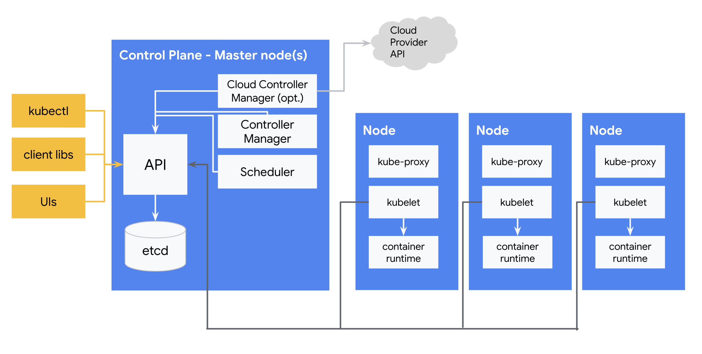
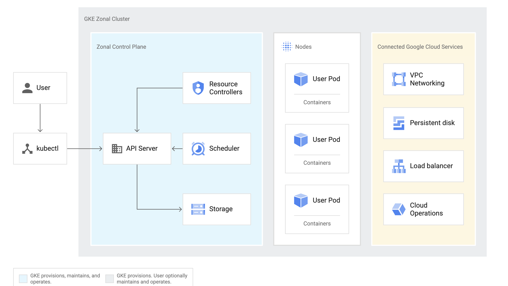

# Part B - Introducing KRM 

In part 1, we set up four [Google Kubernetes Engine (GKE)]() clusters. [GKE](https://cloud.google.com/kubernetes-engine/docs/concepts/kubernetes-engine-overview) is a cloud-hosted distribution of [Kubernetes](https://kubernetes.io/docs/concepts/overview/what-is-kubernetes/), which is an open-source container orchestration engine. Kubernetes is powerful for two big reasons. The first is that Kubernetes allows you to treat multiple host servers - or "Nodes" - as a single computer. This means that that Kubernetes will auto-schedule your containers to Nodes that have room for them. What this means is that clusters can have arbitrarily large numbers of nodes - [thousands of them](https://kubernetes.io/docs/setup/best-practices/cluster-large/) - supporting massive workloads [like machine learning](https://cloud.google.com/blog/products/containers-kubernetes/google-kubernetes-engine-clusters-can-have-up-to-15000-nodes).



The second reason Kubernetes is powerful is because of its **declarative API**. "Declarative" means that you "declare" your desired state in a file, apply it to a cluster, and Kubernetes takes care of the rest, deploying your resources and "making it so." Rather than running imperative, "verb" commands like "run this container," Kubernetes' declarative model has you write down your "nouns." *What* do you want deployed? How much? Any storage or networking resources to know about? And beyond just deploying those "nouns" one-and-done, Kubernetes is constantly **reconciling** your desired state with the live state of the cluster. This means that if a container crashes, Kubernetes knows, and will restart your workload for you. 

You might notice in the diagram above that all arrows point to the Kubernetes API Server - the API is the source of truth for Kubernetes, the "secret sauce." And it is this second point - the power of the always-reconciling, declarative Kubernetes API - that we will focus on for the rest of these demos. 

So what does that "desired" state look like? How do you get configuration into a Kubernetes cluster? With **KRM**. KRM stands for the [**Kubernetes Resource Model**](https://kubernetes.io/docs/concepts/overview/working-with-objects/kubernetes-objects/), a specific configuration structure that Kubernetes can read. KRM can be expressed as YAML or JSON, but more commonly you'll see YAML. 

KRM was created by the Kubernetes authors several years ago, and it was designed to work with that declarative reconciliation model. Each KRM resource is a noun that the Kubernetes control plane knows how to take action on. (If you're ever worked with a REST API with basic CRUD operations, this may sound familiar). Let's look at our first resource. 


### 1. **View the nginx deployment.** 

`nginx-deployment.yaml` contains a Deployment manifest ([source](https://kubernetes.io/docs/tasks/run-application/run-stateless-application-deployment/)). A [Deployment](https://kubernetes.io/docs/concepts/workloads/controllers/deployment/) is a core Kubernetes resource, and a common way to run containers in a cluster. 

View the file: 

```
cat nginx-deployment.yaml 
```

Expected output: 

```YAML
apiVersion: apps/v1
kind: Deployment
metadata:
  name: nginx-deployment
spec:
  selector:
    matchLabels:
      app: nginx
  replicas: 3
  template:
    metadata:
      labels:
        app: nginx
    spec:
      containers:
      - name: nginx
        image: nginx:1.14.2
        ports:
        - containerPort: 80
```

Here, we see the structured KRM format at work. All [Kubernetes objects](https://kubernetes.io/docs/concepts/overview/working-with-objects/kubernetes-objects/) have the following fields:
- `apiVersion` - the API + Version for this resource. Kubernetes has multiple APIs, each with their own version. [Here's the API reference](https://kubernetes.io/docs/reference/generated/kubernetes-api/v1.19/#deployment-v1-apps) for `apps/v1 - Deployment`.
- `kind` - the resource type within that API - here, it's a `Deployment`.
- `metadata` - information *about* the object - like labels, [annotations](https://kubernetes.io/docs/concepts/overview/working-with-objects/annotations/), name. When you create this resource in a cluster, Kubernetes will add its own metadata, including a unique ID, `UID`, for that specific object. 
- `spec` - the core set of fields that you, the user, populate about that resource. In a Deployment spec, for instance, you have to define the container `image` you want to use. Also notice how we'll deploy 3 `replicas` of the same container - this allows for basic scaling. A resource's `spec` is specific to that resource - the Deployment spec, for instance, is different from the [StatefulSet](https://kubernetes.io/docs/concepts/workloads/controllers/statefulset/#components) spec, even though both deploy containers.   

### 2. **Change your local Kubernetes context** to the `cymbal-dev` cluster and verify you can get its Nodes. Note - we'll use the `kubectx` command throughout these demos to easily switch our local terminal to "point to" the different GKE clusters.

```
kubectx cymbal-dev
kubectl get nodes 
```

Expected output: 

```
Switched to context "cymbal-dev".
NAME                                                STATUS   ROLES    AGE   VERSION
gke-cymbal-dev-cymbal-dev-node-pool-4839a130-5hj2   Ready    <none>   25h   v1.18.17-gke.100
gke-cymbal-dev-cymbal-dev-node-pool-4839a130-6jnw   Ready    <none>   25h   v1.18.17-gke.100
gke-cymbal-dev-cymbal-dev-node-pool-4839a130-b8fs   Ready    <none>   25h   v1.18.17-gke.100
gke-cymbal-dev-cymbal-dev-node-pool-4839a130-nbfv   Ready    <none>   25h   v1.18.17-gke.100
```

### 3. **Apply `nginx-deployment.yaml` to the cluster using kubectl**. 

[kubectl](https://kubernetes.io/docs/reference/kubectl/overview/) is a command-line interface between a user and a running Kubernetes API server. (All 4 of your GKE clusters have their own API servers.)  You'll see in the Kubernetes architecture diagram above that `kubectl` is only one way to interact with the Kubernetes API but's the method you'll see most often in demos. Here, the `kubectl apply` command is like a a REST `put` command - it will create the resource if it doesn't exist, or update it, if the resource already exists. 

```
kubectl apply -f nginx-deployment.yaml
```

Expected output: 

```
deployment.apps/nginx-deployment created
```

### 4. **View the running Pods** in the cymbal-dev cluster. 

[Pods](https://kubernetes.io/docs/concepts/workloads/pods/) are the smallest deployable unit in Kubernetes. Each Pod contains one or more running containers - in this case, each of the 3 nginx pods contain 1 nginx container. 

```
kubectl get pods 
```

Expected output: 

```
NAME                                READY   STATUS    RESTARTS   AGE
nginx-deployment-6b474476c4-2fbfc   1/1     Running   0          2m30s
nginx-deployment-6b474476c4-4txp6   1/1     Running   0          2m30s
nginx-deployment-6b474476c4-gqsql   1/1     Running   0          2m30s
```

### 5. **Delete one of the pods in your nginx Deployment.**.  

```
POD=$(kubectl get pod -l app=nginx -o jsonpath="{.items[0].metadata.name}")
kubectl delete $POD
```

Expected output: 

```
pod "nginx-deployment-6b474476c4-2fbfc" deleted
```

### **6. Run `kubectl get pods` again.** 

You should see that Kubernetes noticed that the actual state diverged from your desired state in `nginx-deployment.yaml`, and brought a new nginx Pod back online. Notice that it's a new Pod name, not the name of the Pod you deleted - this is because Kubernetes Deployment Pods are stateless and ephemeral (including their IP addresses). 

```
kubectl get pods 
```

Expected output: 

```
NAME                                READY   STATUS    RESTARTS   AGE
nginx-deployment-6b474476c4-44dq4   1/1     Running   0          2s
nginx-deployment-6b474476c4-knmkr   1/1     Running   0          3m45s
nginx-deployment-6b474476c4-q77jr   1/1     Running   0          3m45s
```

**So what actually happened** when we ran `kubectl apply`? `kubectl` abstracts what is actually a complex process of getting KRM from your local machine into a Kubernetes cluster.

For starters, it's helpful to understand what's inside a Kubernetes cluster - and now that we're working with GKE clusters, let's switch to the specific [GKE architecture](https://cloud.google.com/kubernetes-engine/docs/concepts/cluster-architecture), which you'll notice is very similar to the open-source Kubernetes diagram above. 



All Kubernetes components, and all outside actors - including you, executing `kubectl` commands - interact with the **APIServer**. As said before, the Kubernetes API Server (with its storage backend, **[etcd](https://kubernetes.io/docs/concepts/overview/components/#etcd)**) is the single source of truth for a cluster. This is where both the intended and actual state of each KRM resource lives. 

The **[Resource controllers](https://kubernetes.io/docs/concepts/architecture/controller/)** inside the GKE control plane are basically a set of loops that periodically check "what needs to be done." For instance, if the Deployment controller sees that you just applied a new Deployment to the cluster, it will update that resource as "to be scheduled - 3 pods". Then the **Scheduler**, also periodically checking the API Server, will schedule those 3 pods to the available **Nodes** in your cluster. Each Node runs a process called **kubelet**. The job of the kubelet is to start and stop containers, effectively doing the "last mile" of action to get the cluster's state match your desired state. The kubelet periodically queries the APIServer to see if it has any jobs to do - for instance, start or stop a container using its container runtime (eg. Docker, or in the case of GKE, [containerd](https://cloud.google.com/kubernetes-engine/docs/concepts/using-containerd)).

So when you ran `kubectl apply -f`, a series of events happened ([in-depth steps here](https://github.com/jamiehannaford/what-happens-when-k8s)): 
1. `kubectl` validated your Deployment file.
2. `kubectl` authenticated to the `cymbal-dev` Kubernetes APIServer.
3. The Kubernetes APIServer "admitted" the resource into the API. 
4. The Kubernetes APIServer stored the resource in `etcd`. 
5. The Kubernetes Controllers responsible for Deployments picked up on the new Deployment in their next loop, and marked 3 replicas as "Pending" / to be scheduled. 
6. The Kubernetes Scheduler sees the `Pending` Pods and finds suitable Nodes for the Pods to run on. (eg. checks if the Node has enough CPU/Memory to run that Pod.)
7. The `kubelet` on the assigned Nodes starts the 3 `nginx` containers. You can see which Nodes are running which Pods using the `-o wide` flag.  

```
kubectl get pods -o wide
```

Expected output: 

```
NAME                                READY   STATUS    RESTARTS   AGE   IP         NODE                                                NOMINATED NODE   READINESS GATES
nginx-deployment-6b474476c4-4txp6   1/1     Running   0          59m   10.8.4.3   gke-cymbal-dev-cymbal-dev-node-pool-4839a130-6jnw   <none>           <none>
nginx-deployment-6b474476c4-67hwc   1/1     Running   0          55m   10.8.2.6   gke-cymbal-dev-cymbal-dev-node-pool-4839a130-b8fs   <none>           <none>
nginx-deployment-6b474476c4-gqsql   1/1     Running   0          59m   10.8.3.3   gke-cymbal-dev-cymbal-dev-node-pool-4839a130-5hj2   <none>           <none>
```

Here we can see that the Kubernetes scheduler spread out the 3 nginx pods across 3 out of the 4 Nodes in the `cymbal-dev` cluster. 

The key thing to take away from this section is that the Kubernetes APIServer, with its etcd backing store, is the single source of truth for all "nouns" - KRM objects - in the cluster. What this means is that the `nginx-deployment.yaml` file you applied to the cluster actually gets added to by the Kubernetes control plane, with info about its live state. 

### 7. **Get your deployment from the APIServer using `kubectl`**. 

```
kubectl get deployment nginx-deployment -o yaml 
```

Expected output (abbreviated): 

```YAML 
apiVersion: apps/v1
kind: Deployment
metadata:
  annotations:
    deployment.kubernetes.io/revision: "1"
    kubectl.kubernetes.io/last-applied-configuration: |
      {"apiVersion":"apps/v1","kind":"Deployment","metadata":{"annotations":{},"name":"nginx-deployment","namespace":"default"},"spec":{"replicas":3,"selector":{"matchLabels":{"app":"nginx"}},"template":{"metadata":{"labels":{"app":"nginx"}},"spec":{"containers":[{"image":"nginx:1.14.2","name":"nginx","ports":[{"containerPort":80}]}]}}}}
  creationTimestamp: "2021-04-09T17:20:01Z"
  generation: 1
  managedFields:
...
status:
  availableReplicas: 3
  conditions:
  - lastTransitionTime: "2021-04-09T17:20:03Z"
    lastUpdateTime: "2021-04-09T17:20:13Z"
    message: ReplicaSet "nginx-deployment-6b474476c4" has successfully progressed.
    reason: NewReplicaSetAvailable
    status: "True"
    type: Progressing
 ....
```

You'll notice that this YAML file is much longer than the one you defined in `nginx-deployment.yaml`. This is because the Kubernetes control plane has added some fields - including new metadata like `creationTimestamp`, plus a field called `status`. This represents the live state of your Deployment, along with a log of actions Kubernetes took to get your Pods online. 

In this way, a KRM file is a complete record of not only your desired state, but the live state of the resource, along with a log (`conditions`) of what happened to the resource in the past. 

###  8. Clean up by deleting the nginx-deployment from the cluster. 

```
kubectl delete -f nginx-deployment.yaml 
```

Now that we've learned the basics of KRM and how to interact with a Kubernetes cluster, let's explore a larger sample application. 

### **[Continue to Part C - Introducing the Cymbal Bank app](partC-cymbal-bank.md)**. 
