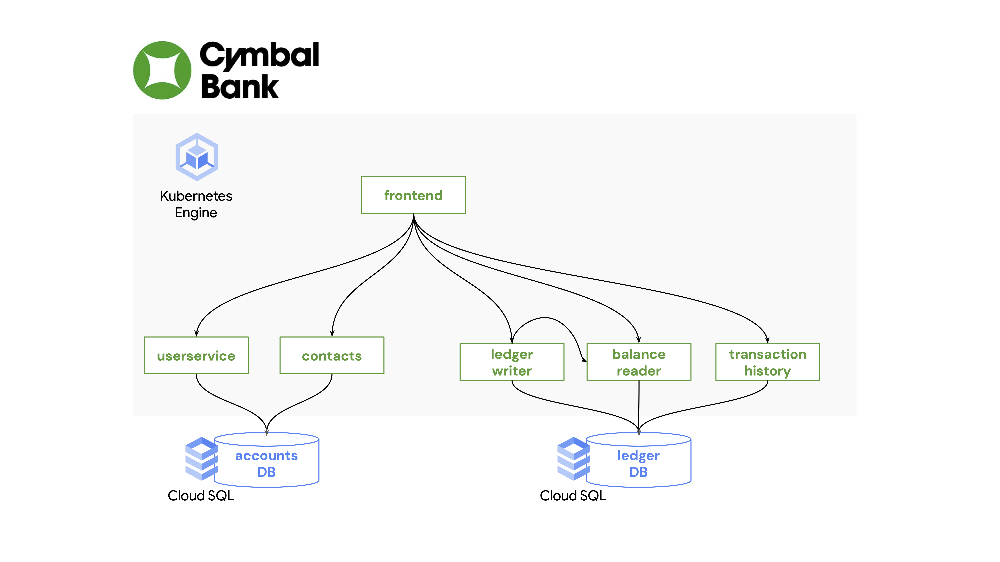

# Part C - Introducing the Cymbal Bank App 

[Cymbal Bank](https://github.com/GoogleCloudPlatform/bank-of-anthos) is a sample application, written in Python and Java, that simulates a retail bank's website. The app allows users to create accounts, send money to their contacts, and make deposits. The application backends store data in two PostgreSQL databases, both running in Google Cloud SQL.  



Each Cymbal Bank service represents one Kubernetes workload. Like the nginx Deployment we saw in Part A, each Cymbal Bank service has its own Deployment, which runs its respective application server as a cntainer. Let's explore the KRM resources for the app. 

### 1. **Copy the Kubernetes manifests** for Cymbal Bank into the `cymbalbank-app-config/` repo, which you cloned during setup.

```
cp -r app-manifests/* cymbalbank-app-config/
```

### 2. **Explore the cymbalbank-app-config repo.** 

Unlike the nginx example where we used `kubectl` to directly apply a Deployment to a cluster, we'll instead use a tool called [kustomize](https://kubectl.docs.kubernetes.io/guides/introduction/kustomize/) to deploy the Cymbal Bank app. kustomize allows you to "customize" KRM to suit different environments, and makes it easier to interact with larger groups of KRM. Kustomize is now built directly into kubectl, meaning you can run kustomize commands with `kubectl apply -k`. 

View the structure of the config repo using `tree`: 

```
tree cymbalbank-app-config/
```

Expected output: 

```
cymbalbank-app-config/
├── README.md
├── base
│   ├── balancereader.yaml
│   ├── contacts.yaml
│   ├── frontend.yaml
│   ├── kustomization.yaml
│   ├── ledgerwriter.yaml
│   ├── loadgenerator.yaml
│   ├── populate-accounts-db.yaml
│   ├── populate-ledger-db.yaml
│   ├── transactionhistory.yaml
│   └── userservice.yaml
└── overlays
    ├── dev
    │   ├── balancereader.yaml
    │   ├── contacts.yaml
    │   ├── frontend.yaml
    │   ├── kustomization.yaml
    │   ├── ledgerwriter.yaml
    │   ├── loadgenerator.yaml
    │   ├── transactionhistory.yaml
    │   └── userservice.yaml
    └── prod
        ├── balancereader.yaml
        ├── contacts.yaml
        ├── frontend.yaml
        ├── kustomization.yaml
        ├── ledgerwriter.yaml
        ├── loadgenerator.yaml
        ├── transactionhistory.yaml
        └── userservice.yaml

4 directories, 27 files
```

Here, we can see that there's a `base` directory, with YAML files for each Cymbal Bank service, plus two `overlay` directories, `dev` and `prod`, each with their own YAML file per Cymbal Bank service. What's going on here? 

### 3. **Explore the Cymbal Bank kustomize overlays.** 

kustomize allows for pre-baked "flavors" of a set of Kubernetes manifests, called [overlays](https://kubectl.docs.kubernetes.io/guides/config_management/components/). Overlays help reduce manual editing of YAML files, while allowing multiple flavors to use the same source YAML. The README in the `cymbalbank-app-config` root directory details the differences between the demo, prod, and dev overlays. Notice that different fields get different values depending on the environment - for instance, we may want more frontend replicas in production to serve real production traffic. 


|      | 🔎 **Tracing** | 📊 **Metrics** | 📝 **Log Level** | 🏦 **Frontend Replicas** |
|------|---------|---------|-----------|---------------------|
| 💻 **Dev**  | off     | off     | `debug`   | 1                   |
| 🚀 **Prod** | on      | on      | `info`    | 3                   |


### 4. **Both overlays rely on the same base manifests for each Cymbal Bank service. For instance, view the `userservice` base manifests:** 

```
cat cymbalbank-app-config/base/contacts.yaml
```

Expected output: 

```
apiVersion: apps/v1
kind: Deployment
metadata:
  name: contacts
  namespace: contacts
spec:
  selector:
    matchLabels:
      app: contacts
  template:
    metadata:
      labels:
        app: contacts
        org: cymbal-bank
    spec:
      serviceAccountName: cymbal-ksa
      terminationGracePeriodSeconds: 5
      containers:
      - name: contacts
        image: contacts
...
```

Notice that this file contains multiple Kubernetes resources, separated with the `---` delimiter, including a Deployment, Service, Secret, and ConfigMaps. All of these represent the Kubernetes resources needed for the contacts service to run: 

- **[Deployment](https://kubernetes.io/docs/concepts/workloads/controllers/deployment/)** - we've seen this one before. Deployment spawn Pods, which run Containers. In this case, the contacts deployment will run the pre-built `contacts` service container. This container hosts a backend server for multiple API endpoints related to a Cymbal Bank customer's contacts, allowing them to send money. Notice that the contacts Deployment also defines a second container, `cloudsql-proxy`, which allows the contacts container to seamlessly connect to Google Cloud SQL in order to access the accounts database. Often when a second "helper" container runs alongside the main container, this is called a "sidecar container." 
- **[Service](https://kubernetes.io/docs/concepts/services-networking/service/)** - The core networking resource in Kubernetes. Allows the contacts deployment to be routable inside and/or outside the cluster. In this case, the Service's type, [`ClusterIP`](https://kubernetes.io/docs/concepts/services-networking/service/#publishing-services-service-types), means that the `contacts` Deployment will only be routable inside the cluster, with the domain name `contacts.default.svc.cluster.local`. 
- **[Secret](https://kubernetes.io/docs/concepts/configuration/secret/)** - a sensitive piece of information that allows you to mount things like passwords (or in this case, a JWT public key) into a Pod, without hardcoding its value into the Deployment YAML for all eyes to see.  
- **[ConfigMaps](https://kubernetes.io/docs/concepts/configuration/configmap/)**- contain configuration that can be mounted into a workload - in this case, mounted into the Deployment. Here, we define config for where the accounts database lives- in this case, localhost or `127.0.0.1`, since we're actually talking to the cloud SQL sidecar container in the same Pod. [Containers in the same pod share](https://cloud.google.com/kubernetes-engine/docs/concepts/network-overview#pods) a Linux networking namespace, therefore we list the Cloud SQL proxy endpoint as `127.0.0.1`. 

This baseline config for `contacts` is then extended in the overlays using "patches." Think of a patch as incomplete KRM - a YAML resource with only the fields specified that you want to override, over the base. 


### **5. View the contacts service patch for the dev overlay:** 

```
cat cymbalbank-app-config/overlays/dev/contacts.yaml 
```

Expected output: 

```
apiVersion: apps/v1
kind: Deployment
metadata:
  name: contacts
  namespace: contacts
spec:
  selector:
    matchLabels:
      app: contacts
  template: 
    spec: 
      containers:
      - name: contacts
        env:
        - name: ENABLE_TRACING
          value: "false"
        - name: ENABLE_METRICS
          value: "false"
        - name: LOG_LEVEL
          value: "debug"
```

Notice that we don't specify the `image` field here - that's already covered by the `base` contacts service Deployment. 

When kustomize is invoked to apply the full set of resources to the cluster, kustomize will combine the base contacts Deployment with the overlay patch above, resulting in one fully-rendered Deployment that it will then apply to the cluster. 

### 6. **Explore the kustomization.yaml for the dev overlay**. 

The last thing to know about kustomize, for now, is that each kustomize directory needs a [`kustomization.yaml` file](https://kubectl.docs.kubernetes.io/references/kustomize/glossary/#kustomization). This provides the config for kustomize itself, telling it where your config lives and how to merge together your base and overlays. Think of this file as a "captain's manifest" for what's inside that directory. 

View the kustomization.yaml file for the dev overlay: 

```
cat cymbalbank-app-config/overlays/dev/kustomization.yaml 
```

Expected output: 

```
apiVersion: kustomize.config.k8s.io/v1beta1
kind: Kustomization
bases:
- ../../base
patchesStrategicMerge:
- balancereader.yaml
- contacts.yaml
- ledgerwriter.yaml
- loadgenerator.yaml
- transactionhistory.yaml
- userservice.yaml
- frontend.yaml
commonLabels:
  environment: dev
```

Here, we define where our base config lives, the set of patches we want to apply over the base, and any "common labels" we want to apply to all the resources we're patching.  

Now, instead of manually deploying the resources to a cluster like we did for `nginx-deployment`, let's set up a Continuous Deployment pipeline to deploy the resources automatically.  

**[Continue to Part D - Deploying Cymbal Bank with Cloud Build](partD-cloud-build-cd.md)**.
