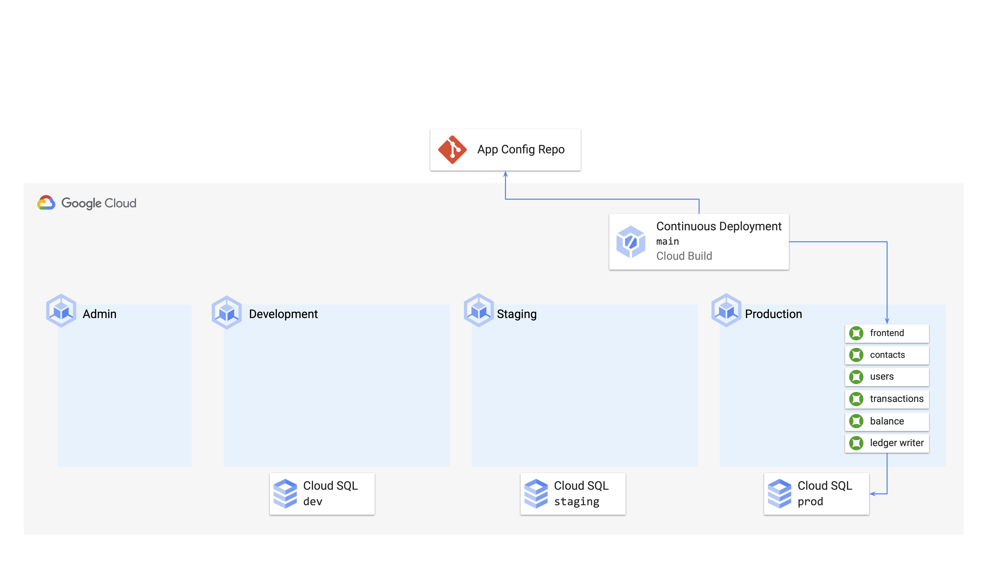
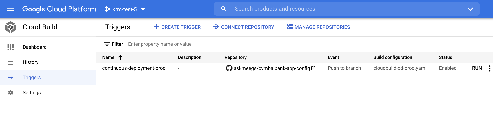
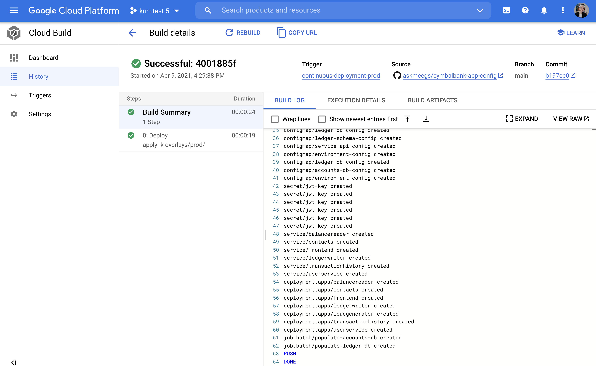
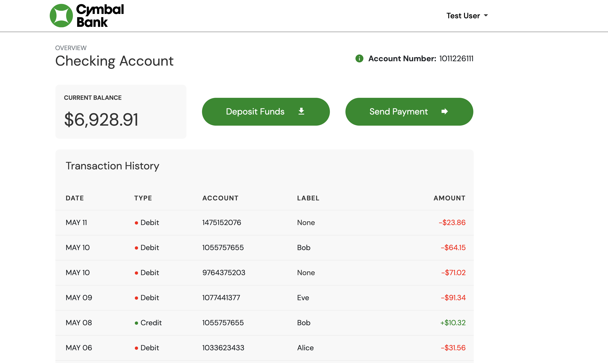

# Part D - Deploying Cymbal Bank with Cloud Build



[**GitOps**](https://www.weave.works/technologies/gitops/) is an idea introduced by [WeaveWorks](https://www.weave.works/), which represents an operating model for Kubernetes where you put your Kubernetes configuration in Git, then allow software - like CI/CD tools - to deploy it. In this way, the only human interactions with the system are pull requests to the Git repo. These pull requests can be reviewed, approved, and audited - rather than imperative commands like `kubectl apply -f`, which are difficult to keep track of and may result in unwanted KRM landing in a Kubernetes cluster. The key benefit of GitOps is that there is always one source of truth for what the desired Kubernetes state should be. 

Let's implement a GitOps-style continuous deployment pipeline for CymbalBank using [Google Cloud Build](https://cloud.google.com/build/docs/overview). Cloud Build is a tool that executes custom build steps on Google Cloud's infrastructure. 

### 1. **View the continuous deployment pipeline**. This file has been provided for you, and defines a Cloud Build pipeline that runs the `kubectl apply -k` command described above, effectively deploying the demo overlay in the `cymbalbank-app-config` repo to the `cymbal-prod` cluster. 

```bash
cat cymbalbank-app-config/cloudbuild-cd-prod.yaml 
```

Expected output: 

```YAML
steps:
- name: 'gcr.io/cloud-builders/kubectl'
  id: Deploy
  args:
  - 'apply'
  - '-k'
  - 'overlays/prod/'
  env:
  - 'CLOUDSDK_COMPUTE_ZONE=us-west1-a'
  - 'CLOUDSDK_CONTAINER_CLUSTER=cymbal-prod'
```

A quick note about the deployment pipeline used in this demo - it's provided just as a basic example of Continuous Deployment using files in a Github repo. In a real production environment, you'd likely want to set up a more progressive deployment pipeline, using something like a [Rolling Update](https://kubernetes.io/docs/tutorials/kubernetes-basics/update/update-intro/) or a [Canary Deployment](https://www.istiobyexample.dev/canary), to safeguard against downtime or potential outages. 


### 2. **Set up Cloud Build authentication to Github**. 

This allows Cloud Build to watch the Github repositories in your account.  

- [Open Cloud Build](https://console.cloud.google.com/cloud-build) in the Google Cloud Console. 
- Ensure that in the top menubar drop-down, your demo project is correctly selected. 
- On the left sidebar, click **Triggers.**  
- Click **Connect Repository.** 
- In the menu that pops up on the right, for `Select Source`, choose Github. Authenticate to your Github account, then under repositories, search `cymbal`. 
- Check **all 3 cymbal-bank repositories** -- `cymbalbank-app-source`, `cymbalbank-app-config`, and `cymbalbank-policy`. We'll create Cloud Build triggers for all 3 repos over the course of the demos. 
- Click **Connect.** 
- Click **Done**. 

### 3. **Create a Cloud Build trigger for cymbalbank-app-config**. 

- In the Triggers menu, click **Create Trigger.** 
- Name it `continuous-deployment-prod`
- Under **Event**, choose `Push to a branch`
- Under **Source**, choose your `cymbalbank-app-config` repo. 
- Enter `main` next to **Branch**. This means that the build will run with every push the `main` branch of this repo. 
- Under **Configuration**, click `Cloud Build configuration file`, `Repository`, and enter `cloudbuild-cd-prod.yaml` next to file location. 
- Click **Create.** 

You should now see the trigger appear in the Cloud Build menu. **Note** - the repository should correspond to `your-github-username/cymbalbank-app-config`, not `askmeegs` as shown below. 




### 4. **Trigger the build by pushing the manifests to your config repo.** 

```bash
cd cymbalbank-app-config/
git add .
git commit -m "Initialize app config repo"
git push origin main
cd .. 
```

Expected output: 

```bash
Writing objects: 100% (37/37), 16.46 KiB | 3.29 MiB/s, done.
Total 37 (delta 25), reused 0 (delta 0), pack-reused 0
remote: Resolving deltas: 100% (25/25), done.
To https://github.com/askmeegs/cymbalbank-app-config
 * [new branch]      main -> main
```

### 5. **Navigate back to Cloud Build and in the left sidebar, click History.** 

Watch the Cloud Build logs as the Continuous Deployment pipeline runs, using `kubectl apply -k` to apply the demo overlay and deploy to the `cymbal-prod` cluster: 





### 6. **Return to your terminal and get the pods in the `cymbal-prod` cluster**: 

```bash
kubectx cymbal-prod
kubectl get pods --all-namespaces --selector=org=cymbal-bank
```

Expected output: 

```bash
NAMESPACE            NAME                                  READY   STATUS    RESTARTS   AGE
balancereader        balancereader-7bd58bcd4f-q9kpj        2/2     Running   1          5m53s
contacts             contacts-7694bb5cb6-2tl8r             2/2     Running   0          5m53s
frontend             frontend-78dcb46b5c-9bmz4             1/1     Running   0          5m53s
frontend             frontend-78dcb46b5c-l84j9             1/1     Running   0          5m53s
frontend             frontend-78dcb46b5c-vv6sd             1/1     Running   0          5m53s
ledgerwriter         ledgerwriter-7959866b4f-5qbjr         2/2     Running   0          5m53s
loadgenerator        loadgenerator-6d66d47f98-fltss        1/1     Running   0          5m52s
transactionhistory   transactionhistory-6c5f59b66c-n4cbf   2/2     Running   0          5m52s
userservice          userservice-5b4b8c8c59-hgnqs          2/2     Running   0          5m52s
```

Notice how there are 3 frontend `replicas`, as defined in the `prod` kustomize overlay. 

You can also run `kubectl get` on the other resource types just deployed, including Services: 

```bash
kubectl get services  --all-namespaces --selector=org=cymbal-bank
```

Expected output: 

```bash
NAMESPACE            NAME                 TYPE           CLUSTER-IP     EXTERNAL-IP   PORT(S)        AGE
balancereader        balancereader        ClusterIP      10.7.252.14    <none>        8080/TCP       3m44s
contacts             contacts             ClusterIP      10.7.241.192   <none>        8080/TCP       3m44s
frontend             frontend             LoadBalancer   10.7.241.130   36.101.109.3  80:31541/TCP   3m44s
ledgerwriter         ledgerwriter         ClusterIP      10.7.244.168   <none>        8080/TCP       3m44s
transactionhistory   transactionhistory   ClusterIP      10.7.249.66    <none>        8080/TCP       3m43s
userservice          userservice          ClusterIP      10.7.249.254   <none>        8080/TCP       3m43s
```

Notice how each service uses `ClusterIP` (enable in-cluster routing only) except for the `frontend`, which is of type `LoadBalancer`. This type means that GCP spawned an external load balancer to route from outside the cluster, into the frontend pod. Navigate to your frontend service `EXTERNAL_IP` in a browser - you should see the CymbalBank login screen, and you should be able to log in with the pre-populated `testuser` credentials and see the Cymbal Bank account home page. 



🥳 **Well done! You've completed Demo 2 - How KRM Works.** 

The next demo will guide you through a Cymbal Bank app developer's journey, getting code into production in our Kubernetes environment. 

### If you're ready, **[Continue to Part 3](/3-app-dev/)**.


## Learn More 

- [Kubernetes doc - What is Kubernetes?](https://kubernetes.io/docs/concepts/overview/what-is-kubernetes/)
- [Kubernetes docs - working with Kubernetes objects](https://kubernetes.io/docs/concepts/overview/working-with-objects/kubernetes-objects/)
- [Github - Kubernetes - the Kubernetes Resource Model](https://github.com/kubernetes/community/blob/master/contributors/design-proposals/architecture/resource-management.md)
- [Kubernetes docs - kubectl](https://kubernetes.io/docs/reference/kubectl/overview/)
- [Github - jamiehannaford - what-happens-when-k8s](https://github.com/jamiehannaford/what-happens-when-k8s)
- [Google Cloud - GKE Cluster Architecture](https://cloud.google.com/kubernetes-engine/docs/concepts/cluster-architecture#control_plane)
- [Kubernetes Docs - Architecture - Controllers](https://kubernetes.io/docs/concepts/architecture/controller/)
- [Kustomize docs - Introduction](https://kubectl.docs.kubernetes.io/guides/introduction/kustomize/)
- [WeaveWorks Guide to GitOps](https://www.weave.works/technologies/gitops/)
- [Google Cloud Build - Deploying to GKE](https://cloud.google.com/build/docs/deploying-builds/deploy-gke)
