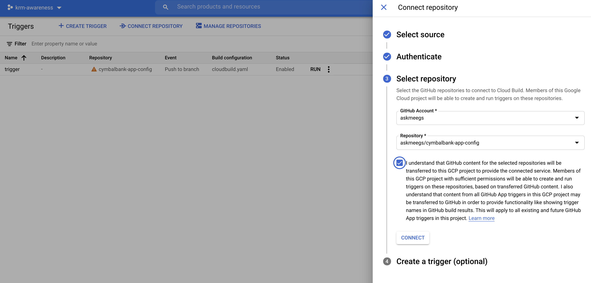

# Setup 

This directory contains Terraform and Cloud Build resources to set up a basic GKE cluster with the CymbalBank app's KRM resources deployed to it. 

Note: This setup process will also create a Github repository in your account, and you will push the CymbalBank 


### Prerequisites 

1. A Google Cloud project 
2. A Github account (you will be creating 3 new repositories overall). 
3. The following tools installed in your local environment: 
- git
- [gcloud](https://cloud.google.com/sdk/docs/install)
- [kubectl](https://cloud.google.com/sdk/gcloud/reference/components/install) - you can install this via gcloud: `gcloud components install kubectl`
- [terraform](https://learn.hashicorp.com/tutorials/terraform/install-cli) 

4. A Github Personal Access token that Terraform can use to create a Github repo on your behalf. See instructions [here](https://docs.github.com/en/github/authenticating-to-github/creating-a-personal-access-token). 

### How to use 

1. Create a Google Cloud project or get the ID of an existing project you can create resources in. 

2. Clone this repo. 

```
git clone https://github.com/askmeegs/intro-to-krm
cd intro-to-krm/2-setup/ 
```

3. Set variables. 

```
export PROJECT_ID="<your-project-id>" 
export GITHUB_USERNAME="<your-github-username>" 
```

4. Enable Google Cloud APIs.  

```
gcloud config set project ${PROJECT_ID}
gcloud services enable container.googleapis.com cloudbuild.googleapis.com
```

5. Replace the values in `terraform.tfvars` with the values corresponding to your project. You can pick any GCP region / zone. 

```
project_id = "<your-project-id>"
project_number = "<your-project-number>"
region     = "us-central1"
zone = "us-central1-b"
github_token = "<your-token>"
```

**Note**: if you choose a different zone from `us-central1-b`, you have to change the cluster zone in `cloudbuild.yaml`. 

6. Run `terraform init`. This downloads the providers (Github, Google Cloud) needed for setup. On success, you should see: 

```
Terraform has been successfully initialized!
```

7. Set up application default credentials for your project - this allows Terraform to create GCP resources on your behalf. 

```
gcloud auth application-default login
```

8. Run `terraform plan`. This looks at the `.tf` files in the directory and tells you what it will deploy to your Google Cloud project. 

```
Plan: 7 to add, 0 to change, 0 to destroy.

Changes to Outputs:
  + kubernetes_cluster_host = (known after apply)
  + kubernetes_cluster_name = "cymbal-test-1"
  + project_id              = "krm-awareness"
  + region                  = "us-central1"
```

9. Run `terraform apply`. It will take a few minutes for Terraform to set up the cluster and the Cloud Build pipeline. When the command completes, you should see something similar to this: 

```
Apply complete! Resources: 7 added, 0 changed, 0 destroyed.

Outputs:

kubernetes_cluster_host = "<IP>"
kubernetes_cluster_name = "cymbal-test-1"
project_id = "your-project-id"
region = "us-central1"
```


10. Connect to your newly-created GKE cluster. 

```
gcloud container clusters get-credentials cymbal-test-1 --zone us-central1-b --project ${PROJECT_ID}
```

11. Now we're ready to deploy the CymbalBank app to this cluster via Cloud Build. To do this, we have to authenticate Cloud Build to Github. Navigate to the Cloud Build console and click "Connect Repository" in the top menubar. Follow the steps to allow Cloud Build to authenticate - select the `cymbalbank-app-config` repo. Skip the `Create Trigger` step; this was already completed by Terraform. 



12. Clone your newly-created CymbalBank app config repo, copy the manifests and push to the `main` branch. This will trigger the Cloud Build pipeline created by Terraform in the previous step. 

```
git clone "https://github.com/${GITHUB_USERNAME}/cymbalbank-app-config"
cd cymbalbank-app-config; mkdir manifests/; 
cp -r ../app-manifests/ manifests/ 
cp ../cloudbuild.yaml .
git add .; git commit -m "Initialize repo"; git push origin main;   
```

13. Navigate to Cloud Build in the Google Cloud Console to view the build status. You should see a success message once Cloud Build deploys your repo's app manifests.


14. Verify that the CymbalBank app has been deployed to your cluster. 

```
$ kubectl get pods 

NAME                                  READY   STATUS    RESTARTS   AGE
accounts-db-0                         1/1     Running   0          2m30s
balancereader-5f57666b9c-6qg44        1/1     Running   0          2m30s
contacts-848bbff9bd-96s4z             1/1     Running   0          2m30s
frontend-565f986f97-cfn5v             1/1     Running   0          2m29s
ledger-db-0                           1/1     Running   0          2m29s
ledgerwriter-7d88d5898c-bl8tq         1/1     Running   0          2m28s
loadgenerator-797dfd6c5c-9rkqj        1/1     Running   0          2m28s
transactionhistory-84cf479f65-7t2b8   1/1     Running   0          2m28s
userservice-7c9bc855f5-p898j          1/1     Running   0          2m28s
```

You can visit the CymbalBank frontend by getting the frontend Service's load balancer IP, and navigating to that IP in a web browser. 

```
$ kubectl get svc frontend

NAME       TYPE           CLUSTER-IP       EXTERNAL-IP   PORT(S)        AGE
frontend   LoadBalancer   10.155.254.143   <YOUR_EXTERNAL_IP>     80:31521/TCP   93s
```

🎊 Congrats! You just deployed KRM to a Google Kubernetes Engine cluster via CI/CD.  