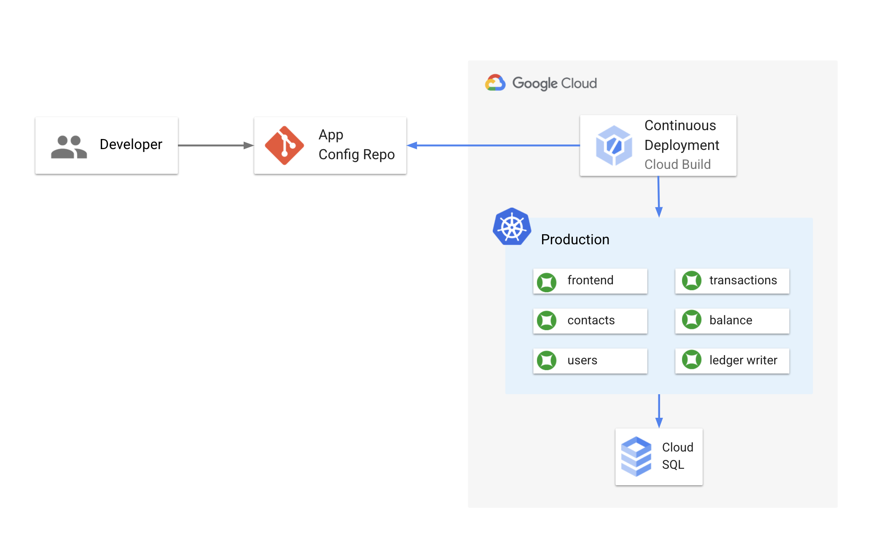

# 2 - Setup 

This directory contains Terraform and Cloud Build resources to set up a basic GKE cluster with the CymbalBank app's KRM resources deployed to it. 

Note: This setup process will also create a Github repository in your account, and you will push the CymbalBank manifests to that repo.



## Prerequisites 

1. A Google Cloud project 
2. A Github account (you will be creating 3 new repositories overall). 
3. The following tools installed in your local environment: 
- git
- [gcloud](https://cloud.google.com/sdk/docs/install)
- [kubectl](https://cloud.google.com/sdk/gcloud/reference/components/install) - you can install this via gcloud: `gcloud components install kubectl`
- [kubectx](https://github.com/ahmetb/kubectx#installation)
- [terraform](https://learn.hashicorp.com/tutorials/terraform/install-cli) 

4. A Github Personal Access token that Terraform can use to create a Github repo on your behalf. See instructions [here](https://docs.github.com/en/github/authenticating-to-github/creating-a-personal-access-token). 

## Steps 

1. **Create a Google Cloud project** or get the ID of an existing project.

1. **Clone this repo.**

```
git clone https://github.com/askmeegs/intro-to-krm
cd intro-to-krm/2-setup/ 
```

1. **Set vars**. 

```
export PROJECT_ID="<your-project-id>" 
export GITHUB_USERNAME="<your-github-username>"
```

2. **Enable Google Cloud APIs.**  

```
gcloud config set project ${PROJECT_ID}
gcloud services enable container.googleapis.com cloudbuild.googleapis.com sqladmin.googleapis.com

```

1. **Replace the values in `terraform.tfvars`** with the values corresponding to your project. 

```
project_id = ""
project_number = ""
github_username = ""
github_token = ""
```

1. **Set up application default credentials** for your project - this allows Terraform to create GCP resources on your behalf. 

```
gcloud auth application-default login
```

1. **Run `terraform init`.** This downloads the providers (Github, Google Cloud) needed for setup. On success, you should see: 

```
Terraform has been successfully initialized!
```

1. **Run `terraform plan`.** This looks at the `.tf` files in the directory and tells you what it will deploy to your Google Cloud project. 

```
Plan: 7 to add, 0 to change, 0 to destroy.

Changes to Outputs:
  + kubernetes_cluster_host = (known after apply)
  + kubernetes_cluster_name = "cymbal-test-1"
  + project_id              = "krm-awareness"
  + region                  = "us-central1"
```

1. **Run `terraform apply`.** It will take a few minutes for Terraform to set up the cluster and the Cloud Build pipeline. When the command completes, you should see something similar to this: 

```
Apply complete! Resources: 7 added, 0 changed, 0 destroyed.

Outputs:

kubernetes_cluster_host = "<IP>"
kubernetes_cluster_name = "cymbal-test-1"
project_id = "your-project-id"
region = "us-central1"
```


1. **Run the cluster setup script.** This sets up kubernetes contexts, boostraps app namespaces, a

```
./cluster-setup.sh
```

1. Verify that you can now access your different clusters as follows: 

```
kubectx cymbal-prod 
kubectl get nodes
```

1. **Set up your app source repo**. 

```
./repo-setup.sh 
```