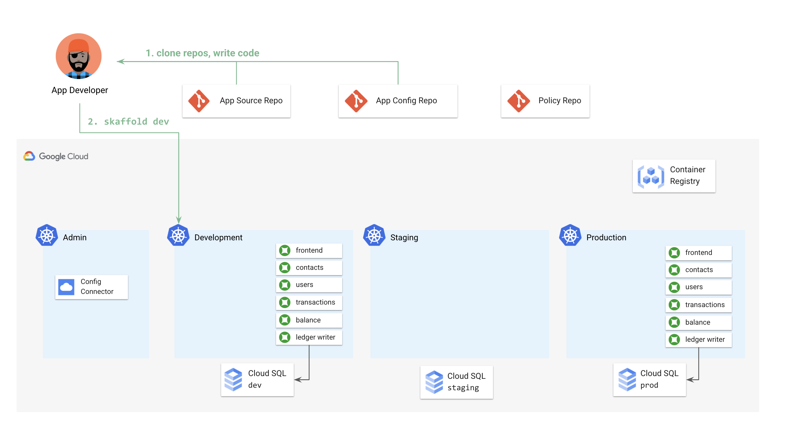
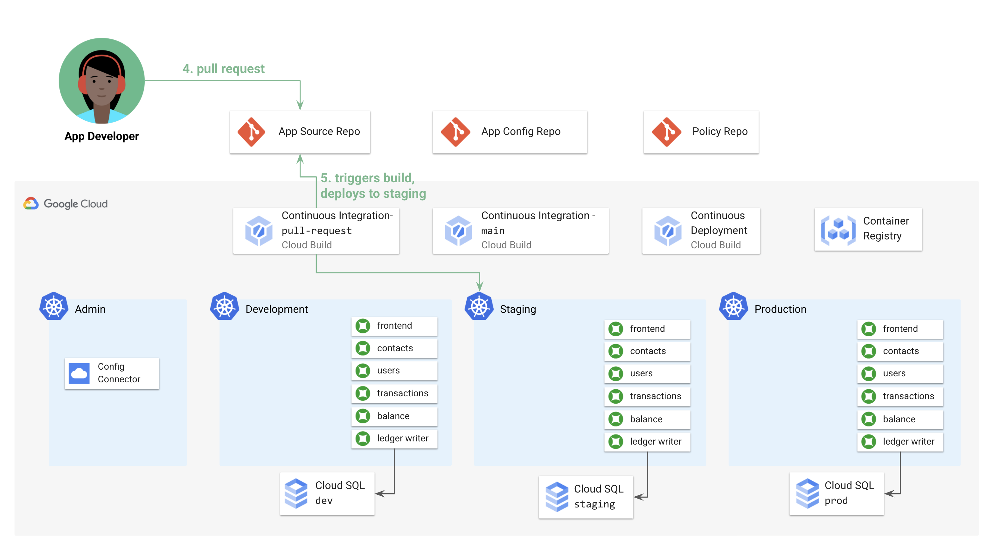
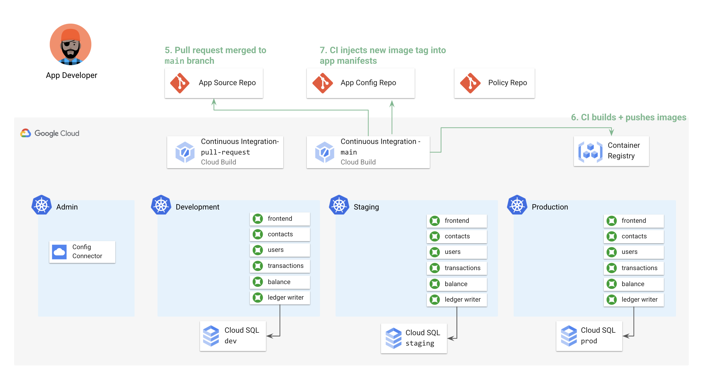
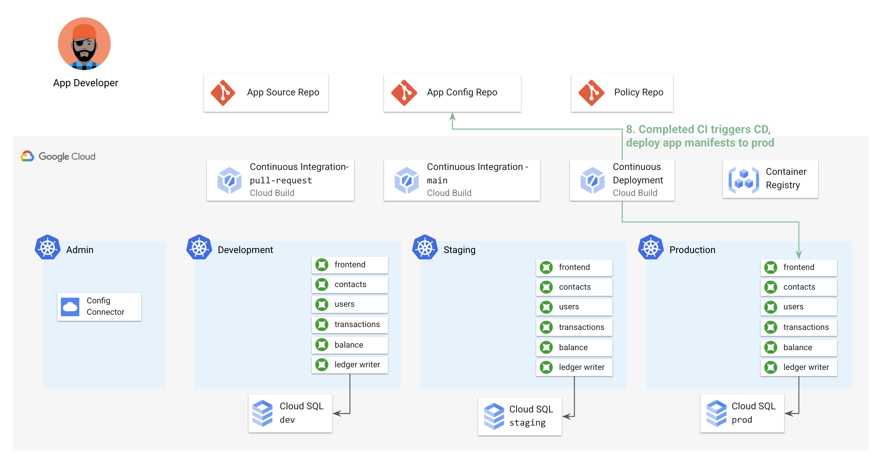

# 3 - App Development with KRM   

This demo shows an example App Developer workflow in a KRM environment, using the `skaffold` and `kustomize` tools to build app features without writing any new YAML files. 

In this scenario, Alice is an app developer

### Prerequisites 

Complete demo [parts 1](/1-setup) and [2](/2-how-krm-works). 

### Part A - Setup  

1. **Set variables.**

```
export PROJECT_ID=<your-project-id>
export GITHUB_USERNAME=<your-github-username>
```

1. **Clone and initialize the app source repo** by copying the upstream [Bank of Anthos](https://github.com/googlecloudplatform/bank-of-anthos) sample app source code into your app-source-repo. 

```
git clone "https://github.com/${GITHUB_USERNAME}/cymbalbank-app-source"
git clone "https://github.com/GoogleCloudPlatform/bank-of-anthos"
cp -r bank-of-anthos/* cymbalbank-app-source/ 
rm -rf bank-of-anthos 
```

1. **Clone the app config repo** inside the app source repo, as a Git submodule. The reason for doing this is so that `skaffold`, the tool that builds the Docker images, needs YAML files. Note that the app developer won't commit directly to the app config repo - this is only writeable from the automated CI. 

```
cd cymbalbank-app-source 
git clone "https://github.com/${GITHUB_USERNAME}/cymbalbank-app-config"
cd ..
```

1. **View the Cloud Build pipelines** 


1. **Copy the Cloud Build pipelines into the source repo.** 

```
cp cloudbuild-ci-pr.yaml cymbalbank-app-source/
cp cloudbuild-ci-main.yaml cymbalbank-app-source/
```

1. **Push the Cloud Build pipelines to the main branch** of your app source repo. 

```
cd cymbalbank-app-source/ 
git add .
git commit -m "Add cloudbuild.yaml"
git push origin main 
```

### Part B - Build + Test a Feature



1. **Check out a new local branch**, to prepare to update the frontend source code. 

```
git checkout -b frontend-banner 
```

1. **Update the frontend source code** by adding a banner to the login page advertising a new interest rate on all checking accounts. In an IDE, open `cymbalbank-app-source/src/frontend/templates/login.html`. Under line , add the following code: 

```

```

1. **Get ready to test those code changes** in the dev GKE cluster. We'll use a tool called [skaffold](https://skaffold.dev) to build Docker images and deploy to the dev GKE cluster. Install skaffold to your local environment by [following the steps here](https://skaffold.dev/docs/install/). 

1. **Copy the provided `skaffold.yaml`** config file into your app source repo. 

```
cp skaffold.yaml cymbalbank-app-source/
```

1. **View the `skaffold.yaml` file**. Note how Skaffold uses KRM to define its own API - meaning, you're using KRM to deploy KRM! 

```

```

1. Run `skaffold dev` to build and deploy your code changes to the dev cluster. 

```
kubectx cymbal-dev
skaffold dev --profile=dev --default-repo=gcr.io/${PROJECT_ID}/cymbal-bank --tail=false 
```

1. View your newly-built pods. 


1. View the new frontend banner by navigating to the frontend UI. 

### Part C - Pull Request --> Staging


 
1. Push the code to the new branch, and put out a pull request in the app source repo. 

```
cd cymbalbank-app-source/ 
git checkout main
git add .
git commit -m "Initialize app source repo"
git push origin main 
cd ..
```

1. Watch Cloud Build - CI - PR. 


1. Switch to the staging cluster and view the frontend banner in staging. 

1. Merge the PR. Watch Cloud Build - CI - Main. 

### Part D - Main CI 



1. Merge the PR. Watch Cloud Build - CI - Main. 


#### Part E - CD 



1. Watch Cloud Build - CD - Prod. 


1. View the new frontend banner running in production. 
