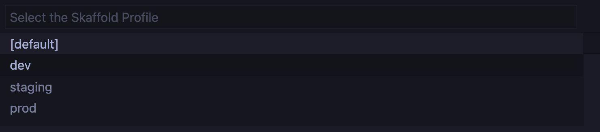
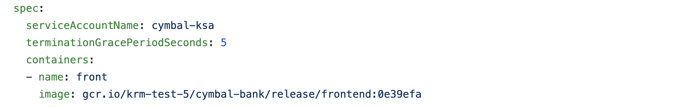

# 3 - App Development with KRM   

This demo shows how an app developer can develop features in a Kubernetes environment using GKE, Cloud Code, skaffold, and kustomize, without having to create or edit any KRM (YAML). This demo also shows a CI/CD pipeline, using Cloud Build, that shows how features get from development to production in a Kubernetes environment.


## Contents 

- [3 - App Development with KRM](#3---app-development-with-krm)
  - [Contents](#contents)
  - [What you'll learn](#what-youll-learn)
  - [Prerequisites](#prerequisites)
  - [Part A - Setup](#part-a---setup)
      - [1. **Open a Terminal and set variables.**](#1-open-a-terminal-and-set-variables)
      - [2. **Switch to the `cymbal-dev` kubecontext.**](#2-switch-to-the-cymbal-dev-kubecontext)
      - [3. **Clone and initialize the app source repo**.](#3-clone-and-initialize-the-app-source-repo)
    - [4. **Copy the CymbalBank source code into the app source repo.**](#4-copy-the-cymbalbank-source-code-into-the-app-source-repo)
      - [5. **Clone the app config repo inside the app source repo.**](#5-clone-the-app-config-repo-inside-the-app-source-repo)
  - [Part B - Add an Application Feature](#part-b---add-an-application-feature)
      - [1. **Update the frontend source code**.](#1-update-the-frontend-source-code)
  - [Part C - Test the feature](#part-c---test-the-feature)
      - [1. **View the provided `skaffold.yaml` file**.](#1-view-the-provided-skaffoldyaml-file)
      - [2. **Copy `skaffold.yaml`** into your app source repo.](#2-copy-skaffoldyaml-into-your-app-source-repo)
      - [3. **Build and deploy the images to the dev cluster**.](#3-build-and-deploy-the-images-to-the-dev-cluster)
      - [4. **Open a new terminal window and view your newly-built pods**.](#4-open-a-new-terminal-window-and-view-your-newly-built-pods)
      - [5. View the new frontend banner running on the dev cluster.](#5-view-the-new-frontend-banner-running-on-the-dev-cluster)
  - [Part D - Continuous Integration (Pull Request)](#part-d---continuous-integration-pull-request)
      - [1. **View the Cloud Build pipeline for Pull Requests to the app source repo**.](#1-view-the-cloud-build-pipeline-for-pull-requests-to-the-app-source-repo)
      - [2. **Create the Continuous Integration - PR trigger.**](#2-create-the-continuous-integration---pr-trigger)
      - [3. **Return to the terminal and push your local frontend-banner branch to remote.**](#3-return-to-the-terminal-and-push-your-local-frontend-banner-branch-to-remote)
      - [4. **Navigate to Github > cymbalbank-app-source and open a pull request in your `frontend-banner` branch.**](#4-navigate-to-github--cymbalbank-app-source-and-open-a-pull-request-in-your-frontend-banner-branch)
      - [5. **Navigate back to Cloud Build and watch the Continuous Integration - Pull Request pipeline run.**](#5-navigate-back-to-cloud-build-and-watch-the-continuous-integration---pull-request-pipeline-run)
      - [6. **View the frontend banner in staging.**](#6-view-the-frontend-banner-in-staging)
  - [Part E - Main CI](#part-e---main-ci)
      - [1. **View the Cloud Build pipeline for commits to the `main` branch of the app source repo**](#1-view-the-cloud-build-pipeline-for-commits-to-the-main-branch-of-the-app-source-repo)
      - [2. **Copy the main CI pipeline into cymbalbank-app-source.**](#2-copy-the-main-ci-pipeline-into-cymbalbank-app-source)
      - [3. **Create a CI main Cloud Build trigger**](#3-create-a-ci-main-cloud-build-trigger)
      - [**4. Merge the frontend-banner pull request**.](#4-merge-the-frontend-banner-pull-request)
      - [5. **Watch the Continuous Integration - Main pipeline run in Cloud Build.**](#5-watch-the-continuous-integration---main-pipeline-run-in-cloud-build)
      - [6. **When the build completes, navigate to Github and open the cymbalbank-app-config repo.**](#6-when-the-build-completes-navigate-to-github-and-open-the-cymbalbank-app-config-repo)
  - [Part F - Continuous Deployment](#part-f---continuous-deployment)
      - [1. Watch Cloud Build - CD - Prod.](#1-watch-cloud-build---cd---prod)
      - [2. View the new frontend banner running in production.](#2-view-the-new-frontend-banner-running-in-production)
  - [Learn More](#learn-more)

## What you'll learn  
- How to set up IDE-to-Kubernetes deployment using VSCode, Google Cloud Code
- How skaffold works with container builders like Docker and Jib to auto-build source code
- How to set up a multi-step CI/CD pipeline for Github pull requests using skaffold 
- How to test and stage source code in GKE environments that mimic production 

## Prerequisites 

1. [Docker desktop](https://www.docker.com/products/docker-desktop) (Mac) or [Docker Engine](https://docs.docker.com/engine/install/ubuntu/) (Linux)
2. [skaffold](https://skaffold.dev/docs/install/). 
3. [VSCode](https://code.visualstudio.com/Download)
4. [Cloud Code Extension for VSCode](https://cloud.google.com/code/docs/vscode/install) 
5. Complete demo [parts 1](/1-setup) and [2](/2-how-krm-works). 


## Part A - Setup  

#### 1. **Open a Terminal and set variables.**

```
cd 3-app-dev/
export PROJECT_ID=<your-project-id>
export GITHUB_USERNAME=<your-github-username>
```

#### 2. **Switch to the `cymbal-dev` kubecontext.**

```
kubectx cymbal-dev
```

#### 3. **Clone and initialize the app source repo**.

Do this by copying the upstream [Bank of Anthos](https://github.com/googlecloudplatform/bank-of-anthos) sample app source code into your app-source-repo. Then remove the upstream Bank of Anthos repo from your local environment.  

```
git clone "https://github.com/${GITHUB_USERNAME}/cymbalbank-app-source"
cd cymbalbank-app-source 
touch README.md 
git add README.md
git commit -m "first commit"
git push origin main
git checkout -b frontend-banner
cd .. 
```

### 4. **Copy the CymbalBank source code into the app source repo.** 

```
git clone "https://github.com/GoogleCloudPlatform/bank-of-anthos"
cd bank-of-anthos; rm -rf .git; cd .. 
cp -r bank-of-anthos/ cymbalbank-app-source/ 
rm -rf bank-of-anthos 
```

#### 5. **Clone the app config repo inside the app source repo.**

The reason for doing this is so that `skaffold`, the tool that builds the Docker images, has the YAML files it needs to deploy to the dev GKE cluster. 

```
cd cymbalbank-app-source; 
git clone "https://github.com/${GITHUB_USERNAME}/cymbalbank-app-config"
```

## Part B - Add an Application Feature 

In this section, we'll make an update to the CymbalBank frontend source code, test it using a local Kubernetes toolchain, then put out a Pull Request to trigger the a multi-part CI/CD workflow.  


#### 1. **Update the frontend source code**. 

Add a banner to the login page advertising a new interest rate on all checking accounts. Return to VSCode and open `cymbalbank-app-source/src/frontend/templates/login.html`. Under line 71, add the following code: 

```
          <div class="col-lg-6 offset-lg-3">
            <div class="card">
              <div class="card-body">
                <h5><strong>New!</strong> 0.20% APY on all new checking accounts. <a href="/signup">Sign up today.</a></h5>
              </div>
            </div>
          </div>
```

## Part C - Test the feature 

We'll use Cloud Code, backed by a tool called [`skaffold`](https://skaffold.dev/docs/quickstart/) to build and test the container images using the new frontend code we just added.

#### 1. **View the provided `skaffold.yaml` file**. 

A skaffold.yaml file is the configuration for skaffold, telling it what images it needs to build, where the source code lives, and any custom "profiles". In this case, we define three profiles - `dev`, `staging`, and `prod` - that deploy the relevant kustomize overlays we explored in [Part 2](/2-how-krm-works/). Also note that the Java images will be built with [Jib](https://github.com/GoogleContainerTools/jib/), a container building tool for Java, and the Python images (frontend, userservice, contacts, loadgenerator) will be built with the default Docker. 

```
cat ../skaffold.yaml 
```

Expected output: 

```
apiVersion: skaffold/v2alpha4
kind: Config
build:
  artifacts:
  - image: frontend
    context: src/frontend
  - image: ledgerwriter
    jib:
      project: src/ledgerwriter
  - image: balancereader
    jib:
      project: src/balancereader
  - image: transactionhistory
    jib:
      project: src/transactionhistory
  - image: contacts
    context: src/contacts
  - image: userservice
    context: src/userservice
  - image: loadgenerator
    context: src/loadgenerator
  tagPolicy:
    gitCommit: {}
  local: 
    concurrency: 4 
  googleCloudBuild:
    concurrency: 4 
deploy:
  statusCheckDeadlineSeconds: 300
  kustomize: {}
profiles:
  - name: dev
    deploy: 
      kustomize: 
        paths:
          - "cymbalbank-app-config/overlays/dev"
  - name: staging
    deploy: 
      kustomize: 
        paths:
          - "cymbalbank-app-config/overlays/prod"
  - name: prod
    deploy: 
      kustomize: 
        paths:
          - "cymbalbank-app-config/overlays/prod"

```

#### 2. **Copy `skaffold.yaml`** into your app source repo. 

```
cp ../skaffold.yaml .
```


#### 3. **Build and deploy the images to the dev cluster**. 

- With `skaffold.yaml` open in VSCode, press `shift-command-p`.
- In the command prompt that appears, type `Cloud Code: Debug on Kubernetes`. A drop-down option should appear; click it. 
- In the skaffold.yaml prompt that appears, choose `cymbalbank-app-source/skaffold.yaml` 

![screenshot]  

- In the "profiles" prompt that appears, choose `dev`. 


- In the kubecontext prompt that appears, choose `cymbal-dev` 



- In the "image registry" prompt that appears, set to: `gcr.io/<project-id></project-id>/cymbal-bank`, replacing `project-id` with your project ID. 


A terminal should open up within VSCode that shows the skaffold logs, as it builds images and deploys to the dev cluster. This will take 3-5 minutes. 

Expected Cloud Code output: 

```
**************URLs*****************
Debuggable container started pod/balancereader-7d87ddb588-mx25g:balancereader (balancereader)
Debuggable container started pod/ledgerwriter-5f45c577-ndl55:ledgerwriter (ledgerwriter)
Debuggable container started pod/transactionhistory-7984675b8d-5fpp7:transactionhistory (transactionhistory)
Update succeeded
***********************************
```

#### 4. **Open a new terminal window and view your newly-built pods**. 

```
kubectl get pods --all-namespaces --selector=org=cymbal-bank
```

Expected output: 

```
NAMESPACE            NAME                                  READY   STATUS    RESTARTS   AGE
balancereader        balancereader-55dc9b5878-jjbfp        2/2     Running   0          112s
contacts             contacts-66b888c46c-ntkms             2/2     Running   0          112s
frontend             frontend-5687494d77-rh58h             1/1     Running   0          112s
ledgerwriter         ledgerwriter-5876d47fd6-g6hm8         2/2     Running   0          111s
loadgenerator        loadgenerator-ffd746b7f-q59z9         1/1     Running   0          111s
transactionhistory   transactionhistory-68c4b9ccd6-nwh24   2/2     Running   0          111s
userservice          userservice-558fcc7fc4-fndgm          2/2     Running   0          111s
```

#### 5. View the new frontend banner running on the dev cluster.

Copy the `EXTERNAL_IP` of your frontend service, paste  it on a browser, and navigate to the frontend's login screen. 

```
kubectl get svc -n frontend frontend 
```

You should see your new banner at the top of the login screen: 


## Part D - Continuous Integration (Pull Request)

Now we're ready to put out a Pull Request in the cymbalbank-app-source repo with our new frontend banner feature. We'll add a new Cloud Build trigger for all new pull requests in the source repo, so that we can auto-deploy the code to our staging GKE cluster, allowing any tests or code reviewers to verify that the changes work as intended with no bugs.  


 

#### 1. **View the Cloud Build pipeline for Pull Requests to the app source repo**. 

Run these commands from the cymbalbank-app-source root directory: 

```
cp ../cloudbuild-ci-pr.yaml . 
cat cloudbuild-ci-pr.yaml
```

Expected output: 

```
steps: 
- name: 'gcr.io/google-samples/intro-to-krm/skaffold-mvn:latest'
  id: Deploy to Staging Cluster 
  entrypoint: /bin/sh
  args:
  - '-c'
  - |
    git clone "https://github.com/$$GITHUB_USERNAME/cymbalbank-app-config"
    gcloud container clusters get-credentials ${_CLUSTER_NAME} --zone ${_CLUSTER_ZONE} --project ${PROJECT_ID} 
    skaffold run --profile=staging --default-repo="gcr.io/${PROJECT_ID}/cymbal-bank/${BRANCH_NAME}" --tail=false
    kubectl wait --for=condition=available --timeout=300s deployment/frontend -n frontend 
    kubectl wait --for=condition=available --timeout=300s deployment/contacts -n contacts 
    kubectl wait --for=condition=available --timeout=300s deployment/userservice -n userservice 
    kubectl wait --for=condition=available --timeout=300s deployment/ledgerwriter -n ledgerwriter 
    kubectl wait --for=condition=available --timeout=300s deployment/transactionhistory -n transactionhistory 
    kubectl wait --for=condition=available --timeout=300s deployment/balancereader -n balancereader 
    kubectl wait --for=condition=available --timeout=300s deployment/loadgenerator -n loadgenerator
  secretEnv: ['GITHUB_USERNAME']
substitutions:
  _CLUSTER_NAME: 'cymbal-staging'
  _CLUSTER_ZONE: 'us-central1-a'
availableSecrets:
  secretManager:
  - versionName: projects/${PROJECT_ID}/secrets/github-username/versions/1 
    env: 'GITHUB_USERNAME'
```

This Cloud Build pipeline will build the source code at the branch corresponding to that Pull Request. Then it deploys those images to the staging cluster, and makes sure the Pods come online. Note that this build uses the Secret Manager secret for `github-username`, deployed by Terraform during bootstrapping, in order to clone the app YAML inside the source directory like we did locally. 

#### 2. **Create the Continuous Integration - PR trigger.** 

Reopen Cloud Build in the Google Cloud Console. Click Triggers > **Create Trigger**. 

- Name: `continuous-integration-pr` 
- Event: `Pull Request` 
- Repository: `<github-username>/cymbalbank-app-source` 
- Base branch: `.*` (any branch)
- Configuration: Cloud Build configuration - `/cloudbuild-ci-pr.yaml` 
- Click **Create**. 

#### 3. **Return to the terminal and push your local frontend-banner branch to remote.**

```
git add .
git commit -m "Add frontend banner, PR CI pipeline" 
git push origin frontend-banner
```

#### 4. **Navigate to Github > cymbalbank-app-source and open a pull request in your `frontend-banner` branch.** 

This will trigger the `cloudbuild-ci-pr.yaml` Cloud Build pipeline.  


#### 5. **Navigate back to Cloud Build and watch the Continuous Integration - Pull Request pipeline run.** 


#### 6. **View the frontend banner in staging.**

```
kubectx cymbal-staging; kubectl get svc frontend -n frontend
```


## Part E - Main CI 


####  1. **View the Cloud Build pipeline for commits to the `main` branch of the app source repo** 

```
cat ../cloudbuild-ci-main.yaml 
```

This pipeline runs when a pull request merges into the `main` branch. It does 4 things: 
1. Builds production images based on the source code that has just landed to the `main branch`. Those images are pushed to Google Container Registry in your project.
2. Clones the `cymbalbank-app-config` repo. 
3. Injects the new image tags into the deployment manifests in `cymbalbank-app-config`. 
4. Pushes those changes to the `main` branch of `cymbalbank-app-config`.  

Note that `cymbalbank-app-config` commits to the `main` branch trigger the Continuous Deployment pipeline we used in [Part 2](/2-how-krm-works). While we ran the Cloud Build trigger manually that time - using upstream release images rather than CI-generated images - this workflow will trigger it automatically. We'll see this in a few steps. 

#### 2. **Copy the main CI pipeline into cymbalbank-app-source.** 

```
cp ../cloudbuild-ci-main.yaml .
git add .
git commit -m "Add cloudbuild CI main" 
git push origin frontend-banner
```

#### 3. **Create a CI main Cloud Build trigger**

Reopen Cloud Build in the Google Cloud Console. Click Triggers > **Create Trigger**. 

- Name: `continuous-integration-main` 
- Event: `Push to a branch` 
- Repository: `<github-username>/cymbalbank-app-source` 
- Branch: `^main$`
- Configuration: Cloud Build configuration - `/cloudbuild-ci-main.yaml` 
- Click **Create**. 


#### **4. Merge the frontend-banner pull request**.

Do this by navigating back to Github and clicking "Squash and Merge." 

#### 5. **Watch the Continuous Integration - Main pipeline run in Cloud Build.**


#### 6. **When the build completes, navigate to Github and open the cymbalbank-app-config repo.** 

In the `base/` directory, and in each Deployment, you should see a new `image` tag, indicating that the CI pipeline injected the tag of the images built from the latest commit to `main`, which since your PR merged, includes the frontend banner source code. If you compare the image tag with the latest commit SHA to the `main` branch of `cymbalbank-app-source`, they should match. 




## Part F - Continuous Deployment  


Back in Part 2, you set up the Continuous Deployment pipeline for cymbal-bank. This pipeline was simple: it looks at new commits to the `main` branch of `cymbalbank-app-config`, and runs `kubectl apply -k` on the `prod` overlay, deploying those manifests to the `cymbal-prod` cluster. 

When you first initialized that pipeline, you used the `demo` overlay (with pre-built images) manually pushed to the config repo to trigger the build, which deployed those pre-built images to the `cymbal-prod` cluster. Now, instead, your CI pipeline is the one that injected the new image tags and committed to the config repo. This better illustrates GitOps best practices, where automation handles the production manifests rather than a human - this reduces the possibility for errors and helps secure the software supply chain overall. (In practice, you might only allow a specific Git "bot" to push the config repo - for these demos, you're using your personal token in CI, so all the commits will show up as "you," including those commits from Cloud Build.)

Also note that this CD pipeline is very simple, just one "kubectl apply" command. In reality, you'd likely have a progressive deploy to production - such as a Kubernetes rolling update or a Canary Deployment using a service mesh or similar tool. By slowly rolling out the new containers into the production GKE environment, and monitoring whether requests are successul, you can safeguard against a production outage or performance degradations. 

Let's watch your frontend banner feature land in production using the CD pipeline. 

####  1. Watch Cloud Build - CD - Prod. 

Navigate back to Cloud Build and ensure that the build ran successfully. 

####  2. View the new frontend banner running in production. 

```
kubectx cymbal-staging; kubectl get svc frontend -n frontend
```

🎉 **Congrats**! You just developed a new CymbalBank feature, tested it in a live Kubernetes environment, and deployed it into production. All without editing a single YAML file. 

## Learn More 

- [Kustomize Documentation](https://kustomize.io/)
- [Examples - Kustomize](https://github.com/kubernetes-sigs/kustomize/tree/master/examples)
- [Kubernetes Docs - Mangaging Kubernetes Objects - Kustomize](https://kubernetes.io/docs/tasks/manage-kubernetes-objects/kustomization/)
- [Kustomize Tutorial](https://kubectl.docs.kubernetes.io/guides/config_management/components/)
- [Cloud Code Documentation](https://cloud.google.com/code/docs/vscode/setting-up-an-existing-app#setting_up_configuration_for_applications_that_already_have_skaffoldyaml)
- [Google Cloud - GitOps-style continuous delivery with Cloud Build](https://cloud.google.com/kubernetes-engine/docs/tutorials/gitops-cloud-build)