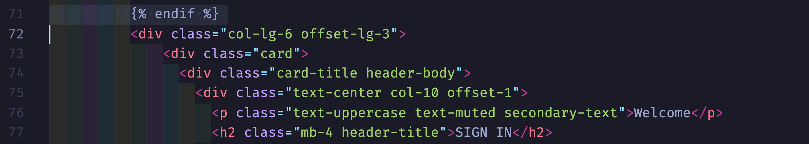
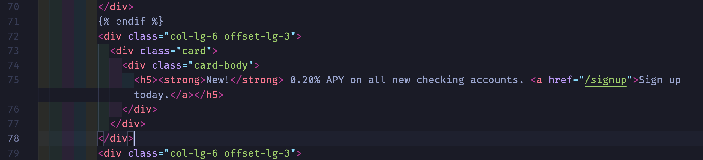

# Part B - Add an Application Feature 

Let's take on the persona of an app developer looking to make an update to the Cymbal Bank frontend source code. The feature you want to add is a banner on the homepage (login screen), advertising an improved interest rate on all new checking accounts.  

### 1. **Open VSCode**. 

### 2. **Add the `intro-to-krm` root directory to your VSCode workspace**.

You can do this by clicking `File > Add Folder to Workspace`. 

### 3. **From the VSCode sidebar, open the Login HTML template.

This file is located in `3-app-dev/cymbalbank-app-source/src/frontend/templates/login.html`**. 

### 4. **In `login.html`, find line 71**.  



### 5. **Under line 71, paste in the following code.** 

This code adds an HTML `card` for a banner advertising the promotional interest rate on new accounts.

```
          <div class="col-lg-6 offset-lg-3">
            <div class="card">
              <div class="card-body">
                <h5><strong>New!</strong> 0.20% APY on all new checking accounts. <a href="/signup">Sign up today.</a></h5>
              </div>
            </div>
          </div>
```

Your `login.html` file should now look like this: 



Let's test our code. **[Continue to part C](partC-test.md)**.