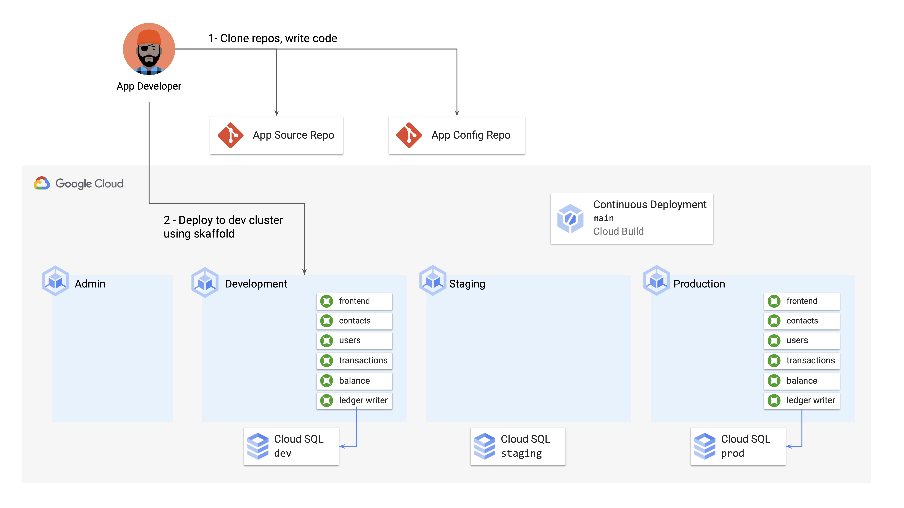
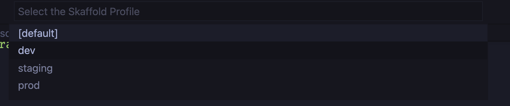
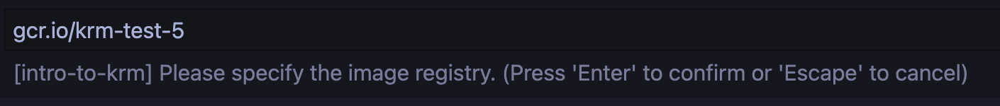

# Part C - Test the frontend feature 



Now we're ready to test our new login screen banner, and make sure it looks the way we want before we put out a Pull Request.

We *could* run the frontend Python server locally, without containerizing it, but then we have to worry about running (or mocking) the backends and databases. So what we can do instead is deploy the entire app - with the frontend code changes - to the Development GKE cluster we set up in part 1. The benefit of doing this, from a developer's perspective, is that it closely mimics the environment running in production.

To deploy the app to the dev cluster, we will use [Google Cloud Code](https://cloud.google.com/code/docs/vscode/features), backed by [`skaffold`](https://skaffold.dev/docs/quickstart/). Cloud Code is a Google Cloud tool designed to make it easier for app developers to build and deploy on top of Google Cloud infrastructure, including GKE but also other platforms like Cloud Run. Cloud Code runs inside a developer's IDE, and provides support for YAML linting, debugging, port-forwarding, and streaming logs.  

[skaffold](https://skaffold.dev/docs/quickstart/) is a command-line tool that can auto-build and auto-deploy source code into GKE, using container builders like Docker. 

### 1. **View the `skaffold.yaml` file in the `app-dev/` directory**. 

```
cat ../skaffold.yaml 
```

Expected output: 

```YAML
apiVersion: skaffold/v2alpha4
kind: Config
build:
  artifacts:
  - image: frontend
    context: src/frontend
  - image: ledgerwriter
    jib:
      project: src/ledgerwriter
  - image: balancereader
    jib:
      project: src/balancereader
  - image: transactionhistory
    jib:
      project: src/transactionhistory
  - image: contacts
    context: src/contacts
  - image: userservice
    context: src/userservice
  - image: loadgenerator
    context: src/loadgenerator
  tagPolicy:
    gitCommit: {}
  local: 
    concurrency: 4 
deploy:
  statusCheckDeadlineSeconds: 300
  kustomize: {}
portForward:
- resourceType: deployment
  resourceName: frontend
  namespace: frontend
  port: 8080
  address: 127.0.0.1
  localPort: 80
profiles:
  - name: dev
    deploy: 
      kustomize: 
        paths:
          - "cymbalbank-app-config/overlays/dev"
  - name: staging
    deploy: 
      kustomize: 
        paths:
          - "cymbalbank-app-config/overlays/prod"
  - name: prod
    deploy: 
      kustomize: 
        paths:
          - "cymbalbank-app-config/overlays/prod"
```

A [skaffold.yaml](https://skaffold.dev/docs/references/yaml/) file is the configuration for skaffold. It tells skaffold where the source code lives for the various Cymbal Bank services, and where the YAML files live for Kubernetes. We configure the Java services (eg. balancereader) to use the [Jib](https://github.com/GoogleContainerTools/jib/) container builder, which is a Java-specific tool that allows us to build directly using Maven without writing Dockerfiles. For the Python services (eg. contacts) we use the default Docker builder. We're also configuring skaffold to use the kustomize overlays we explored in Part 2, mapping the skaffold `dev` **[profile](https://skaffold.dev/docs/environment/profiles/)** to the kustomize dev overlay. We also define skaffold profiles for staging and prod.


###  2. **From the `cymbalbank-app-source/` directory, copy `skaffold.yaml`**. 

Note - this will overwrite the upstream `skaffold.yaml` with our changes, this is ok.

```
cp ../skaffold.yaml .
```

Now we're ready to use Cloud Code, configured with this `skaffold.yaml` file, to build our local code and deploy to the dev GKE cluster. First, we need to point Cloud Code at the right cluster. 

### 3. **Reopen VSCode, and open `skaffold.yaml` in the `cymbalbank-app-source` directory.** 

### 4. **Press `shift-command-p`**, and in the command palette that appears, type `Cloud Code: Run on Kubernetes`. 

A terminal window should pop up at the bottom of the screen. 

### 5. **A skaffold.yaml prompt should appear. Choose `cymbalbank-app-source/skaffold.yaml` from the drop-down.** 

### 6. **A profiles prompt will appear. Choose `dev`.** 



### 7. **A kubecontext prompt will appear. Choose `cymbal-dev`**. 

### 8. **An image registry prompt will appear. Set it to `gcr.io/PROJECT_ID/cymbal-bank`, replacing `PROJECT_ID` with your project ID value.** 



A terminal should open up within VSCode that shows the skaffold logs, as it builds images and deploys to the dev cluster. This will take 3-5 minutes. 

**Notes:** 
- You may see a pop-up asking: `Do you want the application "skaffold" to accept incoming network connections?`. Click **Allow.**  
- You may be prompted with the message: `would you like to clean up deployed resources after each run?` - you can click "Yes' for this. 
- You may see warnings in the logs, such as `Input image registry ... does not match the expected image registry` or `Extensions vscjava.vscode-java-debug needed for debugging`. This is ok, you can ignore the warnings. 

Expected Cloud Code output: 

```
**************URLs*****************
Debuggable container started pod/balancereader-7d87ddb588-mx25g:balancereader (balancereader)
Debuggable container started pod/ledgerwriter-5f45c577-ndl55:ledgerwriter (ledgerwriter)
Debuggable container started pod/transactionhistory-7984675b8d-5fpp7:transactionhistory (transactionhistory)
Update succeeded
***********************************
```

### 9. **Open a new terminal window and view your newly-built pods**. 

```
kubectl get pods --all-namespaces --selector=org=cymbal-bank
```

Expected output: 

```
NAMESPACE            NAME                                  READY   STATUS    RESTARTS   AGE
balancereader        balancereader-55dc9b5878-jjbfp        2/2     Running   0          112s
contacts             contacts-66b888c46c-ntkms             2/2     Running   0          112s
frontend             frontend-5687494d77-rh58h             1/1     Running   0          112s
ledgerwriter         ledgerwriter-5876d47fd6-g6hm8         2/2     Running   0          111s
loadgenerator        loadgenerator-ffd746b7f-q59z9         1/1     Running   0          111s
transactionhistory   transactionhistory-68c4b9ccd6-nwh24   2/2     Running   0          111s
userservice          userservice-558fcc7fc4-fndgm          2/2     Running   0          111s
```

### 10.  View the new frontend banner running on the dev cluster.

Copy the `EXTERNAL_IP` of your frontend service, paste  it on a browser, and navigate to the frontend's login screen. 

```
kubectl get svc -n frontend frontend 
```

You should see your new banner at the top of the login screen: 


Note that `Cloud Code: Run on Kubernetes` uses `skaffold dev` as the underlying command, which constantly watches your local source code for changes, and keeps building the updated services as you write more code. Optionally, make some changes to the login banner or add some text to the `login.html` file - you should see the `Output` in your IDE log the updated build, and if you re-navigate to the frontend external IP, you should see your changes reflected. 

### 11. Remove your test deployment from the dev cluster by pressing `ctrl-cmd-P` and typing `Cloud Code: Delete`. Press enter.  

**💫 Nice work! You just used skaffold, Cloud Code, and kustomize to test code changes in GKE.** 

### **[Continue to Part D: Creating a Pull Request](partD-ci-pr.md)**


## Troubleshooting 

If the `Cloud Code: Run on Kubernetes` command fails, check Cloud Code's configuration: 

1. Open `intro-to-krm/.vscode/launch.json`. You should see a file that looks like this (note - `imageRegistry` should be populated with your Project ID, in this example, `krm-test-6`.)

```JSON
{
    "configurations": [
        {
            "name": "Kubernetes: Run/Debug - dev",
            "type": "cloudcode.kubernetes",
            "request": "launch",
            "skaffoldConfig": "${workspaceFolder}/3-app-dev/cymbalbank-app-source/skaffold.yaml",
            "profile": "dev",
            "watch": true,
            "cleanUp": false,
            "portForward": true,
            "imageRegistry": "gcr.io/krm-test-6/cymbal-bank"
        }
    ]
}
```

2. Verify that all the settings match your project. You can manually edit the file if any fields are off. 