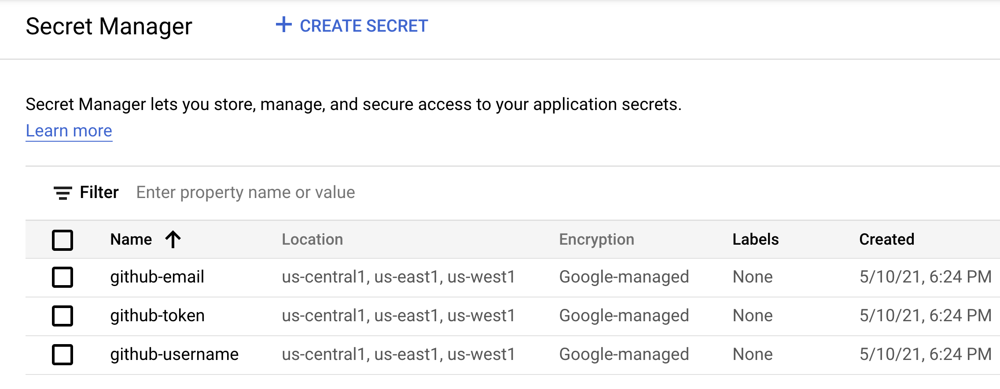
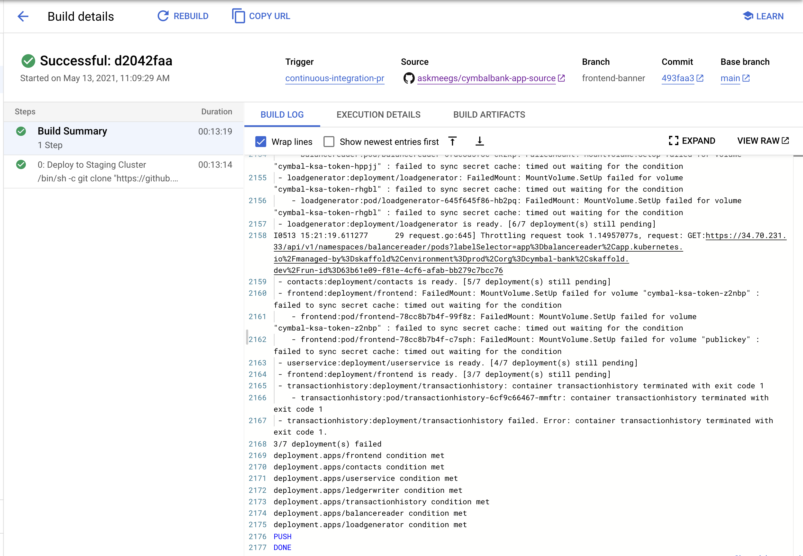

# Part D - Creating a Pull Request 

Now that we've tested the new frontend feature locally using the dev cluster, we are ready to put out a Pull Request in the cymbalbank-app-source repository. We will also explore how to stage a pull request's code on the staging GKE cluster, using Cloud Build and the `skaffold.yaml` file we used in part C. 


 

### 1. **View the Cloud Build pipeline for Pull Requests to the app source repo**. 

Run these commands from the cymbalbank-app-source root directory: 

```
cp ../cloudbuild-ci-pr.yaml . 
cat cloudbuild-ci-pr.yaml
```

Expected output: 

```YAML
steps: 
- name: 'gcr.io/google-samples/intro-to-krm/skaffold-mvn:latest'
  id: Deploy to Staging Cluster 
  entrypoint: /bin/sh
  args:
  - '-c'
  - |
    git clone "https://github.com/$$GITHUB_USERNAME/cymbalbank-app-config"
    gcloud container clusters get-credentials ${_CLUSTER_NAME} --zone ${_CLUSTER_ZONE} --project ${PROJECT_ID} 
    skaffold run --profile=staging --default-repo="gcr.io/${PROJECT_ID}/cymbal-bank/${BRANCH_NAME}" --status-check --tail=false
  secretEnv: ['GITHUB_USERNAME']
substitutions:
  _CLUSTER_NAME: 'cymbal-staging'
  _CLUSTER_ZONE: 'us-central1-a'
availableSecrets:
  secretManager:
  - versionName: projects/${PROJECT_ID}/secrets/github-username/versions/1 
    env: 'GITHUB_USERNAME'
timeout: '1200s' #timeout - 20 minutes
```

This Cloud Build pipeline is designed to run on open Pull Requests in the `cymbalbank-app-source` repo. This means that when the build pipeline runs, it will run out of the `cymbalbank-app-source` directory, at the branch corresponding to the pull request - meaning, the build already will have your frontend banner code. 

This build has one step, and runs from a custom `skaffold-mvn` container, which is just an environment with skaffold, Maven, and kustomize pre-installed. (Maven is needed to build the Java images.) This build does the following: 

1. Clones the app config YAML repo into the source repo, like we did locally in Part C.
2. Connects to the GKE staging cluster we created during setup. 
3. Uses `skaffold run` to build and deploy the pull request code to the staging GKE cluster. This skaffold command uses the [`--status-check` flag](https://skaffold.dev/docs/workflows/ci-cd/) to ensure that all the pods are running before completing successfully.
4. Waits for the pods to be ready. 

Also note how Cloud Build gets the name of the `cymbalbank-app-config` repo from the `GITHUB_USERNAME` secret that Terraform added to Secret Manager in Part 1. You can see the Secret Manager secrets for your project [in the Google Cloud Console](https://console.cloud.google.com/security/secret-manager).  



**Note** - this is a basic pull request pipeline. In a real use case, you'd likely run different tests, like linters, unit tests, and integration test, before staging the code. Also, in a real use case a repo will likely have multiple PRs open at once, and with this build as-is, different PRs would clobber each other because they're trying to deploy the same services to the same namespaces. The way to get around this would be adding a namespaces suffix like `frontend-pr1` -- or deploying all the services into the same namespace, eg. `pr1`.   

### 2. **Create the Continuous Integration - PR trigger.**

We want Cloud Build to run this build pipeline on every commit to open Github pull requests targeted at the `main` branch. 

Navigate to Cloud Build in the console, then click Triggers. Click **Create Trigger.** 

From the Create Trigger menu, set the fields as follows: 

- Name: `continuous-integration-pr` 
- Event: `Pull Request` 
- Repository: `<github-username>/cymbalbank-app-source` 
- Base branch: `^main$`  
- Configuration: Cloud Build configuration - `/cloudbuild-ci-pr.yaml` 
- Click **Create**. 

### 3. **Return to your terminal, and push your local frontend-banner branch to remote.**

```
git add .
git commit -m "Add frontend banner, PR CI pipeline" 
git push origin frontend-banner
```

**Note** - you may see a warning that you've added another repo (`cymbalbank-app-config`) as an "embedded repo" - this is okay, you can ignore the warning. 

```
warning: adding embedded git repository: cymbalbank-app-config
hint: You've added another git repository inside your current repository.
hint: Clones of the outer repository will not contain the contents of
hint: the embedded repository and will not know how to obtain it.
hint: If you meant to add a submodule, use:
```

### 4. **Navigate to Github > cymbalbank-app-source and open a pull request in your `frontend-banner` branch.** 

This will trigger the `cloudbuild-ci-pr.yaml` Cloud Build pipeline.  


### 5. **Navigate to [Cloud Build: History](https://console.cloud.google.com/cloud-build/builds). Watch the Continuous Integration - Pull Request pipeline run.** 

Note - it may take 5-10 minutes for this pipeline to complete.



### 6. **View the frontend banner in staging.**

```
kubectx cymbal-staging
kubectl get svc frontend -n frontend
```


Now let's pretend that your pull request was reviewed by a developer teammate, and you're ready to merge the pull request and get your code into production.

**[Continue to Part E - Merging Your Pull Request.](partE-ci-main.md)** 

## Troubleshooting 

If the CI Pull Request build fails with the following error: 

```
 - balancereader: Error checking cache.
failed to build: getting hash for artifact "balancereader": getting dependencies for "balancereader": could not fetch dependencies for workspace .: initial Jib dependency refresh failed: failed to get Jib dependencies: running [/workspace/mvnw jib:_skaffold-fail-if-jib-out-of-date -Djib.requiredVersion=1.4.0 --projects src/balancereader --also-make jib:_skaffold-files-v2 --quiet --batch-mode]
 - stdout: ""
 - stderr: "Exception in thread \"main\" java.lang.RuntimeException: Could not locate the Maven launcher JAR in Maven distribution...
 ```

This is caused by a possible Jib bug that occurs sporadically on `skaffold build`. Try running the build pipeline again by clicking `Retry` next to `Build Details`. 