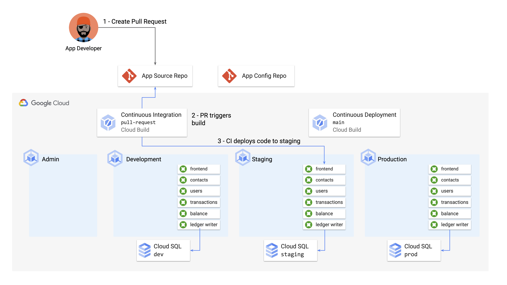
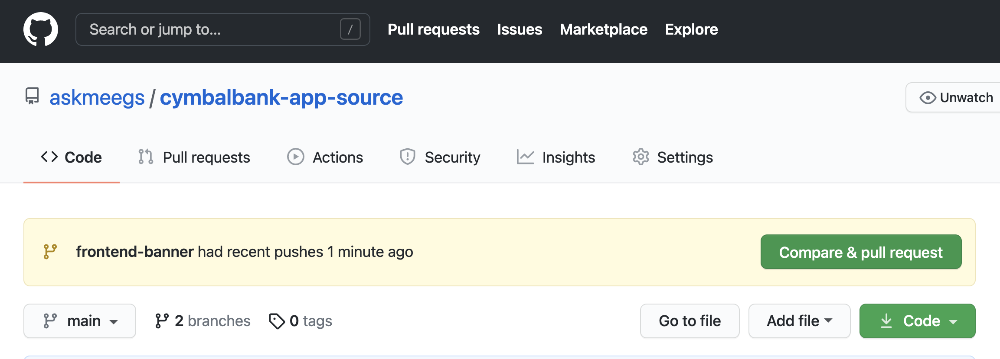
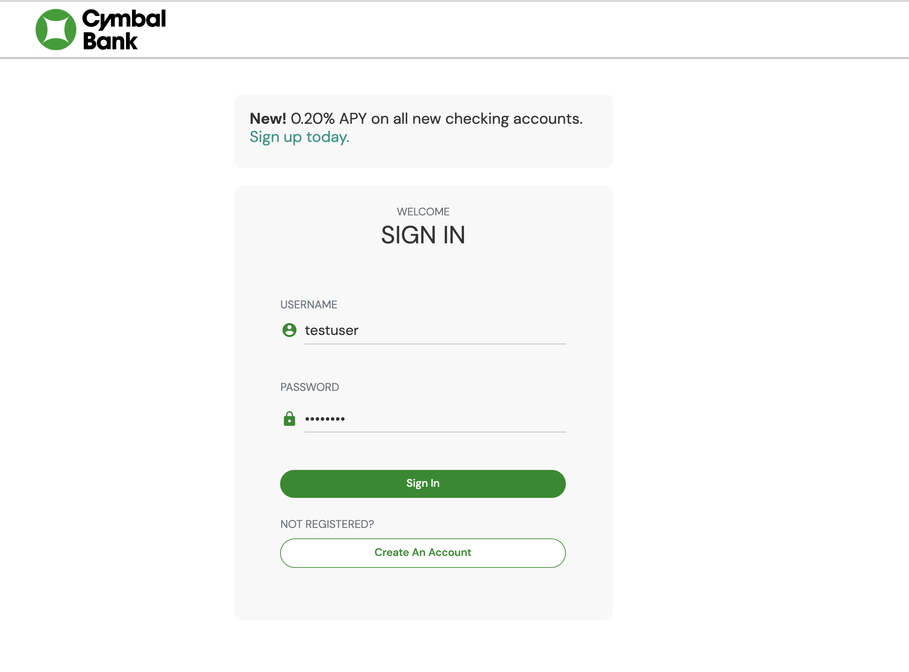

## Part D - Continuous Integration (Pull Request)

Now we're ready to put out a Pull Request in the cymbalbank-app-source repo with our new frontend banner feature. We'll add a new Cloud Build trigger for all new pull requests in the source repo, so that we can auto-deploy the code to our staging GKE cluster, allowing any tests or code reviewers to verify that the changes work as intended with no bugs.  


 

#### 1. **View the Cloud Build pipeline for Pull Requests to the app source repo**. 

Run these commands from the cymbalbank-app-source root directory: 

```
cp ../cloudbuild-ci-pr.yaml . 
cat cloudbuild-ci-pr.yaml
```

Expected output: 

```
steps: 
- name: 'gcr.io/google-samples/intro-to-krm/skaffold-mvn:latest'
  id: Deploy to Staging Cluster 
  entrypoint: /bin/sh
  args:
  - '-c'
  - |
    git clone "https://github.com/$$GITHUB_USERNAME/cymbalbank-app-config"
    gcloud container clusters get-credentials ${_CLUSTER_NAME} --zone ${_CLUSTER_ZONE} --project ${PROJECT_ID} 
    skaffold run --profile=staging --default-repo="gcr.io/${PROJECT_ID}/cymbal-bank/${BRANCH_NAME}" --tail=false
    kubectl wait --for=condition=available --timeout=300s deployment/frontend -n frontend 
    kubectl wait --for=condition=available --timeout=300s deployment/contacts -n contacts 
    kubectl wait --for=condition=available --timeout=300s deployment/userservice -n userservice 
    kubectl wait --for=condition=available --timeout=300s deployment/ledgerwriter -n ledgerwriter 
    kubectl wait --for=condition=available --timeout=300s deployment/transactionhistory -n transactionhistory 
    kubectl wait --for=condition=available --timeout=300s deployment/balancereader -n balancereader 
    kubectl wait --for=condition=available --timeout=300s deployment/loadgenerator -n loadgenerator
  secretEnv: ['GITHUB_USERNAME']
substitutions:
  _CLUSTER_NAME: 'cymbal-staging'
  _CLUSTER_ZONE: 'us-central1-a'
availableSecrets:
  secretManager:
  - versionName: projects/${PROJECT_ID}/secrets/github-username/versions/1 
    env: 'GITHUB_USERNAME'
```

This Cloud Build pipeline will build the source code at the branch corresponding to that Pull Request. Then it deploys those images to the staging cluster, and makes sure the Pods come online. Note that this build uses the Secret Manager secret for `github-username`, deployed by Terraform during bootstrapping, in order to clone the app YAML inside the source directory like we did locally. 

#### 2. **Create the Continuous Integration - PR trigger.** 

Reopen Cloud Build in the Google Cloud Console. Click Triggers > **Create Trigger**. 

- Name: `continuous-integration-pr` 
- Event: `Pull Request` 
- Repository: `<github-username>/cymbalbank-app-source` 
- Base branch: `.*` (any branch)
- Configuration: Cloud Build configuration - `/cloudbuild-ci-pr.yaml` 
- Click **Create**. 

#### 3. **Return to the terminal and push your local frontend-banner branch to remote.**

```
git add .
git commit -m "Add frontend banner, PR CI pipeline" 
git push origin frontend-banner
```

#### 4. **Navigate to Github > cymbalbank-app-source and open a pull request in your `frontend-banner` branch.** 

This will trigger the `cloudbuild-ci-pr.yaml` Cloud Build pipeline.  



#### 5. **Navigate back to Cloud Build and watch the Continuous Integration - Pull Request pipeline run.** 


#### 6. **View the frontend banner in staging.**

```
kubectx cymbal-staging; kubectl get svc frontend -n frontend
```


