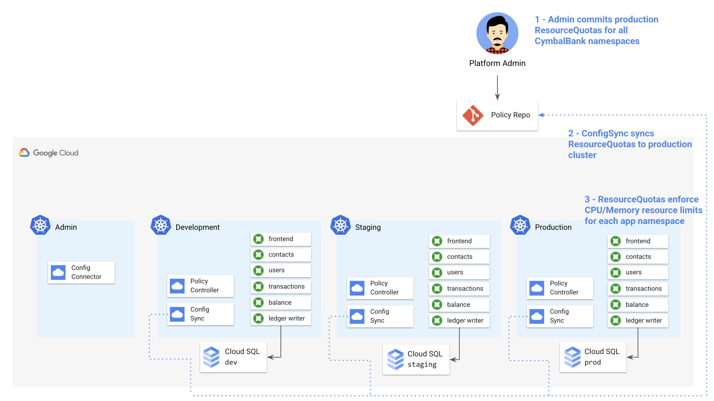
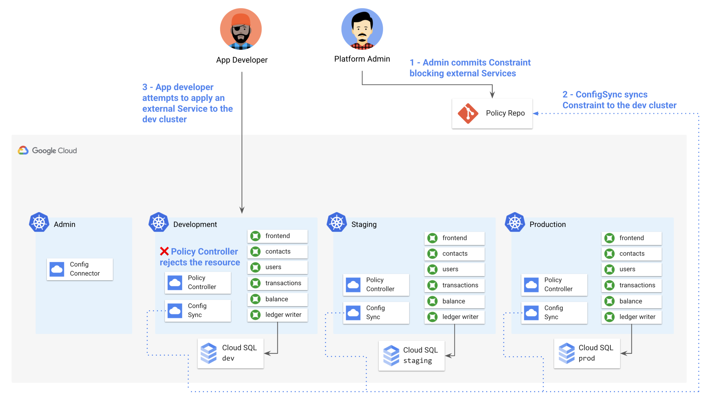
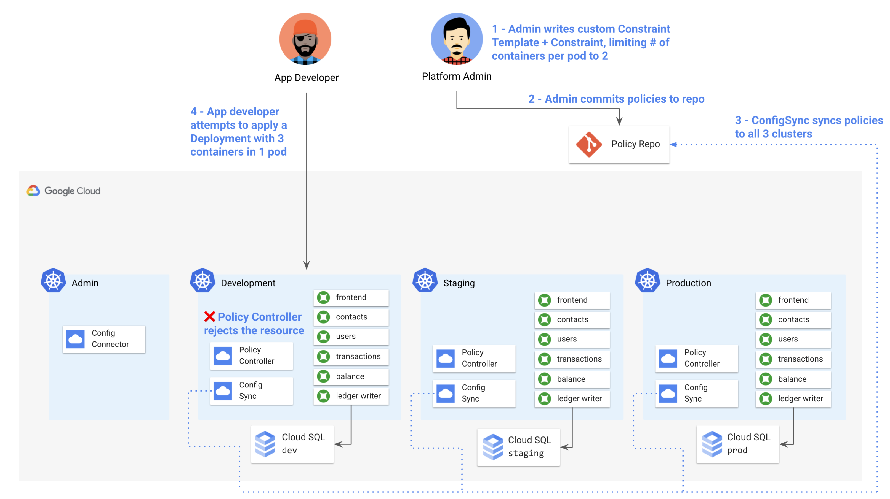
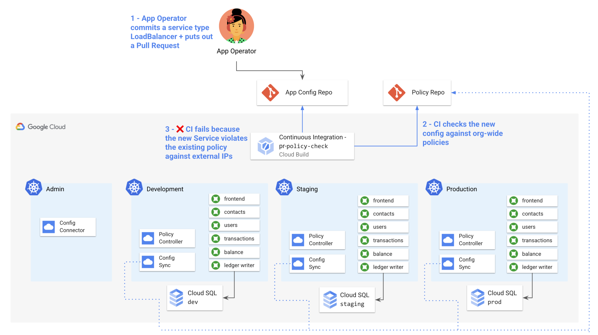

# 4 - Admin Workflow with Config Sync and Policy Controller

## Contents 

## What you'll learn 

- How GitOps promotes security best practices
- How to use Config Sync to sync KRM from Github to multiple GKE clusters
- When to use Config Sync for KRM, vs. CI/CD 
- How to scope resources to only apply to certain GKE clusters
- How Policy Controller promotes compliance in a Kubernetes environment
- How to use Policy Controller to define org-wide policies, synced with ConfigSync.
- How to write your own Policy Controller policies to enforce custom logic
- How to integrate Policy Controller checks into CI/CD for an extra layer of checks  

## Prerequisites 

- Complete parts 1-3. 

## Introduction 

In [part 2](/2-how-krm-works), we learned how the Kubernetes API works, and how to apply resources with `kubectl apply -f`. Then in [part 3](/3-app-dev), we learned how to automatically deploy KRM using skaffold and Cloud Build, with the help of kustomize. 

These two use cases cover Kubernetes app development pretty well. But now imagine that you're a platform developer or administrator, responsible for not just one of the CymbalBank services, but for the entire Kubernetes environment, including the `dev`, `staging`, and `prod` clusters. An app developer may care most about testing their code and getting features into production with minimal friction, but your concerns are probably different. You care about consistency across the whole platform - that certain baseline resources are always deployed and in sync across all the clusters. (You do *not* want a developer to `kubectl apply -f` one of those resources by mistake, and you especially don't want that to happen without anyone knowing.) You also care about compliance with the financial services regulations CymbalBank is subject to, and you might work directly with Cymbal's security team to make sure the necessary policies are in place. 

So if I'm a platform admin, I really care about two things with KRM: 1) **Consistency**, and 2) **Protect the clusters from unsafe configuration**. This demo explores how two Google Cloud tools - **Config Sync** and **Policy Controller** - help platform admins accomplish those two goals. 

## Part A - Install Config Sync and Policy Controller 


1. **Set variables.** 

```
export PROJECT_ID=[your-project-id]
export GITHUB_USERNAME=[your-github-username]
```

2. **Initialize the cymbalbank-policy repo**.

You created this repo during setup. This repo is located at `github.com/YOUR-USERNAME/cymbalbank-policy` and it's currently empty. This script populates the repo with namespaces corresponding to each of the CymbalBank services. These namespaces were created with a shell script, initially. Now we're preparing to bringing those namespaces into Config Sync's management domain, guarding against manual editing or deletion.   

```
./policy-repo-setup.sh
```

3. **Install Config Sync on the dev, staging, and prod clusters.** 
  
4. **TODO** - currently not using this script because PC stuck in pending. Using UI install to install both CS and PC at once. 


```
./install.sh
```

4. **Get the Config Sync install status for all clusters in your project.**

```
gcloud alpha container hub config-management status --project=${PROJECT_ID}
```

Expected output: 

```
Name            Status         Last_Synced_Token  Sync_Branch  Last_Synced_Time      Policy_Controller
cymbal-admin    NOT_INSTALLED  NA                 NA           NA                    NA
cymbal-dev      SYNCED         e2bca67            main         2021-05-05T15:50:00Z  INSTALLED
cymbal-prod     SYNCED         e2bca67            main         2021-05-05T15:54:08Z  INSTALLED
cymbal-staging  SYNCED         e2bca67            main         2021-05-05T15:53:29Z  INSTALLED
```

Notice that each of the `cymbal-dev`, `cymbal-staging`, and `cymbal-prod` clusters are synced to the same commit of the same repo - this is the first step towards consistent config across the GKE environment. 

## Part B - Administering KRM with Config Sync

It's worth noting early on that Config Sync and Policy Controller are not a replacement for the CI/CD pipeline we set up in part 3 - these toolchains are complementary, and we'll actually see later in this demo how to apply Policy Controller checks to our existing CI/CD setup. Further, while Config Sync and CI/CD theoretically can handle all kinds of KRM config, a good rule of thumb is that Config Sync (cymbalbank-policy repo) is best used for policy configuration (eg. RBAC) and platform-level workloads (eg. Prometheus). Whereas CI/CD (cymbalbank-app-config repo) is best used for application workload config (eg. Deployments, Services). Plus we have application source code that lives in a totally separate repo (cymbalbank-app-source) and has no KRM of its own. 

The benefit of this setup is that all KRM lives in Git - so no matter what kind of resources live in each repo, we can see the Git commit history, add CI, and treat all of this configuration as code.

Let's explore how we can use Config Sync to keep the same resources constantly deployed across all three Cymbal Bank clusters.  

1. **Get the `frontend` namespace in the `cymbal-dev` cluster.** 
  
We created this namespace manually during part 1, but now it's being managed by Config Sync.  

```
kubectx cymbal-dev
kubectl get namespace frontend -o yaml 
```

Expected output: 

```
apiVersion: v1
kind: Namespace
metadata:
  annotations:
    config.k8s.io/owning-inventory: config-management-system_root-sync
    configmanagement.gke.io/cluster-name: cymbal-dev
    configmanagement.gke.io/managed: enabled
```

You can see that a set of new `configmanagement` annotations have been added to the existing namespace, including  `configmanagement.gke.io/managed: enabled` which indicates that Config Sync is responsible for managing this resource, keeping it synced with the policy repo. 

Where did this resource come from? Let's explore the structure of the policy repo. 

2. **Run the `tree` command on the newly-initialized `cymbalbank-policy` repo.** 

```
tree cymbalbank-policy/
```

Expected output: 

```
cymbalbank-policy
├── README.md
└── namespaces
    ├── balancereader
    │   └── namespace.yaml
    ├── contacts
    │   └── namespace.yaml
    ├── frontend
    │   └── namespace.yaml
    ├── ledgerwriter
    │   └── namespace.yaml
    ├── loadgenerator
    │   └── namespace.yaml
    ├── transactionhistory
    │   └── namespace.yaml
    └── userservice
        └── namespace.yaml

8 directories, 8 files
```

This repo is what's called an **[unstructured](https://cloud.google.com/kubernetes-engine/docs/add-on/config-sync/how-to/unstructured-repo)** repo in Config Sync. This means that we can set up the repo however we want to, with whatever subdirectory structure suits the Cymbal org best, and Config Sync will deploy all the resources in the subdirectories. The alternative for Config Sync is to use a **[hierarchical](https://cloud.google.com/kubernetes-engine/docs/add-on/config-sync/concepts/hierarchical-repo)** repo, which has a structure you must adhere to (for instance, with cluster-scoped resources in a `cluster/` subdirectory).

By default, resources committed to a policy repo will be synced all clusters that use it as a sync source - so here, each of the Cymbal Bank namespaces we've committed will be synced to the dev, staging and prod clusters, because each of those clusters is set up to sync from this repo. 

We can also scope configs to only be applied to certain clusters. Let's see how.

## Part C - Creating Cluster-Scoped Resources 



[Kubernetes Resource Quotas](https://kubernetes.io/docs/concepts/policy/resource-quotas/) help ensure that multiple tenants on one cluster - in our case, different Cymbal Bank services/app teams - don't clobber each other by eating up too many cluster resources, which can result in evicted pods and potential outages. For example purposes, we'll create this resource only in the `cymbal-prod` cluster, which we specify using the `cluster-name-selector` annotation below. This way, if our CD pipeline tries to deploy resources that violate the quota constraint, the prod cluster will not accept the resource, throwing a `403 - Forbidden` error.

The `production-quotas/` directory contains resource quotas for all Cymbal Bank app namespaces. 

1. **View the frontend Resource Quota YAML.** 

Each Cymbal Bank namespace will get one of these.  

```
cat production-quotas/frontend.yaml
```

Expected output: 

```YAML
apiVersion: v1
kind: ResourceQuota
metadata:
  name: production-quota
  namespace: frontend
  annotations:
    configsync.gke.io/cluster-name-selector: cymbal-dev
spec:
  hard:
    cpu: "100"
    memory: 10Gi
    pods: "10"
```

2. **Copy all the Resource Quota resources into your cloned policy repo.**

```
cp production-quotas/balancereader/quota.yaml cymbalbank-policy/namespaces/balancereader/
cp production-quotas/contacts/quota.yaml cymbalbank-policy/namespaces/contacts/
cp production-quotas/frontend/quota.yaml cymbalbank-policy/namespaces/frontend/
cp production-quotas/ledgerwriter/quota.yaml cymbalbank-policy/namespaces/ledgerwriter/
cp production-quotas/loadgenerator/quota.yaml cymbalbank-policy/namespaces/loadgenerator/
cp production-quotas/transactionhistory/quota.yaml cymbalbank-policy/namespaces/transactionhistory/
cp production-quotas/userservice/quota.yaml cymbalbank-policy/namespaces/userservice/
```

3. **Commit the ResourceQuotas to the `main` branch of the cymbalbank-policy repo.**

```
cd cymbalbank-policy/
git add .
git commit -m "Add ResourceQuotas"
git push origin main
```

Expected output: 

```
Writing objects: 100% (17/17), 1.45 KiB | 740.00 KiB/s, done.
Total 17 (delta 6), reused 0 (delta 0), pack-reused 0
remote: Resolving deltas: 100% (6/6), done.
To https://github.com/askmeegs/cymbalbank-policy
   e2bca67..cdfbaae  main -> main
```

4. **View the Config Sync status again.**

```
gcloud alpha container hub config-management status --project=${PROJECT_ID}
```

Expected output: 

```
Name            Status         Last_Synced_Token  Sync_Branch  Last_Synced_Time      Policy_Controller
cymbal-admin    NOT_INSTALLED  NA                 NA           NA                    NA
cymbal-dev      SYNCED         cdfbaae            main         2021-05-05T20:01:47Z  INSTALLED
cymbal-prod     SYNCED         cdfbaae            main         2021-05-05T20:01:39Z  INSTALLED
cymbal-staging  SYNCED         cdfbaae            main         2021-05-05T20:01:44Z  INSTALLED
```

Here the `Last_Synced_Token` should correspond to the Git commit sha from your latest commit to the policy repo, which you can find using `git log` or by navigating to the repo on Github. 


5. **Get the resource quotas on the prod cluster.** 

```
kubectx cymbal-prod
kubectl get resourcequotas --all-namespaces
```

Expected output: 

```
NAMESPACE                      NAME                  AGE     REQUEST                                                                                                                               LIMIT
balancereader                  gke-resource-quotas   26d     count/ingresses.extensions: 0/100, count/ingresses.networking.k8s.io: 0/100, count/jobs.batch: 0/5k, pods: 1/1500, services: 1/500
balancereader                  production-quota      6m56s   cpu: 300m/700m, memory: 612Mi/512Mi
config-management-monitoring   gke-resource-quotas   5d1h    count/ingresses.extensions: 0/100, count/ingresses.networking.k8s.io: 0/100, count/jobs.batch: 0/5k, pods: 1/1500, services: 1/500
config-management-system       gke-resource-quotas   4h16m   count/ingresses.extensions: 0/100, count/ingresses.networking.k8s.io: 0/100, count/jobs.batch: 0/5k, pods: 4/1500, services: 1/500
contacts                       gke-resource-quotas   26d     count/ingresses.extensions: 0/100, count/ingresses.networking.k8s.io: 0/100, count/jobs.batch: 1/5k, pods: 1/1500, services: 1/500
contacts                       production-quota      6m56s   cpu: 300m/700m, memory: 164Mi/512Mi
...
```

You can see that every namespace as the `production-quota` we just committed, along with a default [GKE resource quota](https://cloud.google.com/kubernetes-engine/quotas#resource_quotas) which limits, for example, the total number of pods that can be deployed to each namespace. 

6. **Get the resource quotas on the dev cluster.** 
  
You should see only ResourceQuotas prefixed with `gke-`, and not the production-quotas. This is because we scoped the production quota resources to only be deployed to the `cymbal-prod` cluster. 

```
kubectx cymbal-prod
kubectl get resourcequotas --all-namespaces
```

7. **Return to the prod context and attempt to delete one of the ResourceQuotas manually.**

You should see an error, [which is ConfigSync saying, "only I can administer this resource"](https://cloud.google.com/anthos-config-management/docs/quickstart#attempt_to_manually_modify_a_managed_object). This enforcement helps you, the platform admin, avoid "configuration drift" (or "shadow ops") in your environment, where any Config Sync-managed resource cannot be deleted with kubectl, by you or anyone -- meaning that the live state of the resource should always reflect the committed resource in Git. 

```
kubectx cymbal-prod
kubectl delete resourcequota production-quota -n frontend
```

Expected output: 

```
error: You must be logged in to the server (admission webhook "v1.admission-webhook.configsync.gke.io" denied the request: requester is not authorized to delete managed resources)
```

## Part D - Using Policy Controller to Block External Services 

Now that we've learned how to use Config Sync to make sure certain resources are deployed consistently across our Kubernetes environment (our first goal), let's address the second goal: preventing unsafe configuration from landing in any of the clusters. 

Up to now, we've used Config Sync to deploy resources that are part of the Kubernetes core APIs (Namespaces, ResourceQuotas). And while those core APIs support several resources that help prevent bad actors from deploying resources, we can actually sync custom policies using a tool called [Policy Controller](). Policy Controller is a Google-managed [Kubernetes admission controller](https://cloud.google.com/anthos-config-management/docs/concepts/policy-controller) that can enforce arbitrary "constraints" related to security and compliance. 

Let's unpack that. An **admission controller** is a pod that sits at the "gate" of a Kubernetes cluster, watching what's coming into the API server and doing some type of operation on that resource, before it's persisted in etcd. That could include modifying the resource in-flight ([MutatingAdmissionWebhook](https://kubernetes.io/docs/reference/access-authn-authz/admission-controllers/#mutatingadmissionwebhook)) or rejecting the resource entirely ([ValidatingAdmissionWebhook](https://kubernetes.io/docs/reference/access-authn-authz/admission-controllers/#validatingadmissionwebhook)). Policy Controller uses the second kind of webhook to validate incoming config against the policies it knows about. Policy Controller is based on an open-source project called [Gatekeeper](https://github.com/open-policy-agent/gatekeeper#gatekeeper), which in turn grew out of the [OpenPolicyAgent](https://www.openpolicyagent.org/) project, part of the [CNCF](https://www.cncf.io/). 

So what do those policy "constraints" look like? What kinds of Kubernetes resources can we use PolicyController to accept or reject? 

Policy Controller comes with a set of [default constraint templates](https://cloud.google.com/anthos-config-management/docs/reference/constraint-template-library). These templates can do things like [block RBAC resources from using wildcards](https://cloud.google.com/anthos-config-management/docs/reference/constraint-template-library#k8sprohibitrolewildcardaccess) (preventing sweeping access to many resources at once), [block privileged containers](https://cloud.google.com/anthos-config-management/docs/reference/constraint-template-library#k8spspallowprivilegeescalationcontainer), and require all pods to have [Liveness probes](https://cloud.google.com/anthos-config-management/docs/reference/constraint-template-library#k8srequiredprobes), a feature that helps avoid outages by restarting Pods stuck in deadlock or similar dying states.  

In this demo, we're going to create a policy for the `cymbal-dev` cluster that [blocks the creation of external services](https://cloud.google.com/anthos-config-management/docs/reference/constraint-template-library#k8snoexternalservices). This will help ensure that no sensitive code in development is exposed to the public.  



1. **Switch to the `cymbal-dev` cluster, and verify that the Constraint Template library is installed.** 
  
This is a set of a few dozen Custom Resources (CRDs), each defining a ConstraintTemplate.   

```
kubectl get constrainttemplates \
    -l="configmanagement.gke.io/configmanagement=config-management"
```

Expected output: 

```
NAME                                      AGE
allowedserviceportname                    2d9h
destinationruletlsenabled                 2d9h
disallowedauthzprefix                     2d9h
gcpstoragelocationconstraintv1            2d9h
k8sallowedrepos                           2d9h
...
```

2. **View the `K8sNoExternalServices` Constrant resource, provided for you in the `constraint-ext-services` directory.** 

This Constraint implements the `[K8sNoExternalServices](https://cloud.google.com/anthos-config-management/docs/reference/constraint-template-library#k8snoexternalservices)` Constraint Template with concrete information about our environment. 

```
cat constraint-ext-services/constraint.yaml
```

Expected output: 

```YAML 
# Blocks the creation of Ingress and Service type=LoadBalancer resources 
apiVersion: constraints.gatekeeper.sh/v1beta1
kind: K8sNoExternalServices
metadata:
  name: dev-no-ext-services
  annotations:
    configsync.gke.io/cluster-name-selector: cymbal-dev
spec:
  internalCIDRs: []
```

Notice how again, we're using Config Sync's `cluster-name-selector` annotation to scope this resource to the `cymbal-dev` cluster only.

**3. Create a new subdirectory in the `policy-repo`, `clusters/cymbal-dev`.**

This is where we'll keep cluster-wide policies, separate from namespace-specific directories. 

```
mkdir -p cymbalbank-policy/clusters/cymbal-dev
```

**4. Copy `constraint.yaml` into the new directory.**

```
cp constraint-ext-services/constraint.yaml cymbalbank-policy/clusters/cymbal-dev/
```

**5. Commit the Constraint to the main branch of the policy repo.**

```
cd cymbalbank-policy 
git add .
git commit -m "Policy Controller - Add K8sNoExternalIP Constraint"
git push origin main 
cd .. 
```

**6. Verify that the policy has been synced to the `cymbal-dev` cluster.**

```
gcloud alpha container hub config-management status --project=${PROJECT_ID}
```

Expected output: 

```
Name            Status         Last_Synced_Token  Sync_Branch  Last_Synced_Time      Policy_Controller
cymbal-admin    NOT_INSTALLED  NA                 NA           NA                    NA
cymbal-dev      SYNCED         9ddcede            main         2021-05-06T15:25:38Z  INSTALLED
cymbal-prod     SYNCED         9ddcede            main         2021-05-06T15:25:41Z  INSTALLED
cymbal-staging  SYNCED         9ddcede            main         2021-05-06T15:25:40Z  INSTALLED
```

**7. Verify that the constraint is deployed to the cymbal-dev cluster.** 

```
kubectl get constraint 
```

Expected output: 

```
 NAME                                                                  AGE
k8snoexternalservices.constraints.gatekeeper.sh/dev-no-ext-services   47s
```

**8. Attempt to manually create a service type LoadBalancer in the `cymbal-dev` cluster, corresponding to the `contacts` service Deployment.**
  
You should get an error stating that the Policy Controller admission webhook is blocking the incoming resource. 

```
kubectl apply -f constraint-ext-services/contacts-svc-lb.yaml
```

Expected output: 

```
Resource: "/v1, Resource=services", GroupVersionKind: "/v1, Kind=Service"
Name: "contacts", Namespace: "contacts"
for: "constraint-ext-services/contacts-svc-lb.yaml": admission webhook "validation.gatekeeper.sh" denied the request: [denied by dev-no-ext-services] Creating services of type `LoadBalancer` without Internal annotation is not allowed
```

**Congrats**! You just deployed your first Policy Controller policy via Config Sync. Policies like this can help platform admins reach the second goal discussed at the beginning of this demo, which is to monitor and prevent unsafe KRM in our environment.  

## Part D - Creating a Custom Constraint Template with Rego 

In addition to the built-in Constraint Template library provided by PolicyController, you can also create [custom Constraint Templates](https://cloud.google.com/anthos-config-management/docs/how-to/write-a-constraint-template) with your own org-specific logic.  These policies don't just have to be related to compliance - they can be arbitrary business logic too, or platform requirements defined within Cymbal Bank.

In this section, we'll write a custom Constraint Template that limits the total number of containers per pod to a set number. We'll then create a Constraint, using that template, that limits the number of containers to **2** per pod. There are certain valid use cases for adding additional ["sidecar" containers](https://kubernetes.io/blog/2015/06/the-distributed-system-toolkit-patterns/) in a Pod, particularly when for example, Cymbal Bank already attaches the [Cloud SQL proxy](https://cloud.google.com/sql/docs/mysql/sql-proxy) container to each backend service, allowing for secure communication to the databases.

But too many containers packed into one Pod can increase the risk of outages - when one container crashes, the whole pod crashes - and it allows for less horizontal scaling (if 1 container in a pod exceeds its resource requirements, the entire pod must be replicated, even if the other container doesn't need to be replicated). To guard against this, we'll create a Constraint Template to enforce the number of containers allowed per Pod, across all the Cymbal Bank GKE clusters. 




**1. View the custom Constraint Template resource, which has been provided for you in the `constraint-limit-containers/` subdirectory.** 

```
cat constraint-limit-containers/constrainttemplate.yaml 
```

Expected output: 

```
apiVersion: templates.gatekeeper.sh/v1beta1
kind: ConstraintTemplate
metadata:
  name: k8slimitcontainersperpod
spec:
  crd:
    spec:
      names:
        kind: K8sLimitContainersPerPod
      validation:
        openAPIV3Schema:
          properties:
            allowedNumContainers:
              type: integer
  targets:
    - target: admission.k8s.gatekeeper.sh
      rego: |
        package k8slimitcontainersperpod

        numTemplateContainers := count(input.review.object.spec.template.spec.containers)
        numRunningContainers := count(input.review.object.spec.containers)
        containerLimit := input.parameters.allowedNumContainers

        template_containers_over_limit = true {
          numTemplateContainers > containerLimit
        }

        running_containers_over_limit = true {
          numRunningContainers > containerLimit
        }

        violation[{"msg": msg}] {
          template_containers_over_limit
          msg := sprintf("Number of containers in template (%v) exceeds the allowed limit (%v)", [numTemplateContainers, containerLimit])
        }

        violation[{"msg": msg}] {
          running_containers_over_limit
          msg := sprintf("Number of running containers (%v) exceeds the allowed limit (%v)", [numRunningContainers, containerLimit])
        }
```

This resource might look a little scary or unfamiliar, so let's unpack how this template works.  PolicyController Constraint Templates are written in a programming language called [Rego](https://www.openpolicyagent.org/docs/latest/policy-language/). Unlike raw KRM, which is OpenAPI-compliant JSON or YAML, Rego is a full-featured programming language, created by the [OpenPolicyAgent](https://www.openpolicyagent.org/) project. Rego is a query language designed specifically for creating policies. Rego [supports](https://www.openpolicyagent.org/docs/latest/policy-reference/) objects, arrays, conditionals, functions, regular expressions, and other general-purpose language features, but it's structured differently from a language like Python or Java in that it's designed to take [some inputs (in our case, a KRM resource)](https://www.openpolicyagent.org/docs/latest/kubernetes-primer/#input-document), reason about the contents of that resource, and return an output, ultimately a boolean value - should this KRM resource be allowed into the cluster, or not?

So you can think of Rego code as statements that are evaluated from top to bottom, with a conclusion made at the end. In the ConstraintTemplate above, for example, the following statement is a conditional setting `template_containers_over_limit` to `true` **if** `numTemplateContainers` is greater than `containerLimit`. Then in the `violation` below that, the statement `template_containers_over_limit` actually means, **if** `template_containers_over_limit` is `true`, **then** throw the policy violation `msg` and reject the resource for defining too many containers per pod. 

```
  template_containers_over_limit = true {
    numTemplateContainers > containerLimit
  }
```
Overall, if we look at a Kubernetes resource and evaluate the intended number of containers per pod, and the number of running containers per pod, and decide that they're both within the allowed number, we throw no policy `violations`. This is what the Policy Controller pod (`gatekeeper`) will do automatically for every resource coming into any of the clusters. 

**2. View the Constraint, which implements the `K8sLimitContainersPerPod` Constraint Template.** 

```
cat constraint-limit-containers/constraint.yaml 
```

Expected output: 

```
apiVersion: constraints.gatekeeper.sh/v1beta1
kind: K8sLimitContainersPerPod
metadata:
  name: limit-three-containers
spec:
  parameters:
    allowedNumContainers: 3
```

Note that this constraint has no `cluster-selector` annotations, so Config Sync will apply it to all of the clusters. 

**3. Commit both resources to the cymbalbank-policy repo.** 

```
cp constraint-limit-containers/constrainttemplate.yaml cymbalbank-policy/clusters/
cp constraint-limit-containers/constraint.yaml cymbalbank-policy/clusters/
cd cymbalbank-policy/
git add .
git commit -m "Add Constraint Template - K8sLimitContainersPerPod"
git push origin main
cd ..
```

**4. Return to the dev cluster. Verify that the second Constraint, `limit-two-containers`, has been created.** 

```
kubectx cymbal-dev
kubectl get constraint
```

Expected output: 

```
NAME                                                                  AGE
k8snoexternalservices.constraints.gatekeeper.sh/dev-no-ext-services   8h

NAME                                                                      AGE
k8slimitcontainersperpod.constraints.gatekeeper.sh/limit-two-containers   3m42s
```

**5. View the test workload.**

This is a Deployment where each Pod has 4 containers, each running `nginx`. 4 containers exceeds our limit of 23 containers per pod, so we would expect Policy Controller to reject this resource. 

```
cat constraint-limit-containers/test-workload.yaml
```

Expected output: 

```YAML
apiVersion: apps/v1
kind: Deployment
metadata:
  name: nginx
spec:
  selector:
    matchLabels:
      app: nginx
  replicas: 1 
  template:
    metadata:
      labels:
        app: nginx
    spec:
      containers:
      - name: nginx1
        image: nginx:1.14.2
        ports:
        - containerPort: 8080
      - name: nginx2
        image: nginx:1.14.2
        ports:
        - containerPort: 8081
      - name: nginx3
        image: nginx:1.14.2
        ports:
        - containerPort: 8082
      - name: nginx4
        image: nginx:1.14.2
        ports:
        - containerPort: 8084
```

**6. Attempt to apply the test workload to the dev cluster.**

You should see an error message. 

```
kubectl apply -f constraint-limit-containers/test-workload.yaml
```

Expected output: 

```
TODO
```

**Well done!** You just used the Rego policy language to deploy your own custom policy for the Cymbal Bank platform. 


## Part E - Add Policy Checks to CI/CD

Policy Controller provides a powerful, flexible way to automatically check incoming resources against org policies. But Policy Controller's setup - as a Kubernetes admission controller, at the gate of the API - means that it can only "catch" (and block) out-of-policy resources on the fly, as they are trying to be deployed through `kubectl`, CI/CD, or some other means. 

For app developers or operators who need to create or edit application YAML files - including those in the cymbalbank-app-config repo, outside of the policy repo - this setup isn't ideal. Because it means that they only know their resources are out of policy at the very moment they get deployed. For policies that only apply to production, they may not know their resources are out of policy until they go through all the effort to write and test code, get PR reviews, run unit tests, etc., only to have to double back and create another PR or roll back the commit. 

So as a platform admin, I want to empower all the developers in my org to know if and when their resources are non-compliant, and have a chance to make changes. And ideally I want multiple layers of enforcement against the same set of policies. Lucky for us, there's a way to integrate Policy Controller into our existing CI, on top of the "at deploy time" enforcement Policy Controller already does. Let's see how. 



**1. Clone the `cymbalbank-app-config` repo in this directory.** 

```
git clone https://github.com/$GITHUB_USERNAME/cymbalbank-app-config
```

**2. View the `cloudbuild-ci-pr-policy.yaml` file in the `app-ci` directory.** 

```
cat/app-ci/cloudbuild-ci-pr-policy.yaml
```

Expected output: 

```
# Source: github.com/GoogleCloudPlatform/anthos-config-management-samples/tree/main/ci-app/app-repo/cloudbuild.yaml
steps:
- id: 'Render prod manifests'
  name: 'gcr.io/google.com/cloudsdktool/cloud-sdk'
  entrypoint: '/bin/sh'
  args: ['-c', 'mkdir hydrated-manifests && kubectl kustomize overlays/prod > hydrated-manifests/prod.yaml']
- id: 'Clone cymbalbank-policy repo'
  name: 'gcr.io/kpt-dev/kpt'
  entrypoint: '/bin/sh'
  args: ['-c', 'kpt pkg get https://github.com/$$GITHUB_USERNAME/cymbalbank-policy.git@main constraints
                  && kpt fn source constraints/ hydrated-manifests/ > hydrated-manifests/kpt-manifests.yaml']
  secretEnv: ['GITHUB_USERNAME']
- id: 'Validate prod manifests against policies'
  name: 'gcr.io/config-management-release/policy-controller-validate'
  args: ['--input', 'hydrated-manifests/kpt-manifests.yaml']
availableSecrets:
  secretManager:
  - versionName: projects/${PROJECT_ID}/secrets/github-username/versions/1 
    env: 'GITHUB_USERNAME'
timeout: '1200s' #timeout - 20 minutes
```

This pipeline has three steps: 
1. **Render prod manifests** - Remember that the cymbalbank-app-config repo has a `base/` directory and two overlays, `dev/` and `prod/`. We'll generate
2. **Clone the cymbalbank-policy repo** - Also remember that this build is running in the cymbalbank-app-config repo, so in order to check those manifests against our policies, we have to clone them in from the policy repo. Also notice that there is a `kpt fn source` command. [**kpt**](https://googlecontainertools.github.io/kpt/) is a KRM package management tool that's still in early development at the time of writing this demo, so we aren't covering it much. All you need to know for the purpose of this build, is that `kpt fn source` means, "run a function called `[source](https://googlecontainertools.github.io/kpt/guides/consumer/function/catalog/sources/)`" to write the compiled policies in `cymbalbank-policy` to the `hydrated-manifests/` directory. 
3. **Validate prod manifests against policies** - Up to now, we've seen Policy Controller work at the admission control level of our GKE clusters. Here, the Policy Controller logic is actually running in a container called `policy-controller-validate`. It can do the same thing that the Admission Controller does - take some incoming KRM (in this case, the contents of the cymbalbank-app-config pull request) and check them against the Constraints in our polciy repo. 

**3. Copy the Cloud Build pipeline into the `cymbalbank-app-config` root and push to the `main branch`.** 

```
cp app-ci/cloudbuild-ci-pr-policy.yaml cymbalbank-app-config/
cd cymbalbank-app-config
git add . 
git commit -m "Add CI for pull requests - policy check"
git push origin main
```

**4. Create a new Cloud Build trigger corresponding to this new policy check pipeline, by navigating to the Console > Cloud Build > Triggers > Create.**

We want to run this pipeline anytime someone puts out a pull request with updated application YAML. 

- **Name**: `continuous-integration-app-policy`
- **Event**: Pull Request
- **Source**: `cymbalbank-app-config`
- **Base Branch**: `^main$`
- **Configuration**: `Cloud Build configuration file` 
- **Cloud Build configuration file location**: `cloudbuild-ci-pr-policy.yaml`

Click **Create**. 

**5. Return to the terminal, and still in the `cymbalbank-app-config` root dir, check out a new branch, `nginx`.**

```
git checkout -b nginx
```

**6. Copy the `test-workload.yaml` Service we used earlier in this demo into the `cymbalbank-app-config` repo, under the `base/` manifests.**

Given that we committed a policy to `cymbalbank-policy` stating that only up to 2 containers are allowed per Pod, we expect the pipeline to fail, with the same Policy Controller error we saw when trying to `kubectl apply -f` this same Deployment. Also update the base `kustomization.yaml` to bring the nginx Deployment into the baseline manifests it knows about. 

```
cp ../constraint-limit-containers/test-workload.yaml ./base/
echo "\n- test-workload.yaml" >> ./base/kustomization.yaml
```

**7. Commit the file to the `nginx` branch.**

```
git add .
git commit -m "Add nginx Deployment"
git push origin nginx
```

**8. In a browser, navigate to `github.com/your-github-username/cymbalbank-app-config`.**

Put out a new Pull Request for the `nginx` branch, into the `main` branch. 

**9.  Navigate back to Cloud Build > History, and watch the build run.** 

You should see an error in the third step, matching the Policy Controller error you saw when trying to `kubectl apply -f` the nginx resource earlier. 

```
Status: Downloaded newer image for gcr.io/config-management-release/policy-controller-validate:latest
gcr.io/config-management-release/policy-controller-validate:latest
Error: Found 1 violations:

[1] Number of containers in template (4) exceeds the allowed limit (3)
```

**TODO** - how to make the policy controller validate image know about constraint template `K8sNoExternalServices` ? 

**🎊 Nice work!** You just added a second layer of policy checks to your Kubernetes platform, helping app developers understand if their resources are in compliance, even before their PRs are reviewed. 

## Learn More 

### Config Sync 

- [Config Sync - Overview](https://cloud.google.com/kubernetes-engine/docs/add-on/config-sync/config-sync-overview?hl=sv-SESee)
- [Config Sync samples](https://github.com/GoogleCloudPlatform/anthos-config-management-samples)
- [Config Sync - Configuring Only a Subset of Clusters](https://cloud.google.com/kubernetes-engine/docs/add-on/config-sync/how-to/clusterselectors)
- [GKE Best practices - RBAC](https://cloud.google.com/kubernetes-engine/docs/how-to/hardening-your-cluster#use_namespaces_and_rbac_to_restrict_access_to_cluster_resources)


### Policy Controller

- [Policy Controller - Overview](https://cloud.google.com/anthos-config-management/docs/concepts/policy-controller)
- [Policy Controller - Creating Constraints using the default Constraint Template library](https://cloud.google.com/anthos-config-management/docs/how-to/creating-constraints)
- [Policy Controller - Writing Constraint Templates with Rego](https://cloud.google.com/anthos-config-management/docs/how-to/write-a-constraint-template)
- [OpenPolicyAgent - Kubernetes Primer](https://www.openpolicyagent.org/docs/latest/kubernetes-primer)
- [OpenPolicyAgent - Rego language](https://www.openpolicyagent.org/docs/latest/policy-language/)
- [OpenPolicyAgent - The Rego Playground](https://play.openpolicyagent.org/)
- [Policy Controller - Using Policy Controller in a CI Pipeline](https://cloud.google.com/anthos-config-management/docs/tutorials/policy-agent-ci-pipeline)