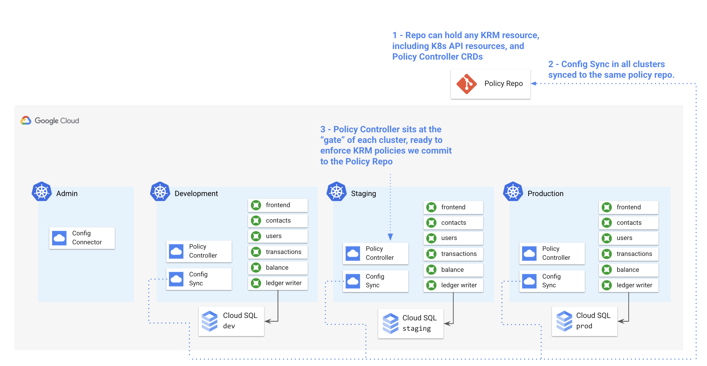

## Part A - Install Config Sync and Policy Controller 



1. **Set variables.** 

```
export PROJECT_ID=[your-project-id]
export GITHUB_USERNAME=[your-github-username]
```

2. **Initialize the cymbalbank-policy repo**.

You created this repo during setup. This repo is located at `github.com/YOUR-USERNAME/cymbalbank-policy` and it's currently empty. This script populates the repo with namespaces corresponding to each of the CymbalBank services. These namespaces were created with a shell script, initially. Now we're preparing to bringing those namespaces into Config Sync's management domain, guarding against manual editing or deletion.   

```
./policy-repo-setup.sh
```

3. **Install Config Sync on the dev, staging, and prod clusters.** 
  
4. **TODO** - currently not using this script because PC stuck in pending. Using UI install to install both CS and PC at once. 


```
./install.sh
```

4. **Get the Config Sync install status for all clusters in your project.**

```
gcloud alpha container hub config-management status --project=${PROJECT_ID}
```

Expected output: 

```
Name            Status         Last_Synced_Token  Sync_Branch  Last_Synced_Time      Policy_Controller
cymbal-admin    NOT_INSTALLED  NA                 NA           NA                    NA
cymbal-dev      SYNCED         e2bca67            main         2021-05-05T15:50:00Z  INSTALLED
cymbal-prod     SYNCED         e2bca67            main         2021-05-05T15:54:08Z  INSTALLED
cymbal-staging  SYNCED         e2bca67            main         2021-05-05T15:53:29Z  INSTALLED
```

Notice that each of the `cymbal-dev`, `cymbal-staging`, and `cymbal-prod` clusters are synced to the same commit of the same repo - this is the first step towards consistent config across the GKE environment. 
