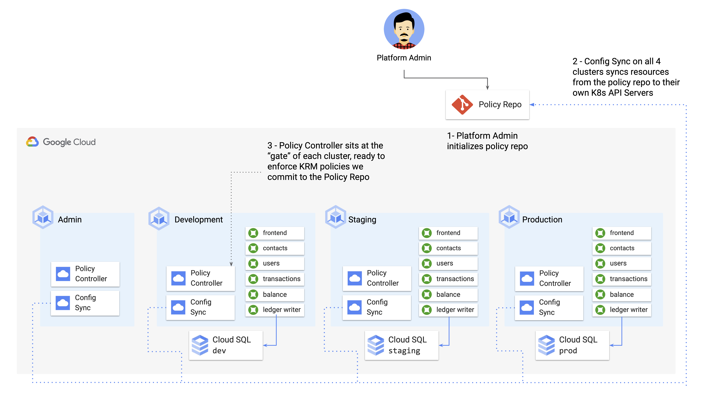
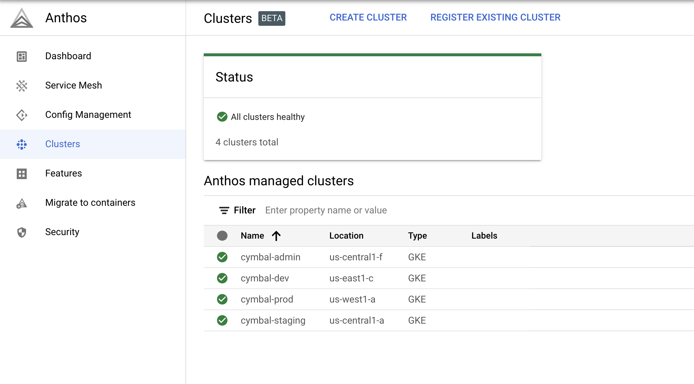
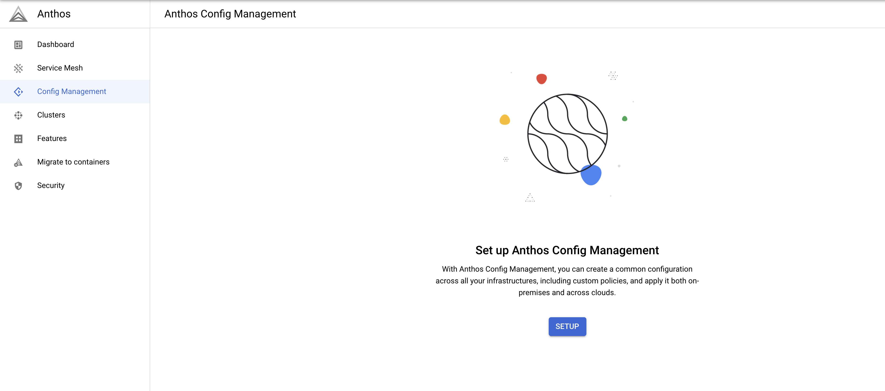
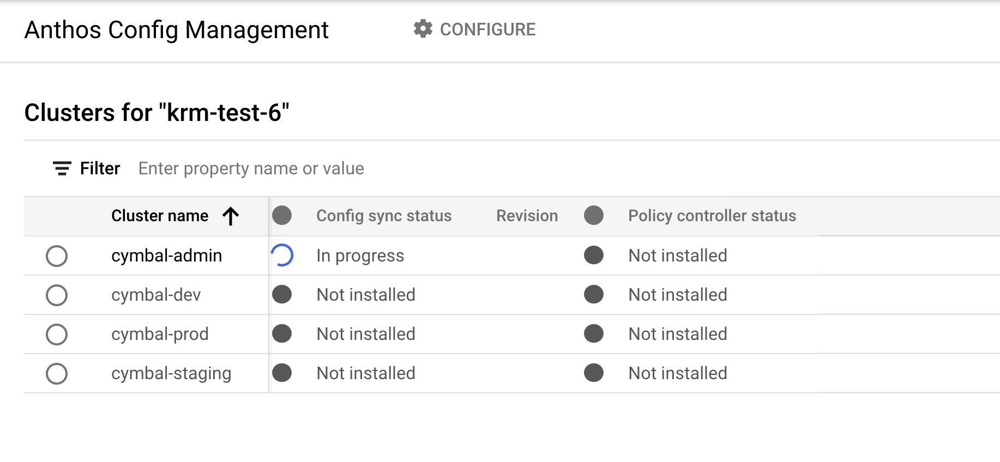
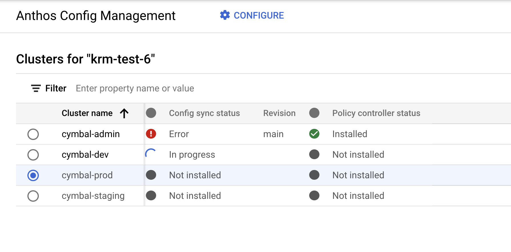
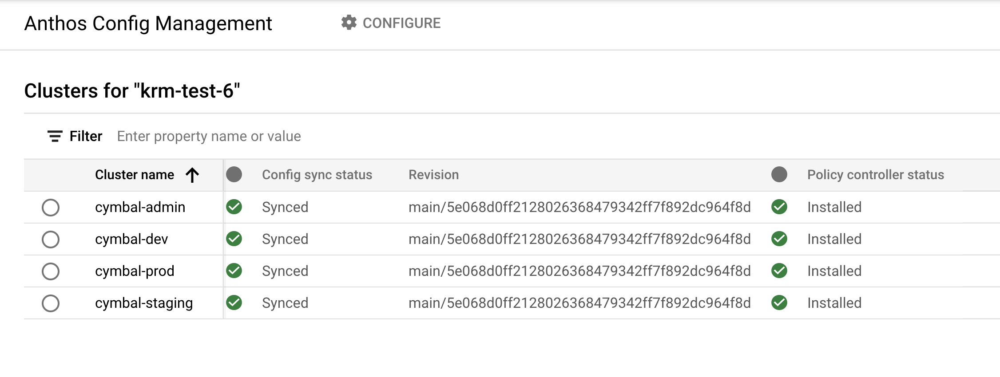

## Part A - Installing Config Sync and Policy Controller 



1. **Set variables.** 

```
export PROJECT_ID=[your-project-id]
export GITHUB_USERNAME=[your-github-username]
```

2. **Initialize the cymbalbank-policy repo**.

You created this Github repo in your account during setup. This repo is located at `github.com/YOUR-USERNAME/cymbalbank-policy` and it's currently empty. 

This script populates your policy repo with namespaces corresponding to each of the CymbalBank services. These namespaces were created with a [shell script in part 1](/1-setup/cluster-setup.sh), initially. Now we're preparing to bringing those namespaces into Config Sync's management domain, guarding against manual editing or deletion.   

Run the policy repo setup script from the `4-platform-admin/` directory: 

```
./policy-repo-setup.sh
```

Expected output: 

```
Compressing objects: 100% (9/9), done.
Writing objects: 100% (17/17), 1.29 KiB | 662.00 KiB/s, done.
Total 17 (delta 0), reused 0 (delta 0), pack-reused 0
To https://github.com/askmeegs/cymbalbank-policy
 * [new branch]      main -> main
```

3. **Navigate to the [Anthos dashboard](https://console.cloud.google.com/anthos) in the Google Cloud Console.** 

4. **In the right sidebar, click Clusters.** You should see your four clusters in the list. 




5. **In the right sidebar, click Config Management.** You should see a window like the one below. **Click "Setup.", then "Enable Config Management."** 



6. **In the Anthos Config Management cluster list, click the open circle next to the `cymbal-admin` cluster. Then at the top of the screen, click "Configure."** 

7. **In the setup menu that appears, populate with the following fields**: 

- **Git repository authentication for ACM:** `None`, then click **Continue.** 
- **ACM Settings for your Clusters:** `Version 1.7.1` or the default-populated version. 
- **Config sync:** check "Enable." A menu will pop up. 
- **URL:** `https:/github.com/your-github-username/cymbalbank-policy`. **Replace `your-github-username` with your username.**
- **Policy controller:** check "Enable." 
- **Branch**: `main`
- **Tag/commit**: leave blank
- **Policy directory**: `/`
- **Sync wait**: leave blank
- **Git proxy**: leave blank 
- **Source format**: `unstructured`
- **Policy controller**: check "Enable."
- **Install default template library**: check to Enable.
- **Audit interval**: 60
- **Exempt namespaces**: leave blank 
- **Enable constraint template objects that reference..**: uncheck

Click **Continue**, then **Done.** You should then see that the Config Sync status for the cymbal-admin cluster is `In progress`. 



8. **Repeat step 7 for the other three clusters: cymbal-dev, cymbal-staging, and cymbal-prod.** (Note - it's also possible to do this setup over the command line, but currently there is a bug when you try to install both Config Sync and Policy Controller at the same time using that method, so to play it safe we're installing in the UI for now.)

9. **Wait for all clusters to show as `Synced` and `Installed` for Config Sync and Policy Controller, respectively**. You may see multiple errors in the UI as these tools are installed on your GKE clusters - this is expected. The total installation time may take 3-5 minutes. 



Eventually, you should see this: 



10. **Return to your terminal. Get the Config Sync install status for all clusters in your project.**

```
gcloud alpha container hub config-management status --project=${PROJECT_ID}
```

Expected output: 

```
Name            Status  Last_Synced_Token  Sync_Branch  Last_Synced_Time      Policy_Controller
cymbal-admin    SYNCED  5e068d0            main         2021-05-13T22:10:25Z  INSTALLED
cymbal-dev      SYNCED  5e068d0            main         2021-05-13T22:11:21Z  INSTALLED
cymbal-prod     SYNCED  5e068d0            main         2021-05-13T22:14:10Z  INSTALLED
cymbal-staging  SYNCED  5e068d0            main         2021-05-13T22:19:12Z  INSTALLED
```

Here, `Last_Synced_Token` is the git commit SHROT_SHA of your latest commit to the `main` branch of your `cymbalbank-policy` repo - you can verify this by `cd`-ing into your policy repo and running: 

```
git log 
```

Expected output: 

```
commit 5e068d0ff2128026368479342ff7f892dc964f8d (HEAD -> main, origin/main)
Author: askmeegs <megan037@gmail.com>
Date:   Thu May 13 17:58:10 2021 -0400

    Init - CymbalBank namespaces
```

So when you installed Config Sync and Policy Controller, what actually got deployed? 

11. **Switch to the dev cluster, and get the Pods in the `config-management-system` and `gatekeeper-system` namespaces.**

```
kubectx cymbal-dev
kubectl get pods -n config-management-system
kubectl get pods -n gatekeeper-system
```

Expected output: 

```
NAME                                  READY   STATUS    RESTARTS   AGE
admission-webhook-6899f7fbd9-2zlvw    1/1     Running   0          14m
admission-webhook-6899f7fbd9-nskpn    1/1     Running   1          14m
reconciler-manager-6b785845c4-5gx47   2/2     Running   0          14m
root-reconciler-8b8889f49-jnnsg       3/3     Running   0          14m

NAME                                             READY   STATUS    RESTARTS   AGE
gatekeeper-audit-76d8d7fb-dbnd7                  1/1     Running   0          15m
gatekeeper-controller-manager-6bf5fdb68f-bftcz   1/1     Running   0          15m
```


The first set of workloads, in the `config-management-system` namespace, run Config Sync. These workloads periodically check your github policy repo for any updates to the KRM source of truth stored there, and deploys those updated resources to the cluster. (Note that every cluster runs their own Config Sync, but all the clusters are synced to the same repo.)

The second set of workloadss, in the `gatekeeper-system` namespace, run Policy Controller. (Policy Controller is based on an open-source project called [Gatekeeper](https://github.com/open-policy-agent/gatekeeper)). These workloads help ensure that any resources entering the cluster - both through CI/CD or through Config Sync - adheres with any policies we set. 

We'll explore how both these tools work in the rest of this demo. 

Now that all our clusters are synced to the same policy repo, we can get started on the first goal - ensuring KRM resource consistency across our multi-cluster environment. 

**[Continue to Part B - Keeping Resources in Sync.](partB-configsync.md)**