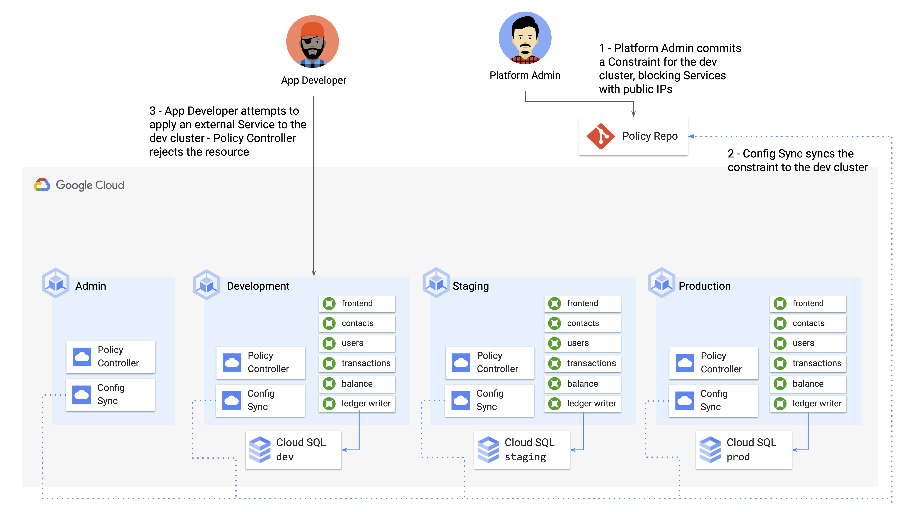

# Part D - Using Policy Controller to Block External Services 

Now that we've learned how to use Config Sync to make sure certain resources are deployed consistently across our Kubernetes environment, let's address the second goal: **preventing unsafe configuration** from landing in any of the clusters. 

Up to now, we've used Config Sync to deploy resources that are part of the Kubernetes core APIs (Namespaces, ResourceQuotas). A Resource Quota is a form of policy that can prevent unsafe config - unsafe meaning, a resource asking for too much CPU or memory - but what if we want to do more complex things, like make sure the name of a resource matches certain guidelines? Or ensure that no Deployment containers run in privileged mdoe?  

This requires **introspection** of a KRM resource itself - said another way, it requires meta-KRM resources about *other* KRM resources. [Policy Controller](https://cloud.google.com/anthos-config-management/docs/concepts/policy-controller) is a tool that does just that. 

Policy Controller is a Google-managed [Kubernetes admission controller](https://cloud.google.com/anthos-config-management/docs/concepts/policy-controller) that can enforce arbitrary "constraints" related to security and compliance. 

Let's unpack that. An **admission controller** is a pod that sits at the "gate" of a Kubernetes cluster, watching what's coming into the API server and doing some type of operation on that resource, before it's "allowed inside" the cluster and persisted in etcd. That "operation on the resource" could include modifying the resource in-flight ([MutatingAdmissionWebhook](https://kubernetes.io/docs/reference/access-authn-authz/admission-controllers/#mutatingadmissionwebhook)) or rejecting the resource entirely ([ValidatingAdmissionWebhook](https://kubernetes.io/docs/reference/access-authn-authz/admission-controllers/#validatingadmissionwebhook)). Policy Controller uses the second kind of webhook to validate incoming config against the policies it knows about, allowing policies in, or rejecting them. Policy Controller is based on an open-source project called [Gatekeeper](https://github.com/open-policy-agent/gatekeeper#gatekeeper), which in turn grew out of the [OpenPolicyAgent](https://www.openpolicyagent.org/) project, part of the [Cloud-Native Computing Foundation](https://www.cncf.io/) (the same foundation that hosts Kubernetes). 

Policy Controller enforces constraints - what do those constraints actually look like? What kinds of Kubernetes resources can we use PolicyController to accept or reject? 

Here's an example. 

```YAML
apiVersion: constraints.gatekeeper.sh/v1beta1
kind: K8sPSPPrivilegedContainer
metadata:
  name: psp-privileged-container
spec:
  match:
    kinds:
      - apiGroups: [""]
        kinds: ["Pod"]
    excludedNamespaces: ["kube-system"]
```

Here, we define a Constraint that blocks [privileged containers](https://kubernetes.io/docs/concepts/policy/pod-security-policy/#privileged). Notice how the `kind` field isn't something general like a Service, but a specific type of policy, `K8sPSPPrivilegedContainer`. This `kind` refers to a **Constraint Template**. 

Think of a Constraint Template as the "what" - what kind of policy? what does it do?, and the Constraint - shown here - is the concrete "how" and "which." How to enforce the policy and which resources to enforce it on? Here, for instance, we're enforcing the "no privileged containers allowed" constraint on all namespaces except for `kube-system`. That's the "how."  

Policy Controller comes with a set of [default Constraint Templates](https://cloud.google.com/anthos-config-management/docs/reference/constraint-template-library). These Constraint Templates can do other things like [block RBAC resources from using wildcards](https://cloud.google.com/anthos-config-management/docs/reference/constraint-template-library#k8sprohibitrolewildcardaccess) (preventing sweeping access to many resources at once), or and require all pods to have [Liveness probes](https://cloud.google.com/anthos-config-management/docs/reference/constraint-template-library#k8srequiredprobes), a feature that helps avoid outages by restarting Pods stuck in deadlock or similar dying states.  

In this demo, we're going to create a policy Constraint for the `cymbal-dev` cluster that [blocks the creation of external services](https://cloud.google.com/anthos-config-management/docs/reference/constraint-template-library#k8snoexternalservices). We'll use an existing Constraint Template from the library to do this. This constraint will help ensure that no sensitive Cymbal Bank code in development is exposed to the public.  



### 1. **Switch to the `cymbal-dev` cluster, and verify that the Constraint Template library is installed.** 
  
This is a set of a few dozen Custom Resources (CRDs), each defining a ConstraintTemplate.   

```
kubectx cymbal-dev

kubectl get constrainttemplates \
    -l="configmanagement.gke.io/configmanagement=config-management"
```

Expected output: 

```
NAME                                      AGE
allowedserviceportname                    2d9h
destinationruletlsenabled                 2d9h
disallowedauthzprefix                     2d9h
gcpstoragelocationconstraintv1            2d9h
k8sallowedrepos                           2d9h
...
```

### 2. **View the `K8sNoExternalServices` Constrant resource, provided for you in the `constraint-ext-services` directory.** 

This Constraint implements the `[K8sNoExternalServices](https://cloud.google.com/anthos-config-management/docs/reference/constraint-template-library#k8snoexternalservices)` Constraint Template with concrete information about our environment. 

```
cat constraint-ext-services/constraint.yaml
```

Expected output: 

```YAML 
# Blocks the creation of Ingress and Service type=LoadBalancer resources 
apiVersion: constraints.gatekeeper.sh/v1beta1
kind: K8sNoExternalServices
metadata:
  name: dev-no-ext-services
  annotations:
    configsync.gke.io/cluster-name-selector: cymbal-dev
spec:
  internalCIDRs: []
```

Here, the `kind: K8sNoExternalServices` refers to the `k8snoexternalservices` constraint template already installed on the cluster. And notice how we're using Config Sync's `cluster-name-selector` annotation to scope this resource to the `cymbal-dev` cluster only. 

### **3. Create a new subdirectory in the `policy-repo`, `clusters/cymbal-dev`.**

This is where we'll keep cluster-wide policies, separate from namespace-specific directories. 

```
mkdir -p cymbalbank-policy/clusters/cymbal-dev
```

### **4. Copy `constraint.yaml` into the new directory.**

```
cp constraint-ext-services/constraint.yaml cymbalbank-policy/clusters/cymbal-dev/
```

### 5. **Run the `tree` command again on the policy repo.**

```
tree cymbalbank-policy/
```

Expected output: 

```
cymbalbank-policy/
├── clusters
│   └── cymbal-dev
│       └── constraint.yaml
└── namespaces
    ├── balancereader
    │   ├── namespace.yaml
    │   └── quota.yaml
    ├── contacts
    │   ├── namespace.yaml
    │   └── quota.yaml
    ├── frontend
    │   ├── namespace.yaml
    │   └── quota.yaml
    ├── ledgerwriter
    │   ├── namespace.yaml
    │   └── quota.yaml
    ├── loadgenerator
    │   ├── namespace.yaml
    │   └── quota.yaml
    ├── transactionhistory
    │   ├── namespace.yaml
    │   └── quota.yaml
    └── userservice
        ├── namespace.yaml
        └── quota.yaml

10 directories, 15 files
```

Although we can structure our policy repo however we want, we're imposing some organization, for readability. Notice how although our `quota.yaml` resources are scoped to the production cluster only, we've put them in their corresponding `namespaces/` directories. Config Sync will correctly scope the resources to the clusters, no matter where we put them in the repo. 

### **6. Commit the Constraint to the main branch of the policy repo.**

```
cd cymbalbank-policy 
git add .
git commit -m "Policy Controller - Add K8sNoExternalIP Constraint"
git push origin main 
cd .. 
```

### **7. Verify that the policy has been synced to the `cymbal-dev` cluster.**

```
gcloud alpha container hub config-management status --project=${PROJECT_ID}
```

Expected output: 

```
Name            Status  Last_Synced_Token  Sync_Branch  Last_Synced_Time      Policy_Controller
cymbal-admin    SYNCED  ed2e4e0            main         2021-05-13T23:59:33Z  INSTALLED
cymbal-dev      SYNCED  ed2e4e0            main         2021-05-13T23:59:42Z  INSTALLED
cymbal-prod     SYNCED  ed2e4e0            main         2021-05-13T23:59:42Z  INSTALLED
cymbal-staging  SYNCED  ed2e4e0            main         2021-05-13T23:59:29Z  INSTALLED
```

### **8. Verify that the constraint is deployed to the cymbal-dev cluster.** 

```
kubectx cymbal-dev
kubectl get constraint 
```

Expected output: 

```
 NAME                                                                  AGE
k8snoexternalservices.constraints.gatekeeper.sh/dev-no-ext-services   47s
```

### **9. Attempt to manually create a service type LoadBalancer in the `cymbal-dev` cluster, corresponding to the `contacts` service Deployment.**
  
You should get an error stating that the Policy Controller admission webhook is blocking the incoming resource. 

```
kubectl apply -f constraint-ext-services/contacts-svc-lb.yaml
```

Expected output: 

```
Resource: "/v1, Resource=services", GroupVersionKind: "/v1, Kind=Service"
Name: "contacts", Namespace: "contacts"
for: "constraint-ext-services/contacts-svc-lb.yaml": admission webhook "validation.gatekeeper.sh" denied the request: [denied by dev-no-ext-services] Creating services of type `LoadBalancer` without Internal annotation is not allowed
```

**🎊 Congrats**! You just deployed your first Policy Controller policy via Config Sync. Notice how, like the namespaces and resource quotas we set up for Config Sync management, these policy constraints will be "sticky." If anyone tries to delete them, Config Sync will say "no." This helps ensure that the necessary policies are always present on the clusters, ready to enforce unsafe KRM from getting in. 

Let's take our Policy Controller knowledge a step further, by writing our own custom Constraint Tempalte outside of the pre-installed library. 

**[Continue to Part E.](partE-custom-policies.md)** 