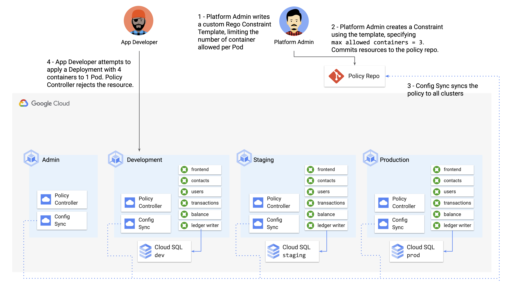

# Part E - Creating Custom Policies

In addition to the built-in Constraint Template library provided by PolicyController, you can also create [custom Constraint Templates](https://cloud.google.com/anthos-config-management/docs/how-to/write-a-constraint-template) with your own org-specific logic.  These policies don't just have to be related to compliance - they can be arbitrary business logic too ("[you can't name your service X!](https://cloud.google.com/anthos-config-management/docs/how-to/write-a-constraint-template#example-constraint-template)").

In this section, we'll write a custom Constraint Template that limits the total number of containers per pod to a set number. We'll then create a Constraint, using that template, that limits the number of containers to **3** per Pod. There are certain valid use cases for adding additional ["sidecar" containers](https://kubernetes.io/blog/2015/06/the-distributed-system-toolkit-patterns/) in a Pod. For instance, the Cymbal Bank backend Pods already have the [Cloud SQL proxy](https://cloud.google.com/sql/docs/mysql/sql-proxy) as a second container. Cloud SQL proxy allows for easy, secure communication from Kubernetes to Cloud SQL.  

But too many containers packed into one Pod can increase the risk of outages - when one container crashes, the whole pod crashes - and it allows for less granular [horizontal scaling](https://stackoverflow.com/questions/11707879/difference-between-scaling-horizontally-and-vertically-for-databases): if 1 container in a pod exceeds its resource requirements, the entire pod must be replicated, even if the other container doesn't need to be replicated. To guard against this, we'll create a Constraint Template to enforce the number of containers allowed per Pod, across all the Cymbal Bank GKE clusters. 




**1. View the custom Constraint Template resource, which has been provided for you in the `constraint-limit-containers/` subdirectory.** 

```
cat constraint-limit-containers/constrainttemplate.yaml 
```

Expected output: 

```
apiVersion: templates.gatekeeper.sh/v1beta1
kind: ConstraintTemplate
metadata:
  name: k8slimitcontainersperpod
spec:
  crd:
    spec:
      names:
        kind: K8sLimitContainersPerPod
      validation:
        openAPIV3Schema:
          properties:
            allowedNumContainers:
              type: integer
  targets:
    - target: admission.k8s.gatekeeper.sh
      rego: |
        package k8slimitcontainersperpod

        numTemplateContainers := count(input.review.object.spec.template.spec.containers)
        numRunningContainers := count(input.review.object.spec.containers)
        containerLimit := input.parameters.allowedNumContainers

        template_containers_over_limit = true {
          numTemplateContainers > containerLimit
        }

        running_containers_over_limit = true {
          numRunningContainers > containerLimit
        }

        violation[{"msg": msg}] {
          template_containers_over_limit
          msg := sprintf("Number of containers in template (%v) exceeds the allowed limit (%v)", [numTemplateContainers, containerLimit])
        }

        violation[{"msg": msg}] {
          running_containers_over_limit
          msg := sprintf("Number of running containers (%v) exceeds the allowed limit (%v)", [numRunningContainers, containerLimit])
        }
```

This resource might look a little scary or unfamiliar, so let's unpack how this template works.

## What is Rego?

PolicyController Constraint Templates are written in a programming language called [**Rego**](https://www.openpolicyagent.org/docs/latest/policy-language/). Unlike the "regular KRM" resources we've seen up to now, Constraint Templates embed Rego code. Rego is a full-featured programming language, created by the [OpenPolicyAgent](https://www.openpolicyagent.org/) project, and it's a query language designed specifically for creating policies.

Rego [supports](https://www.openpolicyagent.org/docs/latest/policy-reference/) objects, arrays, conditionals, functions, regular expressions, and other general-purpose language features. But it's structured differently from a language like Python or Java in that it's designed to take [some **inputs** (in our case, any KRM resource)](https://www.openpolicyagent.org/docs/latest/kubernetes-primer/#input-document), **reason about the contents** of that resource, and return an **output** boolean value - is this resource allowed into the cluster, or not? 

Said another way, custom Constraint Templates with Rego feed Policy Controller its instructions, so that when we `kubectl apply -f deployment.yaml`, Policy Controller knows what to check for. It's a bit tricky because we're ultimately using KRM ConstraintTemplates to reason *about* other KRM files - it's KRM all the way down. 🐢🐢🐢 

## Rego Code Walkthrough  

Rego code is evaluted from top-to-bottom, with the conclusion (allow or deny?) made at the end. The Constraint Template above, `K8sLimitContainersPerPod`, checks if the incoming resource has too many containers per Pod. Line by line, this is what the Rego code does, given some `input.review.object` KRM file (like a Deployment): 

```
numTemplateContainers := count(input.review.object.spec.template.spec.containers)
```

Set a variable, `numTemplateContainers`, to the number of desired Pod containers in the input spec. Note that some Kubernetes resources (StatefulSets, Jobs, Deployments) spawn Pods, but others don't, so in some cases this count will be zero. 

```
numRunningContainers := count(input.review.object.spec.containers)
```

Also get the number of actively running containers for this resource - this is a secondary check because some third-party Kubernetes plugins (like [Prow](https://github.com/kubernetes/test-infra/tree/master/prow)) actually generate Pods directly.


```
containerLimit := input.parameters.allowedNumContainers
```

Get the concrete number of allowed containers per pod, defined in the `Constraint` that uses this `ConstraintTemplate`. A Constraint's information is stored in `input.parameters`. 

```
template_containers_over_limit = true {
  numTemplateContainers > containerLimit
}
```

This is a [Rego if-statement](https://www.openpolicyagent.org/docs/latest/policy-reference/#conditionals-boolean) that sets the condition `template_containers_over_limit` to `true` **if** the number of desired containers is over the limit. 

```
running_containers_over_limit = true {
  numRunningContainers > containerLimit
}
```

Another if statement - set `running_containers_over_limit` to `true` **if** the number of running containers is over the limit. 

```
violation[{"msg": msg}] {
  template_containers_over_limit
  msg := sprintf("Number of containers in template (%v) exceeds the allowed limit (%v)", [numTemplateContainers, containerLimit])
}
```

Throw a policy violation if `template_containers_over_limit` is true. 

```
violation[{"msg": msg}] {
  running_containers_over_limit
  msg := sprintf("Number of running containers (%v) exceeds the allowed limit (%v)", [numRunningContainers, containerLimit])
}
```

Throw a policy violation if `running_containers_over_limit` is true. 

At this point, if Policy Controller has made it to the end of the Rego code without throwing a Violation, the KRM resource is deemed compliant. 
Note that if we have any other Constraints applied to the cluster, Policy Controller will check the incoming resource against those Constraints too. 

## Applying the Custom Policy

**2. View the Constraint, which implements the `K8sLimitContainersPerPod` Constraint Template.** 

```
cat constraint-limit-containers/constraint.yaml 
```

Expected output: 

```
apiVersion: constraints.gatekeeper.sh/v1beta1
kind: K8sLimitContainersPerPod
metadata:
  name: limit-three-containers
spec:
  parameters:
    allowedNumContainers: 3
```

Note that this constraint has no `cluster-selector` annotations, so Config Sync will apply it to all of the clusters. 

**3. Commit both resources to the cymbalbank-policy repo.** 

```
cp constraint-limit-containers/constrainttemplate.yaml cymbalbank-policy/clusters/
cp constraint-limit-containers/constraint.yaml cymbalbank-policy/clusters/
cd cymbalbank-policy/
git add .
git commit -m "Add Constraint Template - K8sLimitContainersPerPod"
git push origin main
cd ..
```

**4. Return to the dev cluster. Verify that the second Constraint, `limit-three-containers`, has been created.** It may take a minute or two for the cluster to sync the policy from Config Sync.

```
kubectx cymbal-dev
kubectl get constraint
```

Expected output: 

```
NAME                                                                  AGE
k8snoexternalservices.constraints.gatekeeper.sh/dev-no-ext-services   8h

NAME                                                                      AGE
k8slimitcontainersperpod.constraints.gatekeeper.sh/limit-three-containers   3m42s
```

**5. View the test workload.**

This is a Deployment where each Pod has 4 containers, each running `nginx`. 4 containers exceeds our limit of 3 containers per pod, so we would expect Policy Controller to reject this resource. 

```
cat constraint-limit-containers/test-workload.yaml
```

Expected output: 

```YAML
apiVersion: apps/v1
kind: Deployment
metadata:
  name: nginx
spec:
  selector:
    matchLabels:
      app: nginx
  replicas: 1 
  template:
    metadata:
      labels:
        app: nginx
    spec:
      containers:
      - name: nginx1
        image: nginx:1.14.2
        ports:
        - containerPort: 8080
      - name: nginx2
        image: nginx:1.14.2
        ports:
        - containerPort: 8081
      - name: nginx3
        image: nginx:1.14.2
        ports:
        - containerPort: 8082
      - name: nginx4
        image: nginx:1.14.2
        ports:
        - containerPort: 8084
```

**6. Attempt to apply the test workload to the dev cluster.**

You should see an error message. 

```
kubectl apply -f constraint-limit-containers/test-workload.yaml
```

Expected output: 

```
Error from server ([limit-three-containers] Number of containers in template (4) exceeds the allowed limit (3)): error when creating "constraint-limit-containers/test-workload.yaml": admission webhook "validation.gatekeeper.sh" denied the request: [limit-three-containers] Number of containers in template (4) exceeds the allowed limit (3)
```

**🌟 Well done!** You just used the Rego policy language to deploy your own custom policy for the Cymbal Bank platform. 

We're almost done with the platform admin story for Cymbal Bank. But before we move on, let's tie together the CI/CD pipeline we built in Demo 3 with the policies we've already set up.  

**[Continue to Part F.](partF-policy-check-ci.md)** 