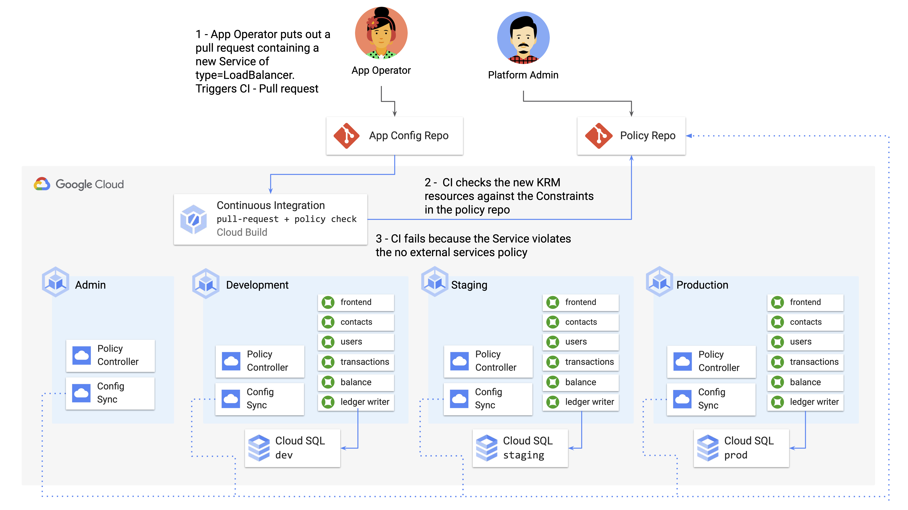

# Part F - Integrate Policy Checks into Application CI/CD 

Policy Controller provides a powerful, flexible way to automatically check incoming resources against org policies. But Policy Controller's setup - as a Kubernetes admission controller, at the gate of the Kubernetes API - means that it can only "catch" (and block) out-of-policy resources on the fly, as they are trying to be deployed through `kubectl` or through CI/CD. 

For app developers or operators who need to create or edit application YAML files, this setup isn't ideal because it means that those developers only know their resources are out of policy **at the moment they get deployed**. Meaning a developer may not know their Kubernetes Deployment is out of compliance until they go through code reviews and run all the tests, only to have to double back and either create another pull requests or roll back a commit to the `main` branch.  

As a platform admin, I want to empower all Cymbal Bank developers to know whether their KRM resources are in compliance with our org-wide policies, so that they have the chance to make changes to those resources. And ideally, I want multiple layers of policy enforcement, not only at deploy-time, but as part of the test pipeline too. Luckily, you can integrate Policy Controller checks into CI/CD. Let's see how. 



### **1. Clone the `cymbalbank-app-config` repo in the `4-platform-admin/` directory.** 

```
git clone https://github.com/$GITHUB_USERNAME/cymbalbank-app-config
```

### **2. View the `cloudbuild-ci-pr-policy.yaml` file in the `app-ci` directory.** 

```
cat app-ci/cloudbuild-ci-pr-policy.yaml
```

Expected output: 

```
# Source: github.com/GoogleCloudPlatform/anthos-config-management-samples/tree/main/ci-app/app-repo/cloudbuild.yaml
steps:
- id: 'Render prod manifests'
  name: 'gcr.io/google.com/cloudsdktool/cloud-sdk'
  entrypoint: '/bin/sh'
  args: ['-c', 'mkdir hydrated-manifests && kubectl kustomize overlays/prod > hydrated-manifests/prod.yaml']
- id: 'Clone cymbalbank-policy repo'
  name: 'gcr.io/kpt-dev/kpt'
  entrypoint: '/bin/sh'
  args: ['-c', 'kpt pkg get https://github.com/$$GITHUB_USERNAME/cymbalbank-policy.git@main constraints
                  && kpt fn source constraints/ hydrated-manifests/ > hydrated-manifests/kpt-manifests.yaml']
  secretEnv: ['GITHUB_USERNAME']
- id: 'Validate prod manifests against policies'
  name: 'gcr.io/config-management-release/policy-controller-validate'
  args: ['--input', 'hydrated-manifests/kpt-manifests.yaml']
availableSecrets:
  secretManager:
  - versionName: projects/${PROJECT_ID}/secrets/github-username/versions/1 
    env: 'GITHUB_USERNAME'
timeout: '1200s' #timeout - 20 minutes
```

This pipeline has three steps: 

1. **Render prod manifests** - Remember that the cymbalbank-app-config repo has a `base/` directory and two overlays, `dev/` and `prod/`. We'll generate the production manifests using kustomize, so that we have fully-hydrated KRM resources to check our policies against. 
2. **Clone the cymbalbank-policy repo** - Also remember that this build is running in the cymbalbank-app-config repo, so in order to check those manifests against our policies, we have to clone them in from the policy repo. Also notice that there is a `kpt fn source` command. [**kpt**](https://googlecontainertools.github.io/kpt/) is a KRM package management tool that's still in early development at the time of writing this demo, so we aren't covering it much. All you need to know for the purpose of this build, is that `kpt fn source` means, "run a function called `[source](https://googlecontainertools.github.io/kpt/guides/consumer/function/catalog/sources/)`" to write the compiled policies in `cymbalbank-policy` to the `hydrated-manifests/` directory. 
3. **Validate the prod manifests against policies** - Up to now, we've seen Policy Controller work at the admission control level of our GKE clusters. Here, the Policy Controller logic is actually running in a container called `policy-controller-validate`, which is pre-built by the Policy Controller team and provided as part of the product. This container can do the same thing that the Admission Controller does - take some incoming KRM (in this case, the contents of the cymbalbank-app-config pull request) and check the resources against the Constraints in our policy repo. 

### **3. Copy the Cloud Build pipeline into the `cymbalbank-app-config` root and push to the `main branch`.** 

```
cp app-ci/cloudbuild-ci-pr-policy.yaml cymbalbank-app-config/
cd cymbalbank-app-config
git add . 
git commit -m "Add CI for pull requests - policy check"
git push origin main
```

### **4. Remove the `K8sNoExternalServices` constraint from the cymbalbank-policy repo.** This is a temporary workaround to an issue with the Policy Controller CI mechanism, where the default constraint template library isn't properly downloaded in, so that constraint isn't recognized as a valid resource. 

```
cd ..
cd cymbalbank-policy
rm clusters/cymbal-dev/constraint.yaml
git add .
git commit -m "Remove K8sNoExternalServices constraint"
git push origin main
cd ../cymbalbank-app-config
```

### **5. Create a new Cloud Build trigger corresponding to this new policy check pipeline, by navigating to the Console > Cloud Build > Triggers > Create.**

We want to run this pipeline anytime someone puts out a pull request with updated application YAML. 

- **Name**: `continuous-integration-app-policy`
- **Event**: Pull Request
- **Source**: `cymbalbank-app-config`
- **Base Branch**: `^main$`
- **Configuration**: `Cloud Build configuration file` 
- **Cloud Build configuration file location**: `cloudbuild-ci-pr-policy.yaml`

Click **Create**. 

### **6. Return to the terminal, and still in the `cymbalbank-app-config` root dir, check out a new branch, `nginx`.**

```
git checkout -b nginx
```

### **7. Copy the `test-workload.yaml` Deployment we used earlier in this demo into the `cymbalbank-app-config` repo, under the `base/` manifests.**

Given that we committed a policy to `cymbalbank-policy` stating that only up to 3 containers are allowed per Pod, we expect the pipeline to fail, with the same Policy Controller error we saw when trying to `kubectl apply -f` this same Deployment. Also update the base `kustomization.yaml` to bring the nginx Deployment into the baseline manifests it knows about. 

```
cp ../constraint-limit-containers/test-workload.yaml ./base/
```

### **8. Add test-workload.yaml to your kustomization.yaml file.** 

Do this by opening `./base/kustomization.yaml` and adding this line to the bottom of the file: 

```
- test-workload.yaml
```

Your kustomization.yaml file should now look like this: 

```YAML 
apiVersion: kustomize.config.k8s.io/v1beta1
kind: Kustomization
resources:
- balancereader.yaml
- contacts.yaml
- ledgerwriter.yaml
- loadgenerator.yaml
- populate-accounts-db.yaml
- populate-ledger-db.yaml
- transactionhistory.yaml
- userservice.yaml
- frontend.yaml
- test-workload.yaml
```

### **8. Commit the file to the `nginx` branch.**

```
git add .
git commit -m "Add nginx Deployment"
git push origin nginx
```

Expected output: 

```
remote: Create a pull request for 'nginx' on GitHub by visiting:
remote:      https://github.com/askmeegs/cymbalbank-app-config/pull/new/nginx
remote:
To https://github.com/askmeegs/cymbalbank-app-config
 * [new branch]      nginx -> nginx
```

### **9. In a browser, navigate to `github.com/your-github-username/cymbalbank-app-config`.**

Put out a new Pull Request for the `nginx` branch, into the `main` branch. 

### **10.  Navigate back to Cloud Build > History, and watch the build run.** 

You should see an error in the third step, matching the Policy Controller error you saw when trying to `kubectl apply -f` the nginx resource earlier. 

```
Status: Downloaded newer image for gcr.io/config-management-release/policy-controller-validate:latest
gcr.io/config-management-release/policy-controller-validate:latest
Error: Found 1 violations:

[1] Number of containers in template (4) exceeds the allowed limit (3)

name: "nginx"
path: prod.yaml
```

**🎊 Nice work!** You just added a second layer of policy checks to your Kubernetes platform, helping app developers understand if their resources are in compliance, even before their PRs are reviewed. 

If you're ready, **[Continue to Demo 5](/5-hosted-resources/README.md).**

## Learn More 

### Config Sync 

- [Config Sync - Overview](https://cloud.google.com/kubernetes-engine/docs/add-on/config-sync/config-sync-overview?hl=sv-SESee)
- [Config Sync samples](https://github.com/GoogleCloudPlatform/anthos-config-management-samples)
- [Config Sync - Configuring Only a Subset of Clusters](https://cloud.google.com/kubernetes-engine/docs/add-on/config-sync/how-to/clusterselectors)
- [GKE Best practices - RBAC](https://cloud.google.com/kubernetes-engine/docs/how-to/hardening-your-cluster#use_namespaces_and_rbac_to_restrict_access_to_cluster_resources)


### Policy Controller

- [Policy Controller - Overview](https://cloud.google.com/anthos-config-management/docs/concepts/policy-controller)
- [Policy Controller - Creating Constraints using the default Constraint Template library](https://cloud.google.com/anthos-config-management/docs/how-to/creating-constraints)
- [Policy Controller - Writing Constraint Templates with Rego](https://cloud.google.com/anthos-config-management/docs/how-to/write-a-constraint-template)
- [OpenPolicyAgent - Gatekeeper - Docs](https://open-policy-agent.github.io/gatekeeper/website/docs/howto/)
- [OpenPolicyAgent - Rego language](https://www.openpolicyagent.org/docs/latest/policy-language/)
- [OpenPolicyAgent - The Rego Playground](https://play.openpolicyagent.org/)
- [Policy Controller - Using Policy Controller in a CI Pipeline](https://cloud.google.com/anthos-config-management/docs/tutorials/policy-agent-ci-pipeline)