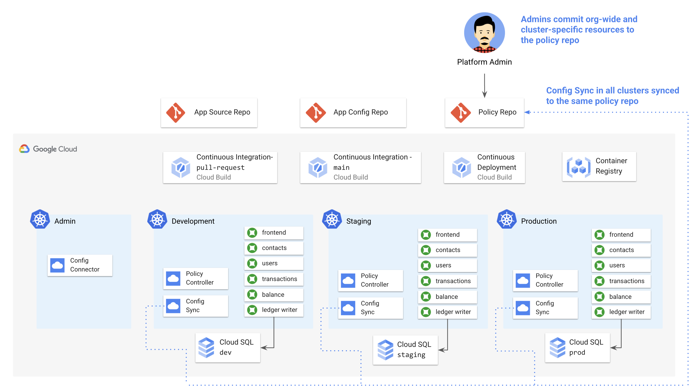

# 4 - Admin Workflow with Config Sync and Policy Controller

## Contents 

## What you'll learn 

- How GitOps promotes SecOps best practices 
- How to use Config Sync to sync KRM from Github to multiple GKE clusters
- When to use Config Sync for KRM, vs. CI/CD 
- How to scope resources to only apply to the dev or prod environments 
- How Policy Controller promotes compliance in a Kubernetes environment
- How to use Policy Controller to define org-wide policies, synced with ConfigSync.

## Prerequisites 

Completed parts 1-3. 

## Part A - Setup 

1. Install the nomos command line tool 

1. Initialize policy repo 

```
./repo_setup.sh
```

1. Install ConfigSync on the dev, staging, and prod clusters. 

```
./install.sh
```

## Part B - A Tour of Config Sync 



1. View cluster sync status 

```
gcloud alpha container hub config-management status --project=${PROJECT_ID}
```

1. View managed namespace to see "managed by" annotation. 

```
kubectx cymbal-dev
kubectl get namespace frontend -o yaml 
```

Expected output: 

```
apiVersion: v1
kind: Namespace
metadata:
  annotations:
    config.k8s.io/owning-inventory: config-management-system_root-sync
    configmanagement.gke.io/cluster-name: cymbal-dev
    configmanagement.gke.io/managed: enabled
    configmanagement.gke.io/source-path: namespaces/frontend/namespace.yaml
    configmanagement.gke.io/token: e2bca67d4f197bf31206de1f37cdc92ee2896049
    configsync.gke.io/declared-fields: '{}'
    configsync.gke.io/git-context: '{"repo":"https://github.com/askmeegs/cymbalbank-policy","branch":"main","rev":"HEAD"}'
```

1. Push a new resource 


1. Try to delete it + watch it be redeployed. (Avoiding configuration drift)


## Part C - Creating a Cluster-Scoped Resource


## Part D - Creating an Org-Wide Policy with Policy Controller 