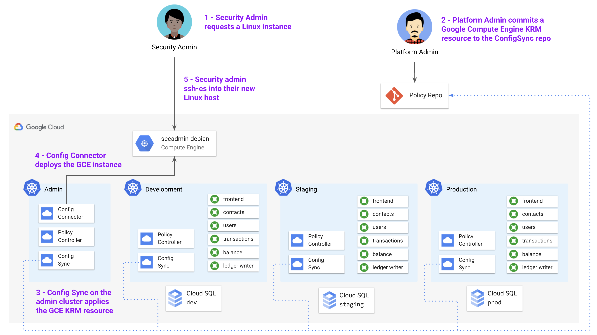

# Part 5 - Using KRM for Hosted Resources 

## What you'll learn 

- Why you'd use the Kubernetes Resource Model to lifecycle resources outside of Kubernetes 


## Introduction 

Why KRM for cloud resources? 
- Frees you from gcloud / bash scripts 
- Unify K8s and non K8s resources into 1 repo, 1 format 
- GitOps + config sync for hosted resources ( > TF)
- Policy checks for hosted resources 

## Part A - Introducing Config Connector for Kubernetes

Way back in Part 1, we used Terraform to set up a bunch of cloud resources - this included multiple GKE clusters, IAM resources, Cloud SQL databases, and Secret Manager secrets. 

Why KRM for cloud resources? 
- Frees you from gcloud / bash scripts 
- Unify K8s and non K8s resources into 1 repo, 1 format 
- GitOps + config sync for hosted resources ( > TF)
- Policy checks for hosted resources 


Config Connector can be installed to GKE as a cluster add-on, on cluster creation, so config sync is already running on the Cymbal Admin cluster. You may have also noticed we didn't install Config Connector on any of the other clusters -- because Config Connector spawns Google Cloud resources outside the cluster, we want to avoid multiple copies of the same resource deployed into different clusters, to avoid clobbering. 

1. Run the setup script 

```
./setup-config-connector.sh 
```

Let's start with a basic example of creating a GCP-hosted resource using Config Connector, declared with KRM. Let's say that one of the security admins in CymbalBank only has access to a Windows machine, and they want to start working with the platform team to study and create org-wide policies using the Policy Controller constraints we learned about in part 4. Because some of the tools we've learned don't support Windows yet, we can spin up a Linux host for them so they have access to a full development environment. 



1. **Set variables.** 

```
export PROJECT_ID=your-project-id
export GITHUB_USERNAME=your-github-username 
```

2. **Clone the `cymbalbank-policy` repo into this directory.** 

```
git clone https://github.com/$GITHUB_USERNAME/cymbalbank-policy 
```

3. **Create a `clusters/cymbal-admin` directory in the `cymbalbank-policy` repo.** 

```
mkdir -p cymbalbank-policy/clusters/cymbal-admin 
```

4. **View the GCE KRM resources.** 

```
cat gce-secadmin/instance.yaml 
```

5. **Copy the GCE resources into the `cymbal-admin` directory.** 


```
cp gce-secadmin/instance.yaml cymbalbank-policy/clusters/cymbal-admin 
```

6. **Commit the resources to the cymbalbank-policy repo.** 

```
cd cymbalbank-policy
git add .
git commit -m "Add GCE instance - Config Connector" 
git push origin main 
```

7. **Wait for the cymbal-admin cluster to sync.** 

```
gcloud alpha container hub config-management status --project=${PROJECT_ID}
```

8. **Get the status of the deployed resources.** 

```
kubectl get gcp 
```

Expected output: 

```
NAME                                                                               AGE     READY   STATUS     STATUS AGE
computesubnetwork.compute.cnrm.cloud.google.com/computeinstance-dep-cloudmachine   5m57s   True    UpToDate   5m3s

NAME                                                            AGE    READY   STATUS     STATUS AGE
computeinstance.compute.cnrm.cloud.google.com/secadmin-debian   6m1s   True    UpToDate   4m3s

NAME                                                                            AGE     READY   STATUS     STATUS AGE
computenetwork.compute.cnrm.cloud.google.com/computeinstance-dep-cloudmachine   5m59s   True    UpToDate   5m48s

NAME                                                                          AGE   READY   STATUS     STATUS AGE
computedisk.compute.cnrm.cloud.google.com/computeinstance-dep1-cloudmachine   6m    True    UpToDate   5m44s
computedisk.compute.cnrm.cloud.google.com/computeinstance-dep2-cloudmachine   6m    True    UpToDate   5m48s

NAME                                                                AGE     READY   STATUS     STATUS AGE
iamserviceaccount.iam.cnrm.cloud.google.com/inst-dep-cloudmachine   5m58s   True    UpToDate   5m57s
```

9. **In a browser, open the Cloud Console and navigate to Compute Engine > VM Instances. Filter on `name:secadmin`. You should see the new GCE instance in the list.** 


**🌈 Nice job!** You just deployed your first cloud-hosted resource with KRM! 

You'll notice that we (the platform admin) had to manually create the GCE resources, and push to the config repo. In a real-life scenario, the platform team might even set up a self-service system with a basic web UI, so that Cymbal Bank employees can request a GCE instance. This web app would take in parameters (like choose an operating system from a drop-down menu, disk size, etc.), and generate a JSON or YAML file with the GCE KRM, commit it to the repo automatically. This would provide a hands-off way of allowing users to set up their own resources, while maintaining a centralized, auditable source of truth in Git. 

## Part B - Enforcing Policies on Cloud-Hosted Resources 

Let's come back to why using KRM for cloud resources is useful. First, because we have Config Sync installed on the same cluster as Config Connector, the security admin who requested this machine can't manually edit it - for instance, they can't increase the disk size, resulting in unexpected costs. Config Sync and Config Connector will always work together to make sure the exact resource specs in the policy repo match the live GCE instance. 

Second, because we have Policy Controller enabled in the cymbal-admin cluster, we can actually create Constraints on cloud resources as well, imposing guardrails on the types of hosted resources allowed, or on the paramters within a specific resource type. This is exciting because it can allow enterprises to explore new Google Cloud products - like [BigQuery](https://cloud.google.com/config-connector/docs/reference/resource-docs/bigquery/bigquerytable), [Firestore](https://cloud.google.com/config-connector/docs/reference/resource-docs/firestore/firestoreindex) or [Game Servers](https://cloud.google.com/config-connector/docs/reference/resource-docs/gameservices/gameservicesrealm) - safely. 

Let's see this in action. Let's say that the data analytics team at Cymbal Bank wants to explore [BigQuery](https://cloud.google.com/bigquery/docs/introduction) to better understand Cymbal's customers. While the application engineering team is at work building a [Pub/Sub](https://cloud.google.com/dataflow/docs/guides/templates/provided-streaming#cloudpubsubsubscriptiontobigquery) export feature between the existing Cloud SQL databases and BigQuery, the analytics team wants to prepare by learning BigQuery. As the platform team, we can enable them while making sure they only use certain allowed sample datasets, and don't import any real customer data yet. 

Let's see how. 


1. View the mock transaction dataset. This is a 1000-line CSV file, whose fields mimic the data currently stored in the Cloud SQL `ledger_db` today. 

```
head bigquery/cymbal-mock-transactions.csv 
```

Expected output: 

```
transaction_id,from_account,to_account,amount,timestamp,user_agent
1,783090138,296808508,$970.43,4/10/2021,Mozilla/5.0
2,065419094,460289381,$301.53,12/27/2020,AppleWebKit/537.36
3,963595720,549123263,$624.50,11/1/2020,Chrome/51.0.2704.103
4,389877011,027171468,$42.24,6/20/2020,Safari/537.36
5,124961818,328966565,$618.91,10/30/2020,Mozilla/5.0
6,267080812,814045028,$170.00,9/5/2020,AppleWebKit/537.36
7,760106461,999333329,$226.68,4/30/2021,Chrome/51.0.2704.103
8,337830129,789806989,$717.91,8/15/2020,Chrome/51.0.2704.103
9,145870222,311667375,$39.17,4/15/2021,Chrome/51.0.2704.103
```

2. Verify that you have the gsutil tool installed - this comes bundled with the gcloud command. [Install the tool](https://cloud.google.com/storage/docs/gsutil_install) if it's not in your PATH. 

```
gsutil -version 
```

Expected output: 

```
gsutil version: 4.61
```

3. Create a Cloud Storage bucket in your project, called `datasets`. 

```
gsutil mb -c standard gs://$PROJECT_ID-datasets
```

Expected output: 

```
Creating gs://krm-test-5-datasets/...
```

4. Upload the mock transaction data to Cloud Storage. 

```
gsutil cp bigquery/cymbal-mock-transactions.csv  gs://${PROJECT_ID}-datasets/cymbal-mock-transactions.csv
```

Expected output: 

```
Copying file://bigquery/cymbal-mock-transactions.csv [Content-Type=text/csv]...
/ [1 files][ 56.6 KiB/ 56.6 KiB]
Operation completed over 1 objects/56.6 KiB.
```

5. View the BigQuery Job, Table, and Dataset resources provided for you in the `bigquery` directory. 

```
cat bigquery/mock-dataset.yaml 
```

Expected output: 

```

```

Here, we define a BigQuery Table, `cymbal-mock-table`, referencing a new Dataset, `cymbal-mock-dataset`, whose data is loaded in from a BigQuery job, `cymbal-mock-load-job`, referencing the CSV file you just uploaded to Cloud Storage. 

6. Replace the `PROJECT_ID` in the `gs://` URL in `mock-dataset.yaml` with your `PROJECT_ID.`

```
sed -i "s/PROJECT_ID/$PROJECT_ID/g" bigquery/mock-dataset.yaml 
```

7. Copy the resources into the cymbalbank-policy repo. 

8. Push to the cymbalbank-policy repo. 

9.  Wait for the resources to sync to the cymbal-admin cluster. 

```
gcloud alpha container hub config-management status --project=${PROJECT_ID}
```

10. Get the GCP resource status. 

```
kubectl get gcp
```

Expected output: 

```
NAME                                                               AGE    READY   STATUS     STATUS AGE
bigquerydataset.bigquery.cnrm.cloud.google.com/cymbalmockdataset   109s   True    UpToDate   108s

NAME                                                           AGE    READY   STATUS     STATUS AGE
bigquerytable.bigquery.cnrm.cloud.google.com/cymbalmocktable   109s   True    UpToDate   107s

NAME                                                              AGE    READY   STATUS     STATUS AGE
bigqueryjob.bigquery.cnrm.cloud.google.com/cymbal-mock-load-job   109s   True    UpToDate   56s...
```

11. Navigate to the Google Cloud Console > BigQuery. In the left sidebar, click the drop-down next to your project. You should see a dataset called `cymbalmockdataset`, and beneath that, a table called `cymbalmocktable`. You should be able to see the populated column fields, and run a `SELECT *` query on the table, to see the 1000-row dataset in the results. 


Now let's come back to the restrictions we outlined at the beginning of this section- for now, the only allowed BigQuery dataset allowed in this (beyond the public datasets) is the one we just created. Let's create a resource name restriction policy to lock down any other BigQuery resources from being commited to the policy repo. Also note that in a real use case, we would lock down BigQuery Table and Dataset creation permissions to the Config Connector Google Service Account only, using Google Cloud IAM to restrict Cymbal Bank analytics team permissions to the `BigQuery Viewer` role only. This would block users from creating BigQuery resources from the console, as well. 

12. View the `dataset-policy.yaml` resources in the `bigquery/` directory. This file defines a constraint template for `BigQueryDatasetAllowName`, and a constraint of type `BigQueryDatasetAllowName`, which together allow only one BigQuery dataset in the policy repo - the one we already created, `cymbalmockdataset`. 

```
cat bigquery/constrainttemplate.yaml
cat bigquery/constraint.yaml
```

Expected output: 

```

```

13. Copy the policy into the cymbalbank-policy repo, and commit to the main branch. 

14. Wait for the resources to sync. 

```
gcloud alpha container hub config-management status --project=${PROJECT_ID}
```

15. Attempt to manually create a new dataset, called `helloworld-dataset`. 

```
kubectl apply -f bigquery/helloworld-dataset.yaml 
```

Expected output: 

```

```

## Part C - Managing Existing Cloud Resources with Config Connector 

In this section, we'll bring our existing hosted Cloud SQL databases- originally created via Terraform, in part 1- into the management of Config Connector, via Config Sync. 

1. [Install the Config Connector tool](https://cloud.google.com/config-connector/docs/how-to/import-export/overview#installing-config-connector) and ensure it's in your PATH: 

```
config connector version
```

Expected output: 

```
1.46.0
```

1. Set variables. 

```
export PROJECT_ID=[your-project-id]
```

1. Get the Config Connector pods in the `cnrm-system` namespace. ("CNRM" stands for "Cloud Native Resource Management" and was an earlier product name for Config Connector.) 

```
kubectx cymbal-admin 
kubectl get pods -n cnrm-system
```

Expected output: 

```
NAME                                            READY   STATUS    RESTARTS   AGE
cnrm-deletiondefender-0                         1/1     Running   0          10h
cnrm-resource-stats-recorder-68648fd95d-9k2hc   2/2     Running   0          10h
cnrm-webhook-manager-7d5b995bbc-4dcv4           1/1     Running   0          10h
cnrm-webhook-manager-7d5b995bbc-pxkkq           1/1     Running   0          10h
```

1. Clone the cymbalbank-policy repo in this directory, and create a "clusters/cymbal-admin" directory.

```
git clone https://github.com/cymbalbank-policy
mkdir -p cymbalbank-policy/clusters/cymbal-admin
```

1. View the resources in the `cloudsql-source` directory. 

1. Copy the resources in the `cloudsql-source` directory into the cymbalbank-policy repo.  

1. Commit the Cloud SQL resources to the cymbalbank-policy repo's `main` branch. 

1. Wait for Config Sync to sync the Cloud SQL resources down to the admin cluster. 

```
gcloud alpha container hub config-management status --project=${PROJECT_ID}
```

1. Get the resources managed by Config Connector. 

```
kubectl get gcp
```

1. Get the sync status for the dev database.

Expected output: 

1. Go into the Google Cloud Console > Cloud SQL and attempt to edit the dev database. 


## With resource export 

```
config-connector export "//sqladmin.googleapis.com/sql/v1beta4/projects/krm-test-5/instances/cymbal-dev" --output cymbalbank-policy/clusters/cymbal-admin/

config-connector export "//sqladmin.googleapis.com/sql/v1beta4/projects/krm-test-5/instances/cymbal-dev/databases/accounts-db" --output cymbalbank-policy/clusters/cymbal-admin/

config-connector export "//sqladmin.googleapis.com/sql/v1beta4/projects/krm-test-5/instances/cymbal-dev/databases/ledger-db" --output cymbalbank-policy/clusters/cymbal-admin/
```

## Part B - Enforcing Cloud Resources with Policy Controller 

One key benefit of bringing our - beyond continuous reconciliation - 

Region restriction for new databases 

https://cloud.google.com/architecture/policy-compliant-resources 


## Learn More 

- [Config Connector overview](https://cloud.google.com/config-connector/docs/overview)
- [List of Google Cloud resources supported by Config Connector](https://cloud.google.com/config-connector/docs/reference/overview)
- [Github - Config Connector samples](https://github.com/GoogleCloudPlatform/k8s-config-connector/tree/master/samples/resources)
- [`gcloud resource-config bulk-export](https://cloud.google.com/sdk/gcloud/reference/alpha/resource-config/bulk-export)
- [Google Cloud Blog - "Sign here! Creating a policy contract with Configuration as Data" - Kelsey Hightower and Mark Balch](https://cloud.google.com/blog/products/containers-kubernetes/how-configuration-as-data-impacts-policy)
- [Github - Config Connector + Policy Controller demo - Kelsey Hightower](https://github.com/kelseyhightower/config-connector-policy-demo) 