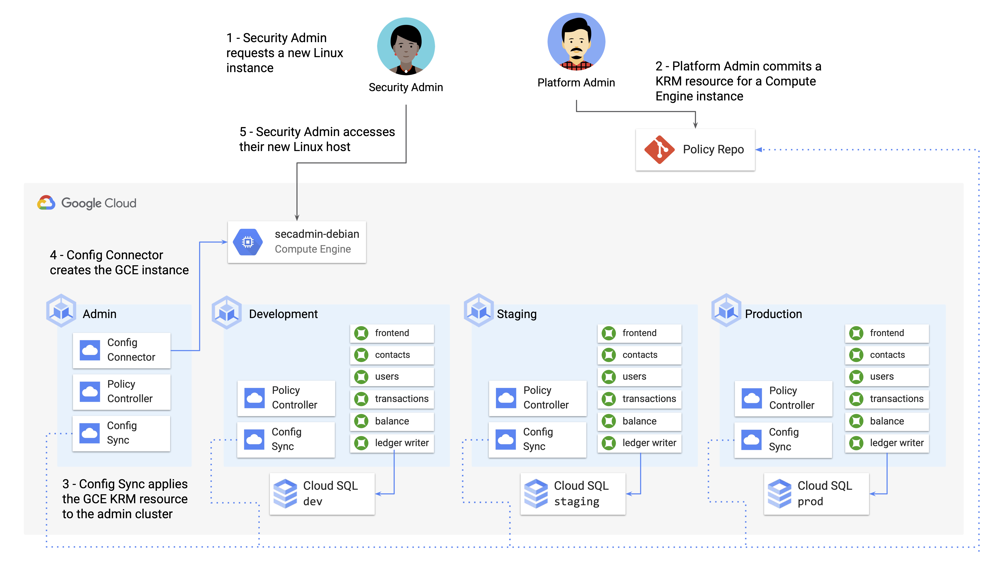
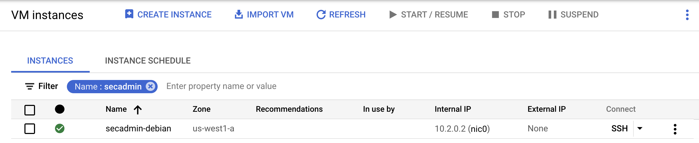

# Part A - Introducing Config Connector

## Introduction 

Back in [Demo 1](/1-setup/), we used Terraform to set up a bunch of cloud resources, including multiple GKE clusters, IAM resources, Cloud SQL databases, and Secret Manager secrets. Terraform is great for bootstrapping hosted resources because like KRM, it uses declarative resource files like this —

```
resource "google_sql_database" "cymbal-dev-ledger-db" {
  project = var.project_id 
  name     = "ledger-db"
  instance = google_sql_database_instance.cymbal-dev.name
}
```

— rather than imperative commands like `gcloud sql databases create...`. Chances are if you're not using Kubernetes, Terraform is a solid config management solution for your hosted resources.

But if you *do* use Kubernetes, you'll end up having two data formats, and two toolchains - Terraform for your cloud resources, and Kubernetes for your Kubernetes resources. Bringing cloud resources from Terraform (or another config management tool) into a KRM format has several benefits: 

- Continuous reconciliation for cloud resources - the Kubernetes Controller model will make sure your cloud-hosted resources are always alive and in sync with the desired state. 
- Unified toolchain (eg. use kustomize and CI/CD to populate all resources, both Kubernetes and cloud)
- 1 config format for developers to learn
- 1 config format to lint and validate
- Integration with Config Sync (Git source of truth will always match what's running in the cloud) 
- Integration with Policy Controller (compliance checks for cloud-hosted resources, in addition to Kubernetes resources)

Of course, every organization has different needs, and if you're already invested in Terraform, it might make sense to continue using that alongside KRM. 

In any case, let's learn how Config Connector works with GCP-hosted resources. 

## Installation 

Let's install Config Connector onto our GKE environment. We'll lifecycle cloud-hosted resources from the `cymbal-admin` cluster, so we'll install Config Connector there. 

### 1. `cd` into the `5-hosted-resources/` directory from the root of this repository. 

```
cd 5-hosted-resources/
```

### 2. **Set variables.** 

```
export PROJECT_ID=your-project-id
export GITHUB_USERNAME=your-github-username 
```

### 3. **Open `configconnector.yaml` and in line 8, replace `PROJECT_ID` with your Project ID.** 

### 4. **Run the setup script.** 

```
./setup-config-connector.sh 
```

Expected output: 

```
✅ Finished installing Config Connector on all clusters.
```

This script grants Config Connector (running in the GKE cluster) the IAM permissions it needs to create and update GCP resources in your project, and deploys Config Connector onto the cluster. 

### 5. **Verify that Config Connector is installed on the admin cluster.**

```
kubectx cymbal-admin
kubectl get pods -n cnrm-system
```

Expected output: 

```
NAME                                            READY   STATUS    RESTARTS   AGE
cnrm-controller-manager-0                       2/2     Running   0          37s
cnrm-deletiondefender-0                         1/1     Running   0          3d19h
cnrm-resource-stats-recorder-68648fd95d-rpqcw   2/2     Running   0          3d19h
cnrm-webhook-manager-7d5b995bbc-bqvcs           1/1     Running   0          3d19h
cnrm-webhook-manager-7d5b995bbc-xpx65           1/1     Running   0          3d19h
```

## Creating a Compute Engine Instance with Config Connector 

Let's start with a basic example of creating a GCP-hosted resource using Config Connector, declared with KRM. Let's say that one of the security admins in CymbalBank only has access to a Windows machine, and they want to start working with the platform team to study and create org-wide policies using the Policy Controller constraints we learned about in part 4. Because some of the tools we've learned don't support Windows yet, we can spin up a Linux host for them so they have access to a full development environment. 




### 1. **View the GCE KRM resources.** 

```
cat compute-engine/instance.yaml 
```

Expected output: 

```
apiVersion: compute.cnrm.cloud.google.com/v1beta1
kind: ComputeInstance
metadata:
  annotations:
    cnrm.cloud.google.com/allow-stopping-for-update: "true"
    configsync.gke.io/cluster-name-selector: cymbal-admin
  name: secadmin-debian
  labels:
    created-from: "image"
    network-type: "subnetwork"
spec:
  machineType: n1-standard-1
  zone: us-west1-a
  bootDisk:
    initializeParams:
      size: 24
      type: pd-ssd
      sourceImageRef:
        external: debian-cloud/debian-9
...
```

This KRM resource defines one Compute Engine instance, along with a Compute Disk and some networking resources. Notice how the KRM looks a lot like a Deployment YAML - it has a name, metadata with some labels, and a spec, with info specifically about a GCE instance. Config Connector knows how to read this `ComputeEngine` resource type, and take action on it - in this case, create a Compute Engine instance in our GCP project. 

### 2. Apply the Compute Engine resources to the admin cluster. **⚠️ Note** - this demo shows applying the cloud-hosted KRM resources manually with kubectl, due to an ongoing bug between Config Sync and Config Connector. But in an ideal scenario, we use Config Sync to sync the Config Connector KRM just like we did policies. 

```
kubectx cymbal-admin
kubectl apply -f compute-engine/instance.yaml
```

### 3. **Get the status of the deployed resources on the cymbal-admin cluster** 

```
kubectl get gcp 
```

Expected output: 

```
NAME                                                                               AGE     READY   STATUS     STATUS AGE
computesubnetwork.compute.cnrm.cloud.google.com/computeinstance-dep-cloudmachine   5m57s   True    UpToDate   5m3s

NAME                                                            AGE    READY   STATUS     STATUS AGE
computeinstance.compute.cnrm.cloud.google.com/secadmin-debian   6m1s   True    UpToDate   4m3s

NAME                                                                            AGE     READY   STATUS     STATUS AGE
computenetwork.compute.cnrm.cloud.google.com/computeinstance-dep-cloudmachine   5m59s   True    UpToDate   5m48s

NAME                                                                          AGE   READY   STATUS     STATUS AGE
computedisk.compute.cnrm.cloud.google.com/computeinstance-dep1-cloudmachine   6m    True    UpToDate   5m44s
computedisk.compute.cnrm.cloud.google.com/computeinstance-dep2-cloudmachine   6m    True    UpToDate   5m48s

NAME                                                                AGE     READY   STATUS     STATUS AGE
iamserviceaccount.iam.cnrm.cloud.google.com/inst-dep-cloudmachine   5m58s   True    UpToDate   5m57s
```

Note - it may take a few minutes for the resources to be created. In the meantime, you may see `UpdateFailed` or `DependencyNotReady`. This is expected. 

### 4. **Open the Cloud Console and navigate to Compute Engine > VM Instances. Filter on `name:secadmin`. You should see the new GCE instance in the list.** 



**🌈 Nice job!** You just deployed your first cloud-hosted resource with KRM! 

You'll notice that we (the platform admin) had to manually write the GCE resource as KRM, and deploy it to the admin cluster. In a real-life scenario, the platform team might even set up a self-service system with a basic web UI, so that Cymbal Bank employees can request a GCE instance. This web app would take in parameters (like choose an operating system from a drop-down menu, disk size, etc.), and generate a JSON or YAML file with the GCE KRM, then commit it to the policy repo, then have Config Sync apply the resource automatically. This would provide a hands-off way of allowing users to set up their own resources, while maintaining a centralized, auditable source of truth in Git. 

**[Continue to Part B.](partB-cloud-policies.md)**