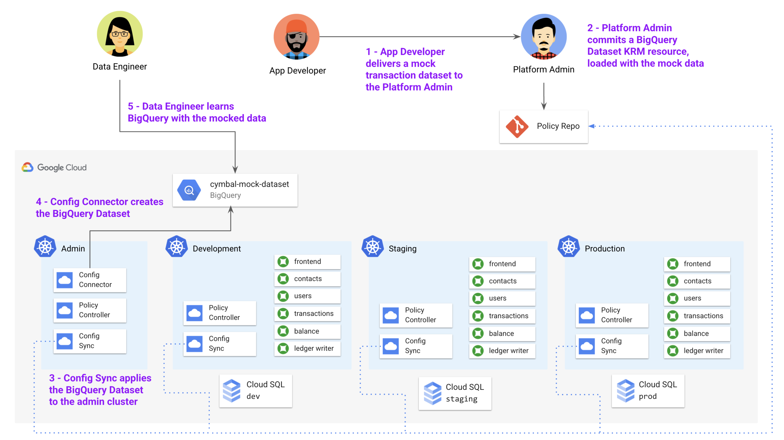

## Part B - Enforcing Policies on Cloud-Hosted Resources 

Let's come back to why using KRM for cloud resources is useful. First, because we have Config Sync installed on the same cluster as Config Connector, the security admin who requested this machine can't manually edit it - for instance, they can't increase the disk size, resulting in unexpected costs. Config Sync and Config Connector will always work together to make sure the exact resource specs in the policy repo match the live GCE instance. 

Second, because we have Policy Controller enabled in the cymbal-admin cluster, we can actually create Constraints on cloud resources as well, imposing guardrails on the types of hosted resources allowed, or on the paramters within a specific resource type. This is exciting because it can allow enterprises to explore new Google Cloud products - like [BigQuery](https://cloud.google.com/config-connector/docs/reference/resource-docs/bigquery/bigquerytable), [Firestore](https://cloud.google.com/config-connector/docs/reference/resource-docs/firestore/firestoreindex) or [Game Servers](https://cloud.google.com/config-connector/docs/reference/resource-docs/gameservices/gameservicesrealm) - safely. 

Let's see this in action. Let's say that the data analytics team at Cymbal Bank wants to explore [BigQuery](https://cloud.google.com/bigquery/docs/introduction) to better understand Cymbal's customers. While the application engineering team is at work building a [Pub/Sub](https://cloud.google.com/dataflow/docs/guides/templates/provided-streaming#cloudpubsubsubscriptiontobigquery) export feature between the existing Cloud SQL databases and BigQuery, the analytics team wants to prepare by learning BigQuery. As the platform team, we can enable them while making sure they only use certain allowed sample datasets, and don't import any real customer data yet. 

Let's see how. 




1. View the mock transaction dataset. This is a 1000-line CSV file, whose fields mimic the data currently stored in the Cloud SQL `ledger_db` today. 

```
head bigquery/cymbal-mock-transactions.csv 
```

Expected output: 

```
transaction_id,from_account,to_account,amount,timestamp,user_agent
1,783090138,296808508,$970.43,4/10/2021,Mozilla/5.0
2,065419094,460289381,$301.53,12/27/2020,AppleWebKit/537.36
3,963595720,549123263,$624.50,11/1/2020,Chrome/51.0.2704.103
4,389877011,027171468,$42.24,6/20/2020,Safari/537.36
5,124961818,328966565,$618.91,10/30/2020,Mozilla/5.0
6,267080812,814045028,$170.00,9/5/2020,AppleWebKit/537.36
7,760106461,999333329,$226.68,4/30/2021,Chrome/51.0.2704.103
8,337830129,789806989,$717.91,8/15/2020,Chrome/51.0.2704.103
9,145870222,311667375,$39.17,4/15/2021,Chrome/51.0.2704.103
```

2. Verify that you have the gsutil tool installed - this comes bundled with the gcloud command. [Install the tool](https://cloud.google.com/storage/docs/gsutil_install) if it's not in your PATH. 

```
gsutil -version 
```

Expected output: 

```
gsutil version: 4.61
```

3. Create a Cloud Storage bucket in your project, called `datasets`. 

```
gsutil mb -c standard gs://$PROJECT_ID-datasets
```

Expected output: 

```
Creating gs://krm-test-5-datasets/...
```

4. Upload the mock transaction data to Cloud Storage. 

```
gsutil cp bigquery/cymbal-mock-transactions.csv  gs://${PROJECT_ID}-datasets/cymbal-mock-transactions.csv
```

Expected output: 

```
Copying file://bigquery/cymbal-mock-transactions.csv [Content-Type=text/csv]...
/ [1 files][ 56.6 KiB/ 56.6 KiB]
Operation completed over 1 objects/56.6 KiB.
```

5. View the BigQuery Job, Table, and Dataset resources provided for you in the `bigquery` directory. 

```
cat bigquery/mock-dataset.yaml 
```

Expected output: 

```

```

Here, we define a BigQuery Table, `cymbal-mock-table`, referencing a new Dataset, `cymbal-mock-dataset`, whose data is loaded in from a BigQuery job, `cymbal-mock-load-job`, referencing the CSV file you just uploaded to Cloud Storage. 

6. Replace the `PROJECT_ID` in the `gs://` URL in `mock-dataset.yaml` with your `PROJECT_ID.`

```
sed -i "s/PROJECT_ID/$PROJECT_ID/g" bigquery/mock-dataset.yaml 
```

7. Copy the resources into the cymbalbank-policy repo. 

8. Push to the cymbalbank-policy repo. 

9.  Wait for the resources to sync to the cymbal-admin cluster. 

```
gcloud alpha container hub config-management status --project=${PROJECT_ID}
```

10. Get the GCP resource status. 

```
kubectl get gcp
```

Expected output: 

```
NAME                                                               AGE    READY   STATUS     STATUS AGE
bigquerydataset.bigquery.cnrm.cloud.google.com/cymbalmockdataset   109s   True    UpToDate   108s

NAME                                                           AGE    READY   STATUS     STATUS AGE
bigquerytable.bigquery.cnrm.cloud.google.com/cymbalmocktable   109s   True    UpToDate   107s

NAME                                                              AGE    READY   STATUS     STATUS AGE
bigqueryjob.bigquery.cnrm.cloud.google.com/cymbal-mock-load-job   109s   True    UpToDate   56s...
```

11. Navigate to the Google Cloud Console > BigQuery. In the left sidebar, click the drop-down next to your project. You should see a dataset called `cymbalmockdataset`, and beneath that, a table called `cymbalmocktable`. You should be able to see the populated column fields, and run a `SELECT *` query on the table, to see the 1000-row dataset in the results. 


Now let's come back to the restrictions we outlined at the beginning of this section- for now, the only allowed BigQuery dataset allowed in this (beyond the public datasets) is the one we just created. Let's create a resource name restriction policy to lock down any other BigQuery resources from being commited to the policy repo. Also note that in a real use case, we would lock down BigQuery Table and Dataset creation permissions to the Config Connector Google Service Account only, using Google Cloud IAM to restrict Cymbal Bank analytics team permissions to the `BigQuery Viewer` role only. This would block users from creating BigQuery resources from the console, as well. 

12. View the `dataset-policy.yaml` resources in the `bigquery/` directory. This file defines a constraint template for `BigQueryDatasetAllowName`, and a constraint of type `BigQueryDatasetAllowName`, which together allow only one BigQuery dataset in the policy repo - the one we already created, `cymbalmockdataset`. 

```
cat bigquery/constrainttemplate.yaml
cat bigquery/constraint.yaml
```

Expected output: 

```

```

13. Copy the policy into the cymbalbank-policy repo, and commit to the main branch. 

14. Wait for the resources to sync. 

```
gcloud alpha container hub config-management status --project=${PROJECT_ID}
```

15. Attempt to manually create a new dataset, called `helloworld-dataset`. This should fail because it violates the policy of only allowing the mock dataset. 

```
kubectl apply -f bigquery/helloworld-dataset.yaml 
```

Expected output: 

```
Error from server ([denied by bigquery-allow-mock-only] The BigQuery dataset name helloworld is not allowed): error when creating "bigquery/helloworld-dataset.yaml": admission webhook "validation.gatekeeper.sh" denied the request: [denied by bigquery-allow-mock-only] The BigQuery dataset name helloworld is not allowed
```

**🏆 Great job!** You just enabled the Analytics team to try out BigQuery, while enforcing a policy on new dataset creation. 
