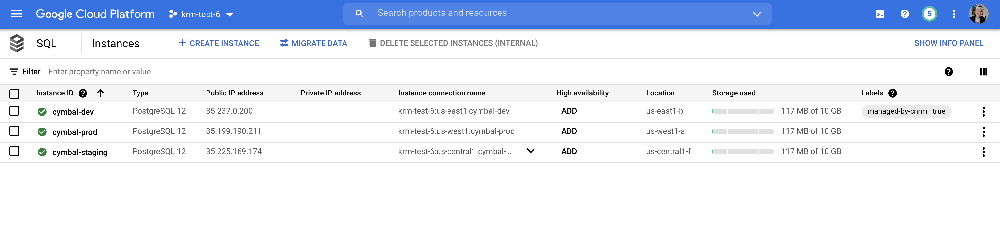

# Part C - Managing Existing Cloud Resources with Config Connector 

Up to now, we've used Config Connector to generate *new* hosted resources, in both Compute Engine and BigQuery. But if you remember way back in part 1, we used Terraform to initially bootstrap the demo environment. This included creating multiple GKE clusters, a set of Secret Manager secrets, some IAM resources, and multiple Cloud SQL instances for dev, staging, and prod. 

For this final demo of the series, let's learn how to bring those existing Google Cloud resources into the management of Config Connector, via gcloud and Config Sync. 

### 1. [Install the Config Connector tool](https://cloud.google.com/config-connector/docs/how-to/import-export/overview#installing-config-connector) and ensure it's in your PATH: 

```bash
config-connector version
```

Expected output: 

```bash
1.46.0
```

### 2. **View the Cloud SQL KRM export script.** 

This script generates static KRM resource files (YAML) for the Cloud SQL development database. (Although these steps only show KRM for the development DB, we could do the same for the staging and production databases as well.)

```bash
cat cloudsql/generate-cloudsql-krm.sh 
```

Expected output: 

```bash
#!/bin/bash

# Dev Instance
config-connector export "//sqladmin.googleapis.com/sql/v1beta4/projects/$PROJECT_ID/instances/cymbal-dev" \
    --output cloudsql/

config-connector export \
    "//sqladmin.googleapis.com/sql/v1beta4/projects/$PROJECT_ID/instances/cymbal-dev/databases/accounts-db" \
    --output cloudsql/

config-connector export \
    "//sqladmin.googleapis.com/sql/v1beta4/projects/$PROJECT_ID/instances/cymbal-dev/databases/ledger-db" \
     --output cloudsql/
```

### 3. **Run the Cloud SQL KRM export script.** 

```bash
./cloudsql/generate-cloudsql-krm.sh
```

### 4. **View the generated KRM resources.** 

```bash
cat cloudsql/projects/$PROJECT_ID/SQLInstance/us-east1/cymbal-dev.yaml
cat cloudsql/projects/$PROJECT_ID/SQLInstance/cymbal-dev/SQLDatabase/accounts-db.yaml
cat cloudsql/projects/$PROJECT_ID/SQLInstance/cymbal-dev/SQLDatabase/ledger-db.yaml
```

Expected otuput: 

```YAML
---
apiVersion: sql.cnrm.cloud.google.com/v1beta1
kind: SQLInstance
metadata:
  annotations:
    cnrm.cloud.google.com/project-id: krm-test-6
  name: cymbal-dev
spec:
  databaseVersion: POSTGRES_12
  region: us-east1
  resourceID: cymbal-dev
  settings:
    activationPolicy: ALWAYS
    availabilityType: ZONAL
    backupConfiguration:
      backupRetentionSettings:
        retainedBackups: 7
        retentionUnit: COUNT
      startTime: "20:00"
      transactionLogRetentionDays: 7
    diskAutoresize: true
    diskSize: 10
    diskType: PD_SSD
    ipConfiguration:
      ipv4Enabled: true
    locationPreference:
      zone: us-east1-b
    pricingPlan: PER_USE
    replicationType: SYNCHRONOUS
    tier: db-custom-1-3840
---
apiVersion: sql.cnrm.cloud.google.com/v1beta1
kind: SQLDatabase
metadata:
  annotations:
    cnrm.cloud.google.com/project-id: krm-test-6
  name: accounts-db
spec:
  charset: UTF8
  collation: en_US.UTF8
  instanceRef:
    external: cymbal-dev
  resourceID: accounts-db
---
apiVersion: sql.cnrm.cloud.google.com/v1beta1
kind: SQLDatabase
metadata:
  annotations:
    cnrm.cloud.google.com/project-id: krm-test-6
  name: ledger-db
spec:
  charset: UTF8
  collation: en_US.UTF8
  instanceRef:
    external: cymbal-dev
  resourceID: ledger-db
```

These KRM files represent the live state of your Cloud SQL resources, originally created using Terraform. (You will see your PROJECT_ID next to `cnrm.cloud.google.com/project-id`.)

### 5. **Apply the Cloud SQL KRM resources to the cymbal-admin cluster.**

```bash
kubectl apply -f cloudsql/projects/$PROJECT_ID/SQLInstance/us-east1/cymbal-dev.yaml
kubectl apply -f cloudsql/projects/$PROJECT_ID/SQLInstance/cymbal-dev/SQLDatabase/accounts-db.yaml
kubectl apply -f cloudsql/projects/$PROJECT_ID/SQLInstance/cymbal-dev/SQLDatabase/ledger-db.yaml
```

Expected output: 

```bash
sqlinstance.sql.cnrm.cloud.google.com/cymbal-dev created
sqldatabase.sql.cnrm.cloud.google.com/accounts-db created
sqldatabase.sql.cnrm.cloud.google.com/ledger-db created
```

Note that although the Kubernetes resources were just created, Config Connector will see that these SQL resources are already running in your project, and the resources won't be updated (since the KRM matches the live state, right now) except for a set of labels that indicate. 

You can see these labels by navigating to the Cloud SQL console. 

### 6. **First, get the Config Connector resource status on the cymbal-admin cluster**. 

```
kubectl get gcp
```

Expected output: 

```bash
NAME                                                AGE   READY   STATUS     STATUS AGE
sqldatabase.sql.cnrm.cloud.google.com/accounts-db   27s   True    UpToDate   24s
sqldatabase.sql.cnrm.cloud.google.com/ledger-db     27s   True    UpToDate   24s

NAME                                               AGE   READY   STATUS     STATUS AGE
sqlinstance.sql.cnrm.cloud.google.com/cymbal-dev   42s   True    UpToDate   10s
```

### 7. **Open the Cloud Console and navigate to Cloud SQL**. 

Notice how in the list, the `cymbal-dev` cluster now has a new label, `managed-by-cnrm: true`. This indicates that this SQL Instance is now under the management umbrella of Config Connector. 



**🚀 Nice job!** You just learned how to export existing, live cloud-hosted resources as declarative KRM, and get Config Connector to manage them. 

## Learn More 

- [Config Connector overview](https://cloud.google.com/config-connector/docs/overview)
- [List of Google Cloud resources supported by Config Connector](https://cloud.google.com/config-connector/docs/reference/overview)
- [Github - Config Connector samples](https://github.com/GoogleCloudPlatform/k8s-config-connector/tree/master/samples/resources)
- [`gcloud resource-config bulk-export](https://cloud.google.com/sdk/gcloud/reference/alpha/resource-config/bulk-export)
- [Google Cloud Blog - "Sign here! Creating a policy contract with Configuration as Data" - Kelsey Hightower and Mark Balch](https://cloud.google.com/blog/products/containers-kubernetes/how-configuration-as-data-impacts-policy)
- [Github - Config Connector + Policy Controller demo - Kelsey Hightower](https://github.com/kelseyhightower/config-connector-policy-demo) 
- [Google Cloud Architecture Center - Creating Policy-Compliant Cloud Resources](https://cloud.google.com/architecture/policy-compliant-resources)
- [Config Connector docs - Importing and exporting existing Google Cloud resources](https://cloud.google.com/config-connector/docs/how-to/import-export/export)

## Wrap-up 

If you made it this far, great work - you just completed several challenging demos that explored the Kubernetes Resource Model with multiple angles, developer personas, products, and tools. 

Let's summarize the key takeaways from all 5 demos: 

- **Building a platform is hard**, especially in the cloud, especially when you have multiple Kubernetes clusters in play, on top of hosted resources.  
- **KRM is one way to manage your Cloud and Kubernetes config**, but it's not the only way - Demo 1 showed us how to do it with Terraform. 
- KRM is a great way to manage resources because Kubernetes is constantly running a **control loop** to make sure your **desired** state matches the **actual** cluster state. We saw this in action both for core Kubernetes API resources (Demo 2 / for instance, Deployments that keep Pods alive) and hosted Cloud resources (Demo 5 / via Config Connector)
- **KRM promotes a "GitOps" model** where you keep all your configuration in Git, and sync it down to multiple clusters at once.  
- Policy Controller, together with Config Sync, allow you to impose custom policies on your KRM resources, both at deploy-time and during CI/CD (Demo 4). These **policies allow you to set fine-grained controls** on different resource types, to ensure compliance within your org. 
- **KRM / the Kubernets API can lifecycle resources that run outside a Kubernetes cluster.** We saw how Config Connector, running inside the admin cluster, created and updated resources in Google Cloud. 

Hopefully you learned a thing or two from these demos- really, we've only just scratched the surface of what KRM can do. All the "learn more" links across Parts 1-5 are available in the [README of this repo](/README.md).

And another set of resources to learn more about KRM, its design principles, and other helpful tools, see: **https://github.com/askmeegs/learn-krm**.

## Cleaning up

If you want to keep your project but delete all the resources deployed by this demo, run the following script from the root of the `intro-to-krm/` repo: 

```
./cleanup.sh
```
